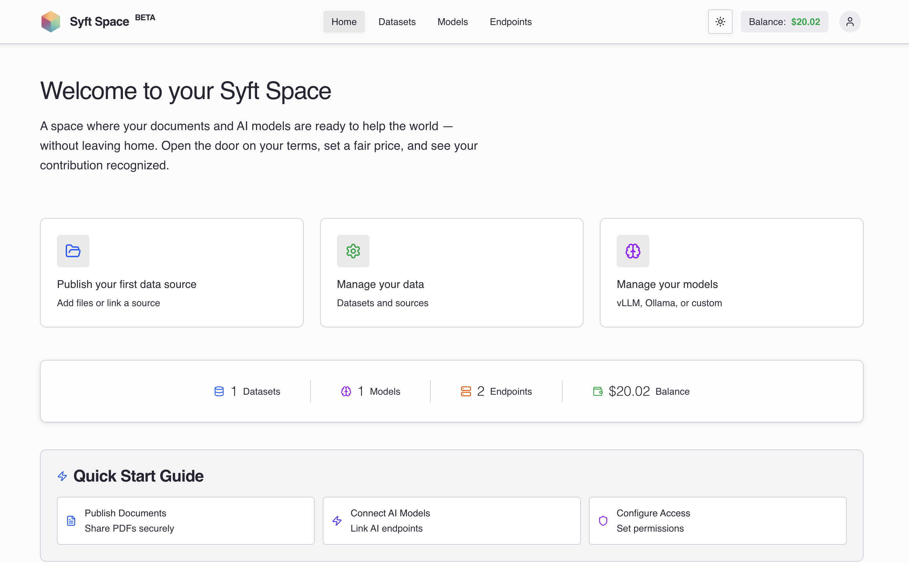
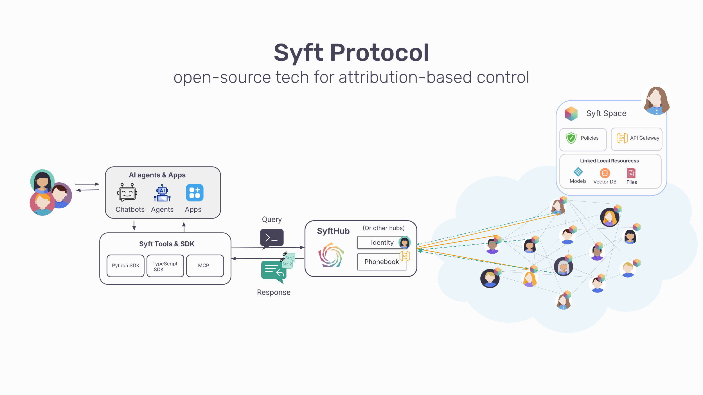

# <a href="https://github.com/OpenMined"></a> Syft Space

[](https://www.python.org/downloads/)
[](https://nodejs.org/)
[](https://fastapi.tiangolo.com/)
[](https://vuejs.org/)
[](LICENSE)

> **Make your knowledge queryable without giving it up.** Syft Space lets you create AI-powered endpoints that others can query while your data stays under your control.



## What is Syft Space?

A Syft Space is a decentralized node operated by anyone with knowledge to share: a publisher, a research lab, a journalist, an institution, or just an individual.

You add your documents, connect an AI model, and create endpoints that others can query. You control who gets access, what they can ask, and whether they pay.

**Key Benefits:**
- **🔒 Privacy-First**: Your data never leaves your control
- **🎯 Selective Sharing**: Share insights, not raw data
- **💰 Monetization**: Set your own pricing and access rules
- **🔍 AI-Powered**: Make any document collection searchable with AI
- **🌐 Decentralized**: Part of a growing network while maintaining independence

Think of it like creating an API for your knowledge - others get answers without seeing your source material.

## 🏗️ Architecture

Syft Space is a full-stack application that creates a bridge between your private data and AI models, allowing controlled access through secure endpoints.



**Core Architecture:**
- **Frontend**: Vue 3 web interface for management and configuration
- **Backend**: FastAPI server handling requests, policies, and data processing
- **Vector Databases**: Local or remote databases (Weaviate, Qdrant, ChromaDB) for document indexing
- **AI Models**: Integration with OpenAI, Anthropic, Ollama, vLLM, and other providers
- **SyftHub Integration**: Optional publishing to the decentralized knowledge network

The system automatically provisions Docker containers for local vector databases and provides a unified API for querying across different data sources and AI models.

## How It Works

Build your knowledge hub with four core components:

### 📚 **Datasets**
Upload documents or connect vector databases. Files are automatically indexed for AI search.

### 🤖 **Models**
Connect OpenAI, Anthropic, Ollama, vLLM, or any OpenAI-compatible provider.

### 🔗 **Endpoints**
Combine datasets and models into queryable RAG endpoints anyone can use.

### 🛡️ **Policies**
Control access, set rate limits, and configure pricing for your endpoints.

```
[Your Data] + [AI Model] → [Queryable Endpoint] + [Your Rules] = [Controlled Knowledge Sharing]
```

## Use Cases

- **📊 Publishers & Creators** — Make your content AI-queryable for your audience while maintaining attribution and control
- **🎓 Researchers** — Turn your papers and notes into a searchable knowledge assistant that others can query
- **🏢 Organizations** — Build AI-powered customer support from your documentation without exposing internal details
- **👥 Teams** — Create searchable knowledge hubs from scattered wikis, docs, and guides
- **💡 Data Monetization** — Share valuable insights from your data without exposing the underlying information

## 🚀 Getting Started

### Step 1: Install Syft Space

**Prerequisites:** 4GB RAM minimum, 8GB recommended

Choose your installation method:

#### Option A: Desktop App (Recommended for beginners)
- **macOS**: Download `.dmg` from [Releases](https://github.com/OpenMined/syft-space/releases)
- **Linux**: Download `.AppImage`, `.deb`, or `.rpm` from [Releases](https://github.com/OpenMined/syft-space/releases)

**Features:** One-click setup, system tray integration, auto-updates

#### Option B: Docker (Production ready)
```bash
docker run -d \
    --name syft-space \
    --restart unless-stopped \
    -p 8080:8080 \
    -v /var/run/docker.sock:/var/run/docker.sock \
    -v /dev/null:/root/.docker/config.json \
    -v syft-space-data:/data \
    ghcr.io/openmined/syft-space:latest
```

#### Option C: From Source (Development)
```bash
git clone https://github.com/OpenMined/syft-space.git
cd syft-space
./run.sh
```

### Step 2: Register Your Account
1. Open [http://localhost:8080](http://localhost:8080) in your browser
2. Click **"Register"** and create your account
3. **Important**: Add your developer token (for local) or public IP (for VM deployment)

### Step 3: Add Your Data
1. Go to **Datasets** → **Add Dataset**
2. Upload documents, files, or connect a vector database
3. Wait for automatic processing and indexing

### Step 4: Create an Endpoint
1. Go to **Endpoints** → **Add Endpoint**
2. Select your dataset and choose an AI model
3. Configure output type (search, AI summary, or both)
4. Set access policies and pricing

### Step 5: Test & Publish
1. Test your endpoint with the built-in query interface
2. Click **Publish** → Choose visibility (Organization or Public)
3. Your endpoint is now live at [syfthub.openmined.org](https://syfthub.openmined.org)

**Example API Query:**
```bash
curl -X POST http://localhost:8080/api/v1/endpoints/my-docs/query \
  -H "Content-Type: application/json" \
  -H "Authorization: Bearer your-token" \
  -d '{"messages": [{"role": "user", "content": "What are the main topics?"}]}'
```

## 🔑 Developer Token

**Required for local deployments only.** If you're running Syft Space locally (not on a VM with public IP), you'll need a developer token to publish endpoints.

| Scenario | Token Required? |
|----------|----------------|
| 🏠 Local machine | ✅ Yes - get from OpenMined |
| ☁️ Cloud VM/Server | ❌ No - uses public IP |
| 🧪 Local development only | ❌ No - for testing only |

**Getting a token:** Contact OpenMined directly (currently in beta)
**Configure:** During onboarding or in Settings → Network

## ✨ Key Features

- **🗄️ Multi-database support**: Weaviate, Qdrant, ChromaDB, or remote data sources
- **🤖 Multi-model support**: OpenAI, Anthropic, vLLM, Ollama, and other providers
- **⚙️ Auto-provisioning**: Automatically manages Docker containers for local databases
- **💻 Desktop & web interface**: Run it as an app or deploy as a service
- **📊 Usage analytics**: Monitor costs, tokens, and performance
- **🌐 Marketplace integration**: Publish to SyftHub for discovery


## 📁 Project Structure

```
syft-space/
└── packages/
    └── spaces/              # the Syft Space package
        ├── backend/         # Python FastAPI server
        │   └── syft_space/  # Main application code
        ├── frontend/        # Vue 3 web interface
        ├── docs/            # Documentation
        ├── Dockerfile       # Container build
        └── docker-compose.yml
```

## 📚 Documentation

- **[Quick Start](http://syft.docs.openmined.org/quickstart)** — Get started in 3 steps: add data, create endpoint, publish
- **[Introduction](http://syft.docs.openmined.org/space)** — Understand the concepts
- **[Components Overview](http://syft.docs.openmined.org/space/components/overview)** — Datasets, models, endpoints, and policies
- **[API Reference](http://syft.docs.openmined.org/space/api)** — REST API documentation
- **[Installation Guide](http://syft.docs.openmined.org/installation)** — Complete setup instructions

### Component Guides
- [Datasets](http://syft.docs.openmined.org/space/components/datasets) — Managing your data sources
- [Models](http://syft.docs.openmined.org/space/components/models) — AI providers and configuration
- [Endpoints](http://syft.docs.openmined.org/space/components/endpoints) — Queryable RAG services
- [Policies](http://syft.docs.openmined.org/space/components/policies) — Access control and rate limiting

**Interactive API docs:** [http://localhost:8080/docs](http://localhost:8080/docs) (when running locally)

## 🌐 Part of the Syft Network

A Space connects to **[SyftHub](https://syfthub.openmined.org)** — a decentralized registry where knowledge providers meet knowledge seekers.

**How it works:**
- 📍 **Discovery**: Others find your published endpoints through SyftHub
- 🔍 **Querying**: Users can search and query across multiple Spaces
- 📝 **Attribution**: Every contribution is tracked and credited automatically
- 🏗️ **Open Architecture**: Built on open protocols — no single point of control

The network grows stronger as more Spaces join, but each Space maintains full autonomy over its data and policies.

## 🤝 Contributing

We welcome contributions! Here's how to get started:

1. **Fork the repository** and clone it locally
2. **Set up development environment** (see [Development Guide](http://syft.docs.openmined.org))
3. **Create a feature branch** for your changes
4. **Submit a pull request** with a clear description

**Development setup:**
```bash
git clone https://github.com/your-fork/syft-space.git
cd syft-space
./run.sh
```

See the [Development Documentation](http://syft.docs.openmined.org) for detailed setup and contribution guidelines.

## 📄 License

This project is part of the OpenMined ecosystem and is licensed under the Apache License 2.0. See the [LICENSE](LICENSE) file for details.

---

<div align="center">
  <strong>Built with ❤️ by the <a href="https://github.com/OpenMined">OpenMined</a> community</strong><br>
  <em>Making AI safer through privacy-preserving technology</em>
</div>
