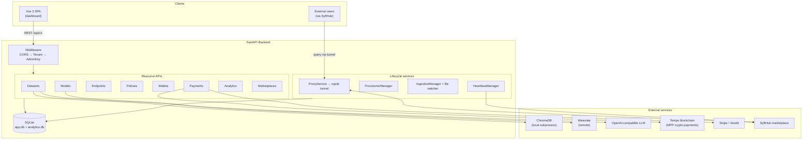
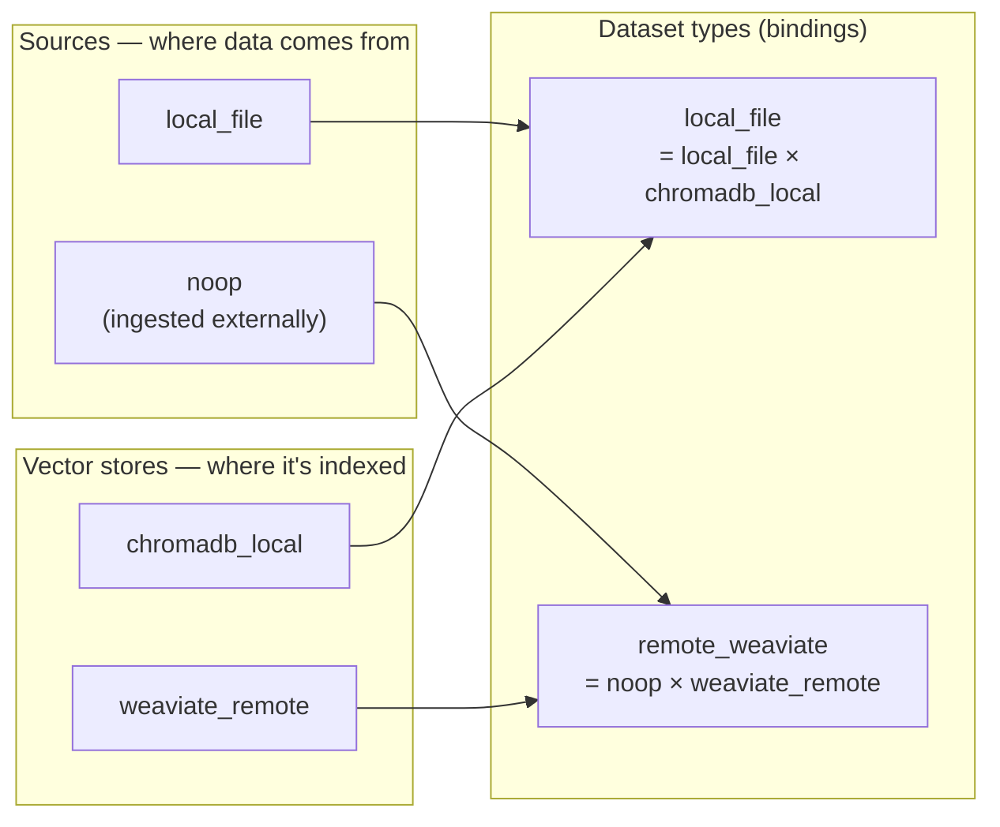
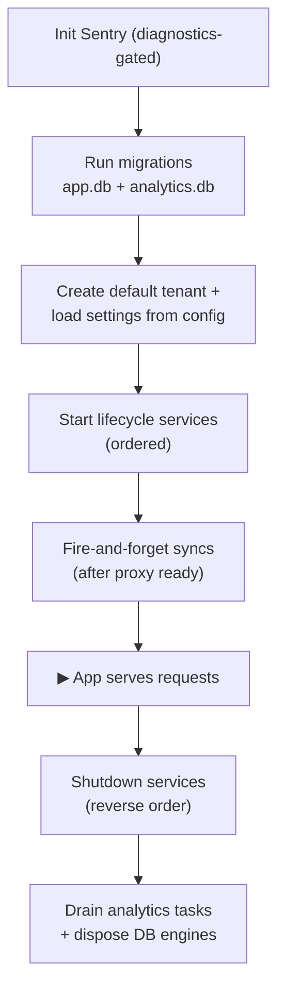
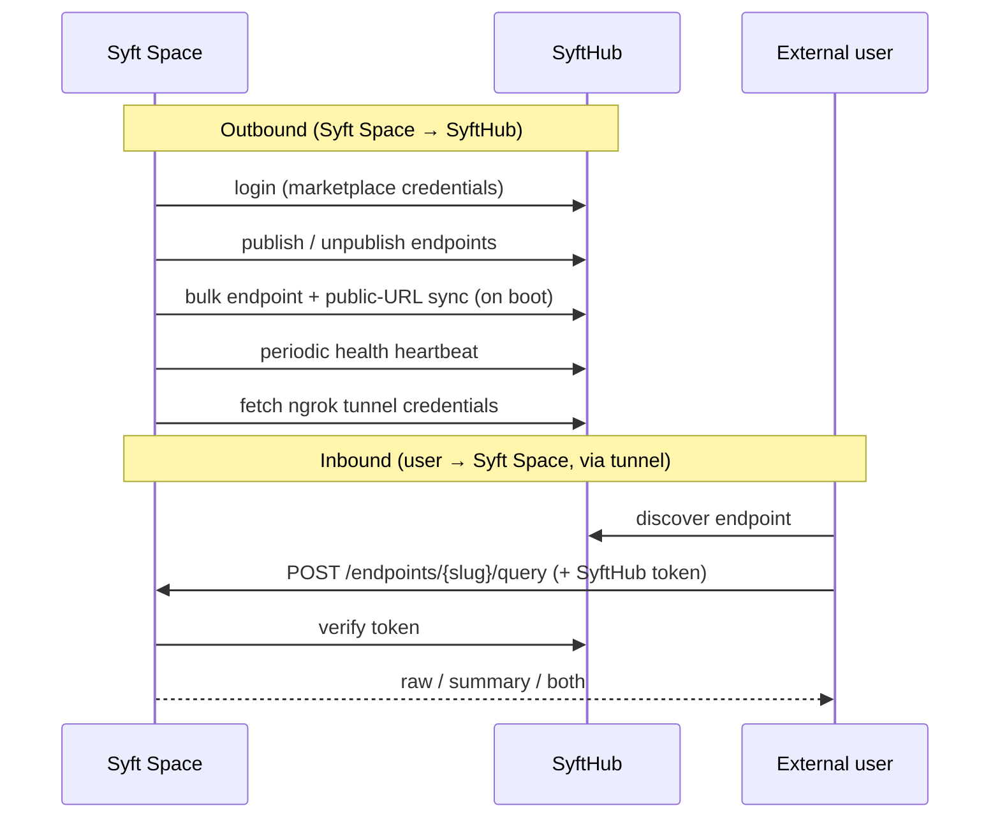

# Architecture

Syft Space is a full-stack application: a **Vue 3 SPA** talking to a **FastAPI
backend** that orchestrates vector databases, LLMs, payments, and an optional
connection to the **SyftHub** marketplace. This document covers the backend's
shape and runtime behavior. For the domain model see [Core
Concepts](./concepts.md); for the request path see [Query Flow](./query-flow.md).

## System overview



## Component map

Every component lives under `syft_space/components/` and follows the same
internal layout (see [Component pattern](#component-pattern)).

| Component | Responsibility |
| --- | --- |
| `datasets` | CRUD for datasets + provisioner lifecycle management |
| `dataset_types` | Registry of dataset-type **bindings** (source × vector store) |
| `sources` | Where data comes from — file pickers + ingestion (`local_file`, `noop`) |
| `vector_stores` | Where data is indexed/searched (`chromadb_local`, `weaviate_remote`) |
| `ingestion` | File-watch + batch ingestion jobs into vector stores |
| `models` | CRUD for LLM instances |
| `model_types` | Registry of model types (`openai`) |
| `endpoints` | Endpoint CRUD, the **query pipeline**, and marketplace publishing |
| `policies` | Policy CRUD + capability validation |
| `policy_types` | Policy implementations — access, rate limit, PII filter, payments |
| `wallets` | Payment **credential** storage (mpp / stripe / xendit) |
| `payments` | The **money** — invoices, ledger, balances, MPP balance queries, webhooks |
| `marketplaces` | SyftHub account credentials, registration, publishing |
| `analytics` | Query-event capture + dashboard stats (separate DB) |
| `feedback` | In-app bug reports / feedback → forwarded to SyftHub |
| `settings` | Public URL + ngrok proxy config + diagnostics toggle |
| `tenants` | Multi-tenancy entities + request-scoping middleware |
| `auth` | Admin-key middleware, bearer scheme, `@public_route` marker |
| `shared` | Database, logging, async utils, lifecycle protocol, SyftHub client, proxy |

### The source / vector-store split

The big architectural idea in the data layer: **a dataset type is a binding of
a *source* to a *vector store*.** The two axes are orthogonal.



This means new combinations (e.g. *S3 files → Weaviate*, *local files →
Qdrant*) are a small binding, not a new monolithic type. See
[Extending the Platform](./extending.md).

## Component pattern

Each component is a self-contained vertical slice:

```
component/
├── entities.py     # SQLModel database models
├── repository.py   # Data access (CRUD), one DB session per operation
├── handlers.py     # Business logic (the "use cases")
├── schemas.py      # Pydantic request/response models
├── routes.py       # build_*_routes(...) → an APIRouter
└── __init__.py
```

Wiring happens once, explicitly, in [`main.py`](../syft_space/main.py):
repositories → handlers → `build_*_routes()` → mounted under `/api/v1`. There
are **no import side effects** — registries and routes are populated by explicit
function calls, which keeps startup fast and dependencies obvious.

## Startup & lifecycle

`main.py` defines an async `lifespan` that runs this sequence on boot:



**Lifecycle services** implement a shared `LifecycleService` protocol and start
in this order (shutdown is the reverse):

1. **ProxyService** — opens the ngrok tunnel, fetching credentials from SyftHub.
2. **ProvisionerManager** — starts/stops vector-store provisioners (e.g. the
   ChromaDB subprocess) and re-discovers them after restart from persisted state.
3. **LocalFileWatcher** — owns the shared filesystem observer.
4. **IngestionManager** — the background worker that ingests watched files
   (waits for provisioners to be ready via a coordination event).
5. **EndpointHeartbeatManager** — periodically reports published-endpoint health
   to marketplaces.

After services start, two **fire-and-forget** tasks run once the proxy is ready:
sync the public URL to the marketplace, and bulk-sync published endpoints.
Dataset-type imports are also warmed in the background to avoid first-request
latency. None of these block startup — failures are logged and the server
continues.

## External integration: SyftHub

The backend talks to SyftHub (the marketplace) through a single
`SyftHubClient` (httpx). Two directions:



The tunnel makes a locally-running Syft Space reachable from the public internet
without exposing the host directly. See [Query Flow](./query-flow.md) for what
happens inside that inbound query.

## Technology stack

| Layer | Choice |
| --- | --- |
| **Web framework** | FastAPI (async) on Uvicorn (ASGI) |
| **Language** | Python 3.12 |
| **ORM / models** | SQLModel + SQLAlchemy, Pydantic v2 |
| **Database** | SQLite via `aiosqlite` (main + analytics), Alembic migrations |
| **HTTP client** | httpx (async) |
| **Vector DB (local)** | ChromaDB (subprocess) |
| **Vector DB (remote)** | Weaviate |
| **LLM** | OpenAI SDK — any OpenAI-compatible API (OpenAI, vLLM, Ollama) |
| **Doc processing** | Docling (PDF, DOCX, …) |
| **File watching** | watchdog |
| **Payments (crypto)** | `mpp` + Web3 on the Tempo blockchain |
| **Payments (gateway)** | Stripe, Xendit |
| **Tunnel** | ngrok |
| **Logging / errors** | loguru + Sentry (diagnostics-gated) |
| **Analytics** | self-hosted event store (separate SQLite DB) |
| **Tooling** | uv, Ruff (format + lint), mypy, pytest |

The frontend is Vue 3 + TypeScript + Pinia + shadcn/vue + Tailwind, built with
Vite/Bun and served as static files by the backend under `/frontend`.
</content>
