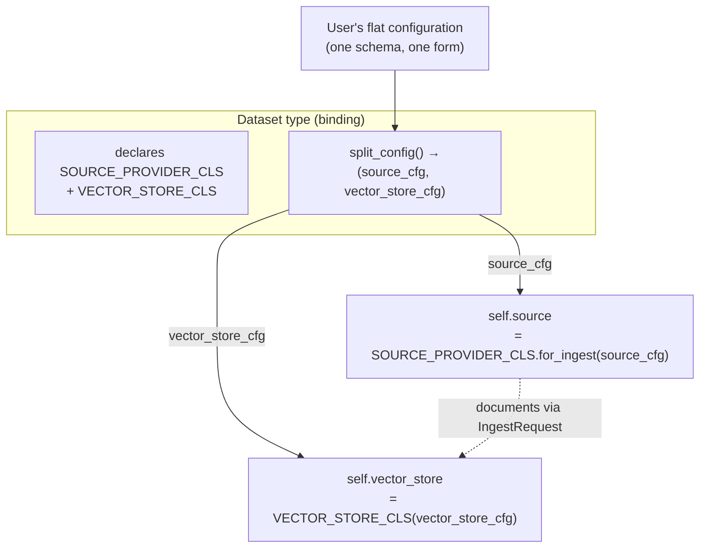
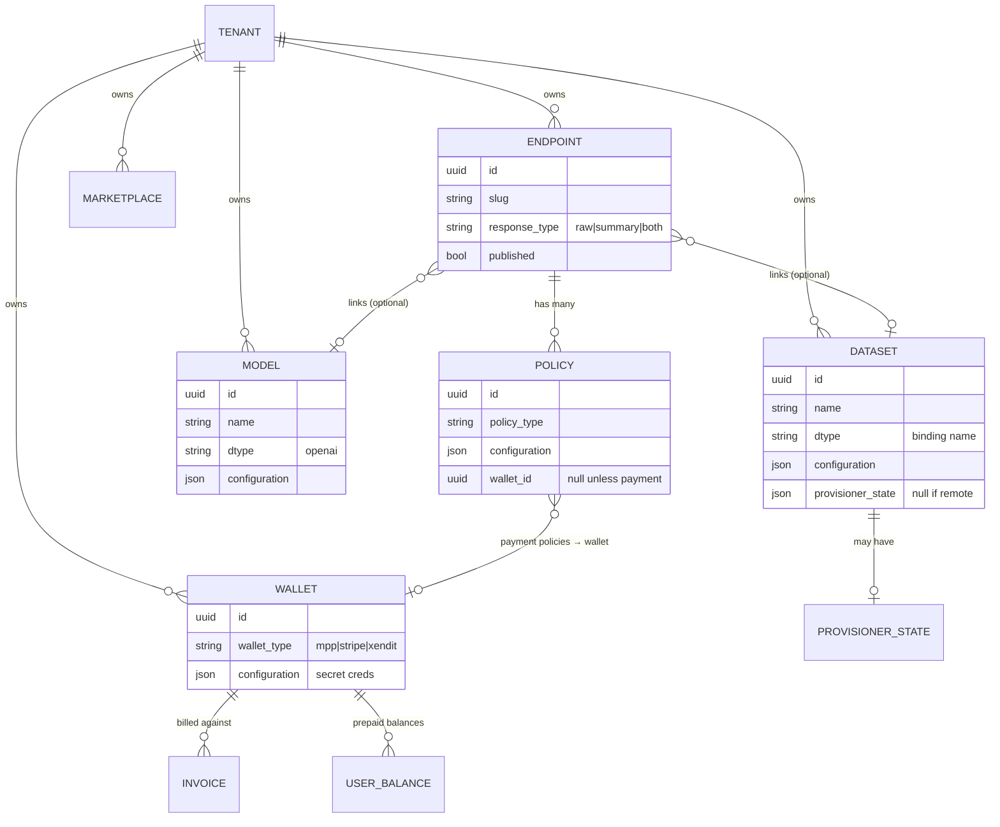

# Core Concepts

This is the domain model: the nouns you create and how they relate. If you've
read the [30-second mental model](./README.md#the-30-second-mental-model), this
is the long version.

## The data layer: sources, vector stores, dataset types

Three concepts, deliberately separated:

| Concept | Question it answers | Interface | Built-ins |
| --- | --- | --- | --- |
| **Source** | *Where does the data come from?* | `BaseSource` / `BaseSourceProvider` / `BaseBrowser` | `local_file`, `noop` |
| **Vector Store** | *Where is it indexed and searched?* | `BaseVectorStore` | `chromadb_local`, `weaviate_remote` |
| **Dataset Type** | *Which source pairs with which store?* | `BaseDatasetType` (a **binding**) | `local_file`, `remote_weaviate` |

- A **source** knows how to browse items (for the file picker), stream
  documents for ingestion, and optionally subscribe to changes (file watching).
  The `noop` source is the *"no ingestion"* case: it does nothing, used when the
  vector store is populated **externally, outside Syft Space** (you manage
  ingestion yourself) and Syft Space only reads/searches it.
- A **vector store** knows how to ingest chunks, run similarity search, and
  delete content.
- A **dataset type** binds one source to one vector store and exposes a single
  configuration schema to the user. The two shipped bindings:
  - `local_file` → local files (the `local_file` source) indexed in a local
    ChromaDB subprocess.
  - `remote_weaviate` → a remote Weaviate cluster you populate externally, so it
    pairs the Weaviate store with the `noop` source — search-only, with no
    ingestion through Syft Space.

Because the axes are orthogonal, adding *S3 → Weaviate* or *local files →
Qdrant* is just a new binding. See [Extending the Platform](./extending.md).

### How the coupling actually works

The source and the vector store **never reference each other**. The dataset type
is the single place they meet — the *composition root* of the binding. The
contract is small and explicit:

*Solid arrows = construction at startup; the dashed arrow = documents flowing
from source to store at ingest time.*

1. **Declaration.** A binding sets two class attributes — `SOURCE_PROVIDER_CLS`
   and `VECTOR_STORE_CLS` — naming exactly one source and one vector store.
2. **One config, split per axis.** The user fills in a single flat
   `configuration`. The binding's `split_config()` divides it into a source
   config and a vector-store config. `configuration_schema()` returns the
   combined schema; `validate_configuration()` validates the flat shape, then
   delegates to each axis's own validator.
3. **Instantiation.** `BaseDatasetType.__init__` builds `self.source` (via the
   provider's `for_ingest` factory) and `self.vector_store` from those configs.
4. **Delegation.** The base class implements the dataset-type surface by
   forwarding to the two axes — you rarely override these:

   | Dataset-type method | Delegates to |
   | --- | --- |
   | `search()` | the **vector store** |
   | `ingest()` / `delete()` | the **vector store** |
   | `healthcheck()` | the **vector store** |
   | `connection_fields()` | the **vector store** |
   | `enabled()` | **both** must be enabled |
   | change-watching (paths, extensions) | the **source** |

5. **The neutral data contract.** When data flows from source to store, it
   travels as the shared `IngestContext` / `IngestRequest` types
   (`shared/ingest_types`) — not a source- or store-specific shape. Because every
   source emits that contract and every vector store accepts it, **any source can
   pair with any store**. That shared contract is exactly what makes the two axes
   orthogonal instead of N×M tightly-coupled implementations.

## Datasets

A **Dataset** is a configured instance of a dataset type — for example, a
`local_file` dataset that indexes `/home/me/docs` into a ChromaDB collection.

- `name` (unique per tenant), `dtype` (the binding name), `configuration` (the
  filled-in schema), `summary`, `tags`.
- If the dataset type has a **provisioner**, creating the dataset starts the
  backing infrastructure (e.g. the ChromaDB subprocess) and persists
  `provisioner_state` so it can be re-discovered after a restart.

## Models

A **Model** is a configured LLM. Today the only model type is `openai`, which
speaks the OpenAI chat-completions API — point `base_url` at OpenAI, vLLM,
Ollama, or any compatible server. Fields: `name`, `dtype`, `configuration`
(`api_key`, `model`, `base_url`, `system_prompt`).

## Endpoints

An **Endpoint** is the queryable unit. It links a dataset and/or a model and
declares how it answers.

- Must reference **at least one** of `dataset_id` / `model_id`.
- `response_type` decides the pipeline:

| `response_type` | Uses | Behavior |
| --- | --- | --- |
| `raw` | dataset only | return search hits |
| `summary` | model only | return an LLM answer |
| `both` | dataset → model | RAG: search, inject top hits as context, return both |

- `slug` is the unique, URL-safe identifier used for querying and publishing.
- `published` / `published_to` track marketplace publication. Endpoints can also
  be archived/unarchived.

See [Query Flow](./query-flow.md) for exactly what happens on a query.

## Policies

A **Policy** is a configured pre/post hook attached to one endpoint. The policy
**type** decides the behavior; the policy stores the filled config.

| Policy type (`NAME`) | Purpose | Needs a wallet? |
| --- | --- | --- |
| `access` | Allow/deny by email glob (deny wins) | — |
| `rate_limit` | Throttle requests (`"50/m"`, `"1000/h"`), per-user or global | — |
| `pii_filter` | Redact PII from responses | — |
| `mpp_per_request` | Crypto micropayment per query (Tempo / MPP) | ✅ `mpp` |
| `mpp_per_document` | Crypto micropayment per returned document | ✅ `mpp` |
| `stripe_per_request` | Prepaid-balance charge per query (Stripe top-ups) | ✅ `stripe` |
| `stripe_per_document` | Prepaid-balance charge per document | ✅ `stripe` |
| `xendit_per_request` | Prepaid-balance charge per query (Xendit top-ups) | ✅ `xendit` |
| `xendit_per_document` | Prepaid-balance charge per document | ✅ `xendit` |

Notes:

- Hooks receive **all** configs of their type on the endpoint and decide their
  own aggregation. `access` is permissive-OR (any allow passes, any deny
  blocks); `rate_limit` is restrictive-AND (every limit must pass).
- A policy type declares **capabilities** (e.g. *requires an `mpp` wallet*). The
  `CapabilityChecker` validates these when a policy is created — you can't attach
  a payment policy without a compatible wallet.
- Payment details live in [Payments & Wallets](./payments.md).

## Wallets & payments

Two separate components, deliberately:

- A **Wallet** stores **credentials** for a payment provider (`mpp`, `stripe`,
  `xendit`). Secrets stay in `configuration`; only safe fields are returned by
  the API.
- **Payments** track the **money**: invoices, a ledger, prepaid user balances,
  MPP balance/transaction queries, and provider webhooks.

A payment policy references a wallet via `wallet_id`. All payment policies on a
single endpoint must use the **same** wallet. See [Payments &
Wallets](./payments.md).

## Marketplaces & tenants

- A **Marketplace** holds the credentials and sync state for a SyftHub instance
  you publish to.
- A **Tenant** is the isolation boundary. With multi-tenancy off, everything
  lives under one default tenant; with it on, every resource is tenant-scoped.

## Entity relationships

### Relationship rules

- An endpoint **must** reference at least one of `dataset_id` / `model_id`.
- A dataset or model may be linked to **many** endpoints; a policy belongs to
  exactly **one** endpoint.
- A **payment** policy **requires** a `wallet_id`; non-payment policies never set
  one. All payment policies on an endpoint must use the **same** wallet.
- Deleting a wallet sets dependent `policy.wallet_id` to `NULL`, and is
  **blocked** while users hold a balance or invoices are pending (unless forced)
  — see [Payments › Wallet deletion guard](./payments.md#wallet-deletion-guard).
- `response_type` determines which links are exercised at query time (`raw` →
  dataset, `summary` → model, `both` → both).

## Provisioner vs. healthcheck

Two distinct status concepts, easy to confuse:

| | **Provisioner status** | **Healthcheck** |
| --- | --- | --- |
| Answers | Is the *infrastructure* running? | Is the *service* responding? |
| Applies to | Types with a provisioner (e.g. local ChromaDB) | Every type |
| Mechanism | Re-discovers resources from persisted state | Calls the type's `healthcheck()` |
| Example state | `running` / `stopped` / `starting` / `error` | application-level OK / error |

Remote types (e.g. `remote_weaviate`) have no provisioner — they report `null`
for provisioner status and rely solely on healthcheck.
</content>
