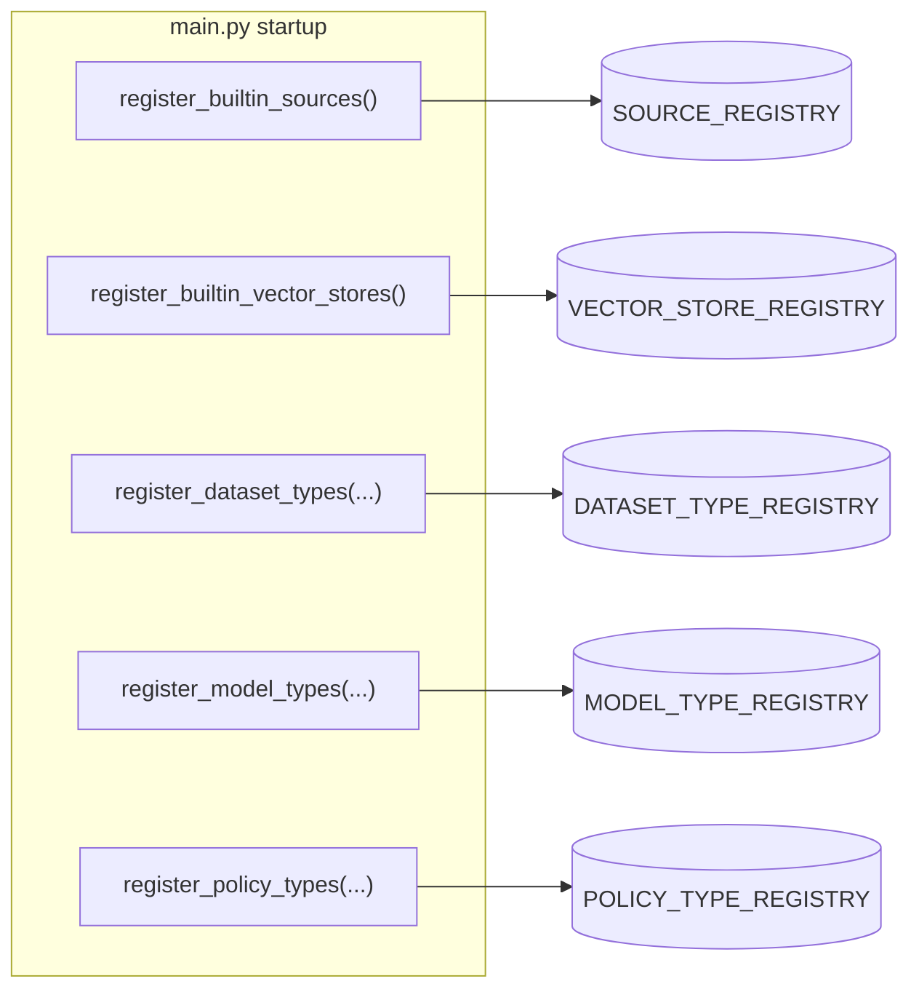

# Extending the Platform

Datasets (via sources + vector stores), models, and policies are all **pluggable
registries**. Built-ins are registered explicitly at startup in
[`main.py`](../syft_space/main.py) — there are no import side effects, so adding a
type means implementing an interface and adding one registration call.



Most registries register **lazily** by module path + class name, so heavy
imports (chromadb, weaviate, torch) only happen the first time a type is used.

---

## Add a vector store

A vector store handles indexing and similarity search. Implement
`BaseVectorStore` (see
[`vector_stores/interfaces.py`](../syft_space/components/vector_stores/interfaces.py)):
roughly `search()`, plus `ingest()` / `delete()` if it's writable
(`IngestableVectorStore`). If it needs managed infrastructure (like the local
ChromaDB subprocess), also provide a `BaseVectorStoreProvisioner`.

1. Create `vector_stores/my_store/my_store.py` implementing the interface.
2. Register it in `vector_stores/registry.py` → `register_builtin_vector_stores()`:

   ```python
   VECTOR_STORE_REGISTRY.register(
       "my_store",
       "syft_space.components.vector_stores.my_store.my_store",
       "MyVectorStore",
   )
   ```

## Add a source

A source defines where data comes from. A source contributes three classes
(see [`sources/interfaces.py`](../syft_space/components/sources/interfaces.py)):
`BaseBrowser` (the picker), `BaseSource` (ingestion — list/stream documents,
optionally `subscribe()` for change-watching), and a `BaseSourceProvider` that
describes the source and builds the other two.

1. Create `sources/my_source/…` implementing the three classes.
2. Register the provider in `sources/registry.py` →
   `register_builtin_sources()`:

   ```python
   SOURCE_REGISTRY.register(
       "my_source",
       "syft_space.components.sources.my_source.my_source",
       "MySourceProvider",
   )
   ```

## Add a dataset type (a binding)

A dataset type **binds** a source to a vector store and exposes one config
schema. This is usually all you need once the source and store exist —
e.g. *"my_source files indexed in chromadb_local"*. Because `BaseDatasetType`
delegates `search` / `ingest` / `healthcheck` to the two axes (see
[Concepts › How the coupling works](./concepts.md#how-the-coupling-actually-works)),
a binding is mostly **declaration**, not implementation:

1. Create `dataset_types/my_type.py` subclassing `BaseDatasetType` (or
   `IngestableDatasetType` if it ingests — see
   [`dataset_types/interfaces.py`](../syft_space/components/dataset_types/interfaces.py)).
   You typically only provide:
   - `SOURCE_PROVIDER_CLS` and `VECTOR_STORE_CLS` — the two axes to pair.
   - `split_config(configuration)` — split the flat user config into
     `(source_cfg, vector_store_cfg)`.
   - `configuration_schema()` — the combined config schema shown to users.

   The base class instantiates both axes and delegates the rest. Override
   `validate_configuration()` only for binding-level checks.
2. Register it lazily in `dataset_types/__init__.py` →
   `register_builtin_types()`:

   ```python
   registry.register_lazy_dataset_type(
       "my_type",
       "syft_space.components.dataset_types.my_type",
       "MyDatasetType",
   )
   ```

## Add a model type

Implement `BaseModelType` (see
[`model_types/interfaces.py`](../syft_space/components/model_types/interfaces.py)):
`chat()`, `healthcheck()`, `configuration_schema()`, `enabled()`. Register it in
`model_types/__init__.py` → `register_builtin_types()`.

```python
registry.register_model_type(MyModelType)
```

## Add a policy type

Implement `BasePolicyType` (see
[`policy_types/interfaces.py`](../syft_space/components/policy_types/interfaces.py)):

- `pre_hook(configs, context)` — runs before the query; raise
  `PolicyViolationError` (→ 403) or `PaymentRequiredError` (→ 402) to block,
  or mutate/inject into the context.
- `post_hook(configs, context)` — runs after; can record usage, add cost, or
  block the response.
- `configuration_schema()` — the JSON schema users fill in.
- `capabilities()` — declare requirements (e.g. a required wallet type). The
  `CapabilityChecker` enforces these when a policy is created.

Hooks receive **all** configs of that type on the endpoint, so the type owns its
aggregation logic (AND/OR/custom). Register it in `policy_types/__init__.py` →
`register_builtin_types()`:

```python
registry.register_policy_type(MyPolicy)
```

> **Tip:** the payment policy types are a good template. Per-request and
> per-document variants share a base class (`PrepaidBalancePerRequestPolicy`,
> `MppPaymentPolicy`); a concrete provider subclass only declares its `NAME`,
> `DESCRIPTION`, and identity fields.

---

## Checklist

After adding any type:

- [ ] Implement the interface from the component's `interfaces.py`.
- [ ] Add the registration call in the right `register_builtin_*` /
      `register_builtin_types` function.
- [ ] If it needs infrastructure, implement and wire a provisioner.
- [ ] Confirm it appears under `GET /api/v1/<resource>/types/`.
- [ ] Verify its config schema renders via `…/types/{name}/schema`.
</content>
