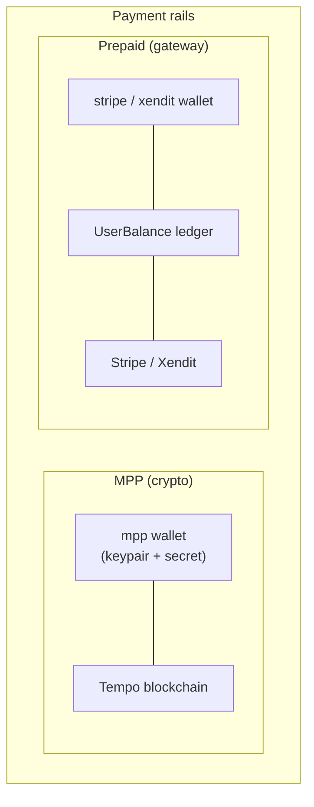
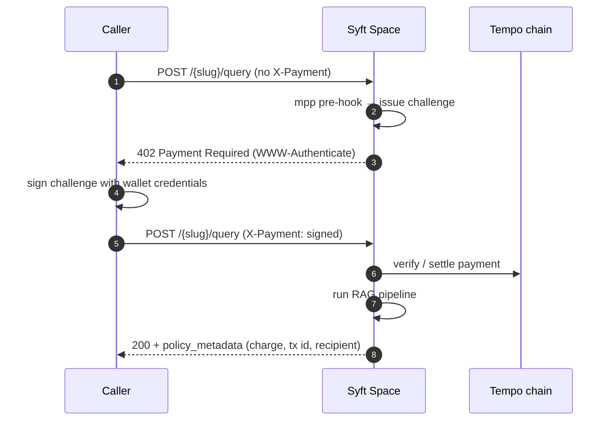
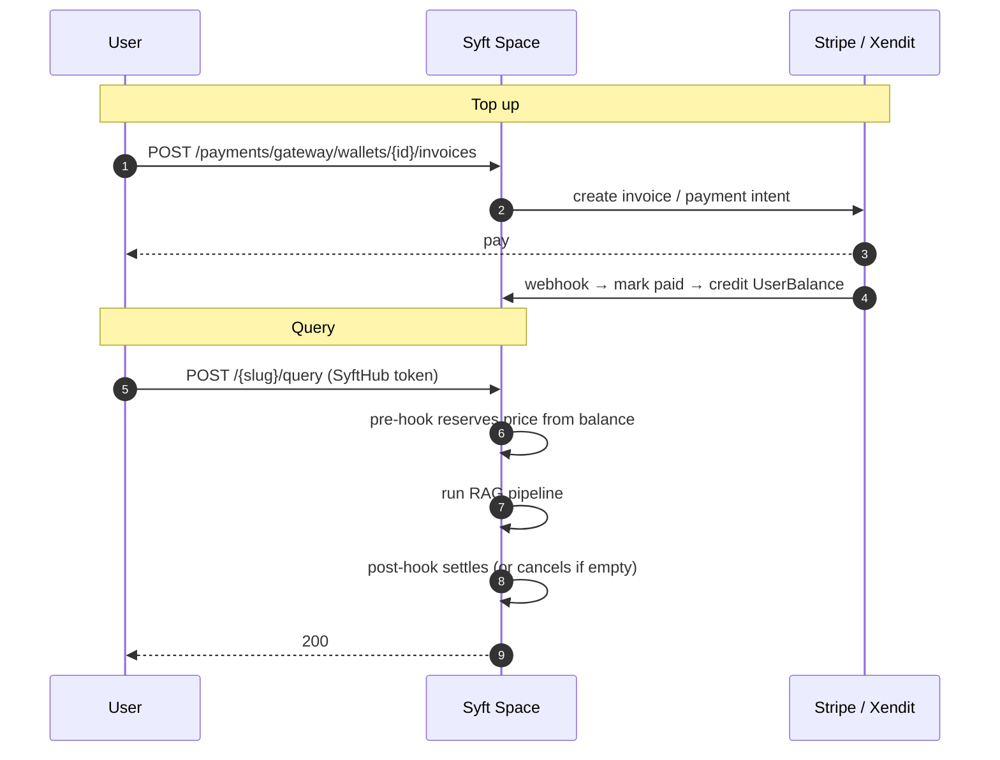

# Payments & Wallets

Syft Space lets endpoint owners **charge for queries**. Two components
collaborate, with a clean separation of concerns:

| | **`wallets/`** | **`payments/`** |
| --- | --- | --- |
| Holds | Provider **credentials** | The **money** — invoices, ledger, balances, receipts |
| Knows about | How to talk to a provider | How much each user owes/holds |
| Example data | a Stripe API key, an MPP keypair | an invoice, a prepaid balance row |

A **payment policy** on an endpoint references a wallet (`wallet_id`); at query
time the [query pipeline](./query-flow.md) loads the wallet's credentials and
the payment component does the actual charging.

## Two payment rails

- **MPP (Machine Payments Protocol)** — pay-per-query **at request time** using a
  cryptographic challenge/response settled on the **Tempo** blockchain
  (`pathUSD`). No pre-funding; the caller signs and pays for each query.
- **Prepaid (gateway: Stripe / Xendit)** — users **top up a balance** through the
  payment gateway; each query **deducts** from that wallet-scoped balance.
  Stripe and Xendit share the exact same `UserBalance` ledger — only the top-up
  rail differs.

## Wallet providers

| Provider | `wallet_type` | Credentials (kept secret) | Notes |
| --- | --- | --- | --- |
| MPP | `mpp` | wallet address, private key, MPP secret | Generated or imported from a private key |
| Stripe | `stripe` | Stripe API key (+ webhook secret) | Prepaid balance rail |
| Xendit | `xendit` | Xendit API key, callback token | Prepaid balance rail |

Wallet management lives under `/api/v1/wallets` (generate/import MPP, create
gateway wallets, update credentials, list/get/delete). Only **safe** display
fields are returned by the API — secrets never leave the server.

## Payment policy types

Attach one of these to an endpoint (it must reference a compatible wallet):

| Policy `NAME` | Rail | Charges | Wallet |
| --- | --- | --- | --- |
| `mpp_per_request` | MPP | per query | `mpp` |
| `mpp_per_document` | MPP | per returned document | `mpp` |
| `stripe_per_request` | Prepaid | per query | `stripe` |
| `stripe_per_document` | Prepaid | per returned document | `stripe` |
| `xendit_per_request` | Prepaid | per query | `xendit` |
| `xendit_per_document` | Prepaid | per returned document | `xendit` |

All support **tiered pricing** (match `sender_email` against `applied_to` globs;
most-specific pattern wins). The `CapabilityChecker` enforces that the endpoint's
wallet matches the policy's required type, and that all payment policies on one
endpoint use the **same** wallet — so every charge for that endpoint settles
against one provider account and one ledger, rather than splitting a user's
payment across rails.

## MPP flow (pay at request time)

If the response turns out empty, the post-hook avoids charging. Balance and
transaction history for an MPP wallet are read live from Tempo via
`GET /api/v1/payments/mpp/{wallet_id}/balance` and `/transactions`.

## Prepaid flow (top up, then deduct)

Users can inspect their own balance/invoices/transactions through the public
`/payments/gateway/wallets/{id}/…/me` routes; owners get tenant-wide views under
the admin-only `/payments/gateway/…` routes.

## What the caller sees per query

Charges are reported in the query response itself, not via headers. Every
response carries a `policy_metadata` envelope with one entry per policy; a
payment entry records its `status` (`charged` / `refunded` / `free`), the
`amount`/`currency`, the `recipient`, and the rail-native `transaction` id
(Tempo tx hash for MPP, ledger UUID for prepaid). When a payment policy blocks
the query, the same envelope rides the `402`/`403` with a `reason_code`
(e.g. `PAYMENT_REQUIRED`, `INSUFFICIENT_BALANCE`) and human-readable `reason`.
See [Query Flow](./query-flow.md#9-response) for the full shape.

## Wallet deletion guard

Because a wallet anchors real money, deletion is guarded. A wallet **cannot be
deleted** while:

- it has **pending invoices** (wait for them to settle), or
- users still hold a **non-zero balance** against it (refund them first).

Pass `force=true` to override. This guard is wired through dependency inversion —
the `wallets` component asks an injected check from `payments` rather than
importing it. When a wallet *is* deleted, dependent `policy.wallet_id` values are
set to `NULL`.

## How the pieces wire together

`main.py` injects concrete provider adapters into the handlers (Clean
Architecture — the use-case logic doesn't know about Stripe/Xendit/Tempo
specifics):

- `WalletHandler` ← `{ mpp, xendit, stripe }` providers + the deletion guard.
- `PaymentHandler` ← `{ xendit, stripe }` gateways + a `PaymentLedger`
  unit-of-work + `BalanceService`.
- `PolicyHandler` ← `CapabilityChecker` (validates wallet ↔ policy on create).
- `QueryEndpointHandler` ← wallet repository + balance service (loads
  credentials and charges at query time).
</content>
