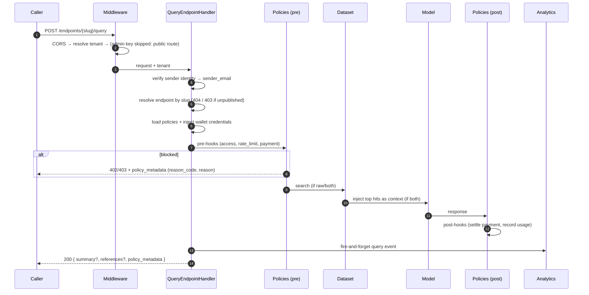
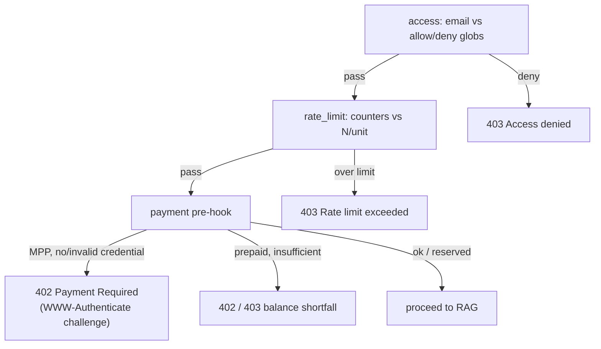

# Query Flow

This traces a single call to `POST /api/v1/endpoints/{slug}/query` — the heart
of the platform. The same path serves the dashboard (admin key) and external
SyftHub users (tunnel + token).

## At a glance



## Step by step

### 1. Middleware

`CORS → TenantMiddleware → AdminKeyMiddleware`. The query route is a
`@public_route`, so the **admin key check is skipped** — but tenant resolution
still runs (from `X-Tenant-Name` or the default tenant).

### 2. Authenticate the sender

The handler resolves a verified `sender_email` from the `Authorization` bearer
token:

- If the token **equals the admin key**, the caller is the owner (the
  marketplace email is used).
- Otherwise the token is verified against **SyftHub**. Valid → the verified
  email; invalid → `401`.

This `sender_email` is what access, rate-limit, and payment policies key off.

### 3. Resolve the endpoint

Look up the endpoint by `slug` within the tenant. `404` if it doesn't exist;
`403` if it isn't published (owners can still use `POST /{slug}/preview`).

### 4. Inject wallet credentials

For any payment policy on the endpoint, the linked **wallet** is loaded and its
credentials (plus any caller-supplied payment header) are placed into the
policy context — so policies never read the database themselves.

### 5. Pre-hooks

Each policy type's `pre_hook` runs with **all** its configs on the endpoint. Any
hook can block:



- **MPP** payment policies issue a `402` challenge if the caller hasn't paid,
  then verify the signed `X-Payment` credential on retry.
- **Prepaid** (Stripe/Xendit) policies **reserve** the price from the user's
  wallet-scoped balance, to be settled or cancelled in the post-hook.

### 6. The RAG pipeline

Branches on `endpoint.response_type`:

| `response_type` | What runs |
| --- | --- |
| `raw` | dataset search → `references` only |
| `summary` | model chat → `summary` only |
| `both` | dataset search → inject top hits as context → model chat → both |

- **Search** uses the dataset type (its bound vector store) to return scored
  documents `{ document_id, content, metadata, score }` for the last user
  message, honoring `similarity_threshold` and `limit`.
- **Chat** uses the model type (OpenAI-compatible). For `both`, the top hits are
  prepended as a system/context message so the answer is grounded in them.

### 7. Post-hooks

`post_hook` runs for each policy type with both request and response available:

- **Payment** policies settle the charge — record what was charged, to whom, and
  the rail-native transaction id in `policy_metadata`, or **cancel the
  reservation** if the response was empty (no summary, no documents), so callers
  aren't billed for nothing.
- Other policies record usage / audit as needed. A post-hook can still block.

### 8. Analytics

The handler fires a **fire-and-forget** query event (status + cost + redacted
query text) to the separate analytics database. It never blocks the response and
is drained on shutdown.

### 9. Response

```jsonc
// 200 OK
{
  "summary":    { /* LLM answer, usage, cost */ } /* present for summary|both */,
  "references": { /* documents[], provider_info */ } /* present for raw|both */,
  "policy_metadata": { /* see below */ }
}
```

Every query response — success **and** rejection — carries a `policy_metadata`
envelope, the authoritative record of what each policy did. Clients read it
instead of reconstructing price/recipient from policy config:

```jsonc
{
  "outcome": "success",          // or payment_required / rate_limited / access_denied / ...
  "entries": [
    {
      "policy_type": "mpp_per_request",
      "kind":   "payment",       // payment | access | transform | rate_limit
      "status": "charged",       // charged | refunded | free | rejected | applied | skipped
      "amount": 0.01, "currency": "USD",
      "recipient":   { "username": "...", "wallet_address": "..." },
      "transaction": { "rail": "mpp", "id": "0x…" },
      "reason_code": null,       // e.g. INSUFFICIENT_BALANCE / RATE_LIMITED when rejected
      "reason":      null        // human-readable explanation when rejected
    }
  ]
}
```

On a block, the route returns `402`/`403` with the **same** envelope (plus a
`detail` message), so a rejection's `reason_code`/`reason` explain *why* in the
body, not just the status code.

For the precise field set, see `POST /endpoints/{slug}/query` in `/docs`. For
the payment-specific exchanges (challenge, prepaid settlement) see
[Payments & Wallets](./payments.md).
</content>
