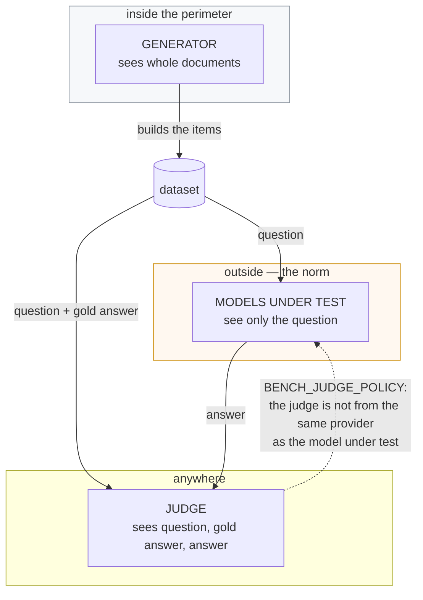

# Stage 1. Preparing the rig

What has to be installed, what to configure and how to make sure the run will
start at all. A measurement takes hours and costs money in external models —
finding out three hours in that the judge is unreachable is expensive. So the
stage has two diagnostic commands, and you begin with them.

The overall picture of the pipeline — [README.md](README.md).

---

## What to install

```bash
cp .env.example .env
cp config/spaces.example.json config/spaces.json   # fill in your own Spaces

docker compose up -d          # the benchmark's Postgres on 5442
uv sync
uv run alembic upgrade head   # schema

uv run syft-benchmark secrets keygen >> .env       # the master key for secrets
```

**Its own database on its own port.** The benchmark's Postgres (5442) is
separate from the Space's database, and that is not a deployment convenience:
it holds a **third copy of the corpus content** after the Space's files and
ChromaDB — gold answers not infrequently quote the source verbatim, and
retrieved chunks and prompts are stored whole. It is protected the same way the
corpus is; see [privacy.md](privacy.md) and [data-model.md](data-model.md).

---

## Where a setting lives

**In the database, in one row.** There are three layers to a measurement's
settings — the installation's defaults, the Space's instrument, the node's
probe — and this is the bottom one, in the database rather than in the
environment: changing a default must not mean going to the host the service
runs on.

```bash
uv run syft-benchmark settings show                       # what is overridden
uv run syft-benchmark settings set retrieval_top_k 8
uv run syft-benchmark settings unset retrieval_top_k      # back to the default
```

The same row is what the Space's UI edits through `GET`/`PUT /settings`.

**The environment is the layer under the row**, not a seed. It is read-only —
nothing here ever writes to it — and it is what the deployment supplies. The
precedence, bottom to top:

    the built-in defaults → the environment → the installation's row
        → the Space's instrument → the node's probe

So `BENCH_SOMETHING` sets the environment variable and means the setting
`something` — but the place to change that setting is `settings set` or the
API, under the name without the prefix, not the environment.

The row is not seeded from the environment on start, deliberately: the
container's compose file sets the addresses that differ inside a container, and
a one-time seed would apply them once and then silently ignore every change
after that — leaving an installation pointed at a model provider inside itself.

Four things stay in the environment for good, and each for its own reason.

| Variable | Why it cannot be in the row |
| --- | --- |
| `BENCH_DATABASE_URL` | It is the address of the row |
| `BENCH_CONTROL_TOKEN` (and host, port, origins) | It guards the API that edits the row; a lock whose key is inside it is not a lock |
| `BENCH_ALLOW_EXTERNAL_MODELS`, `BENCH_EXTERNAL_HOSTS` | The perimeter. See below — it is a decision for whoever has the host, not whoever has a key |
| `BENCH_SECRET_KEY`, `BENCH_SECRET_KEYS_RETIRED` | It opens the stored secrets |

`BENCH_DB_PORT` and `BENCH_SPACE_NETWORK` are read by `docker compose`, not by
the application at all.

---

## Where a secret lives

**Sealed, in a table of its own.** The provider keys and the Space tokens are
encrypted with AES-256-GCM before they reach the database, and each ciphertext
is bound to the name of the slot it belongs in — so a row cannot be copied from
`judge_key` into `subject_key` to redirect the model under test at somebody
else's provider.

They are not kept with the settings, and that is the point of the separation:
the settings are read on every launch, copied into a job's snapshot and every
run's params, handed out by `/defaults` and written to the log. A key among
them would travel to all of those places.

```bash
uv run syft-benchmark secrets keygen        # generate a master key, once
uv run syft-benchmark secrets list          # what is stored, and since when
printf %s "sk-or-v1-..." | uv run syft-benchmark secrets set judge_key
uv run syft-benchmark secrets unset judge_key
uv run syft-benchmark secrets rotate        # after changing the master key
```

Piped rather than passed as an argument: an argument is in the shell history
and in the process list of every user on the machine.

**Without a master key nothing is stored.** The service refuses rather than
falling back to plain text, because an installation with half its secrets
encrypted and no record of which half is worse than one that said no.

**A key left in `.env` goes on working, and is named for what it is.** Nothing
copies it into the store behind your back: that would leave the plaintext in
the file regardless — the part that matters — while making "the keys are
encrypted at rest" true of everything except the one nobody was told about. So
the service says at startup, and `secrets list` says on demand, which keys it
is still reading from the environment in the clear.

**What the sealing protects**: dumps, backups, replicas, a stolen volume.
**What it does not**: anyone who can already read the process's environment or
memory — the master key is there. That is the ordinary bargain of keeping the
key outside the data, and the step beyond it is an external KMS.

---

## The Space registry

```bash
uv run syft-benchmark spaces
```

The nodes under test are described in `config/spaces.json`: the node's key, the
Space's address, the name of the collection in the index, the endpoint's answer
mode, and the settings tuned for that corpus — above all the similarity
threshold.

**The collection name is given explicitly.** In the index the collection is
named after the Space's dataset, not after the target's key; the two coincide
only when the key has been hand-picked to match the index. `chunks` and the
target check show what is actually in the index — the owner should not have to
guess what the Space called the collection.

**The similarity threshold is an axis of the measurement, not a constant**, so
it can be set per Space as well. At zero the endpoint is obliged to return
top-k for ANY question, including one whose answer is not in the corpus: it is
physically unable to stay silent. A run at `0.0` and a run at `0.45` answer
different questions and do not add up into one share — both the report and the
resume logic watch for this.

**The index is read over two transports.** ChromaDB is raised as a subprocess
inside the Space's container, so the main path is **http**, when the port is
published to the host, and the fallback is **docker exec**: the same HTTP
request is executed by python inside the container. The pipeline works against
a node whose Chroma port was never published, without recreating containers.

| Setting | Default | What it does |
| --- | --- | --- |
| `chroma_tenant` | `default_tenant` | Separation within a single Chroma server |
| `chroma_database` | `default_database` | The same |
| `chroma_internal_port` | `8100` | The port INSIDE the container, not forwarded outwards |

You need to touch these only if the index was raised by something other than
the default deployment.

If the benchmark is driven from the Space's UI, the file remains a **seed**:
targets live in a table, and at service start-up only those not yet in the
table are taken from the file. See [control-api.md](control-api.md).

---

## Three model roles

There are three roles, each with its own address, key and model. The separation
is substantive, not organisational.



| Role | Sees documents | Where it usually lives | Settings |
| --- | --- | --- | --- |
| **generator** | yes, whole | inside the perimeter | `BENCH_GENERATOR_URL` / `_KEY` / `_MODEL` |
| **model under test** | no, the question only | outside | `BENCH_SUBJECT_URL` / `_KEY` / `_MODELS` |
| **judge** | no | anywhere | `BENCH_JUDGE_URL` / `_KEY` / `_MODEL`, `BENCH_JUDGE_MODELS` |

**The generator** works over documents and therefore should normally stay
inside the perimeter. Taking it outside is possible, but that is a deliberate
decision by the owner — see "The bounds of the perimeter" below.

**The models under test do not see documents at all.** All they get is the
question, and that is the main point: access to the corpus is not needed to
test them, which means any external model can be tested without anything
leaving the perimeter except the questions themselves. So here an external
provider is the norm, not the exception: the point of the measurement is to
compare the endpoint with what is available to everyone.

**The judge** must not be from the same provider as the model under test. On
the independence policy and the panel — [05-judging.md](05-judging.md).

An empty address for a role means "take the shared one", from
`BENCH_OLLAMA_URL`. A configuration with a single local model stays one line
long, and the roles can be pulled apart when that is actually needed.

The addresses and the model names are settings; the keys are secrets and go in
sealed.

```bash
# generator inside, models under test outside, judge from a third provider
uv run syft-benchmark settings set ollama_url http://localhost:11434
uv run syft-benchmark settings set generator_model gemma3-4b-gpu

uv run syft-benchmark settings set subject_url https://openrouter.ai/api/v1
uv run syft-benchmark settings set subject_models   '["anthropic/claude-sonnet-4","openai/gpt-4o","google/gemini-2.5-pro"]'
printf %s "sk-or-v1-..." | uv run syft-benchmark secrets set subject_key

uv run syft-benchmark settings set judge_url https://openrouter.ai/api/v1
uv run syft-benchmark settings set judge_model google/gemini-2.5-pro
printf %s "sk-or-v1-..." | uv run syft-benchmark secrets set judge_key
```

And in `.env`, because the perimeter is not settable from anywhere else:

```bash
BENCH_ALLOW_EXTERNAL_MODELS=true
BENCH_EXTERNAL_HOSTS=["openrouter.ai"]
```

### The model names are not free text

A model is named by **this service's identifier for it**, not by whatever a
particular provider calls it. The identifier is the vendor-namespaced slug —
`anthropic/claude-sonnet-5` — and the provider's own name is worked out where
the call is made: the same model is `claude-sonnet-5` at Anthropic's own API.
So moving an installation from one provider to another does not rewrite the
settings, and what was measured before the move stays comparable with what is
measured after it.

The identifiers come from a catalogue that ships with the code, so nothing has
to be reachable for the list to exist:

```bash
uv run syft-benchmark models claude            # search it
uv run syft-benchmark models --vendor openai   # one vendor
uv run syft-benchmark models --refresh         # fetch the provider's list afresh
```

`--refresh` is a call outside the perimeter — the catalogue is public, but
fetching it is still a call — so it happens on that explicit word and under the
same permission as everything else that leaves. Without it the shipped snapshot
stands, and a name it has never heard of is still accepted: refusing a model
released this morning would be worse than not knowing it.

A `~vendor/thing-latest` name is resolved to what it means as the setting is
saved. It is convenient and it is a trap: it points at a different model every
few months, so a run under it could not be repeated and two runs a season apart
would sit in one report under one name.

The identifier is what the settings hold; what actually served each call is
recorded beside the results — see `syft-benchmark upstreams` in
[04-evaluation.md](04-evaluation.md).

---

## The bounds of the perimeter

| Variable | Default | What it does |
| --- | --- | --- |
| `BENCH_ALLOW_EXTERNAL_MODELS` | `false` | Allow models outside the perimeter |
| `BENCH_EXTERNAL_HOSTS` | `[]` | A list of allowed hosts, named one by one |

Both stay in `.env` and are deliberately not settable through the API. The ban
is a check rather than an agreement because the questions are built from
private documents; a list of allowed hosts that anyone holding the control key
could edit would not be a perimeter. The shared provider key is a secret —
`secrets set llm_api_key`.

**One flag is not enough: the host has to be named explicitly.** Otherwise
turning the mode on would open the road anywhere at all, including places the
owner never intended. A key is not a permission either: until the ban is
lifted explicitly, calling an external provider stays an error even if the key
is set.

The check sits in the LLM client, not in the callers: there are many callers,
and forgetting the check once is enough. This is
[invariant 2](privacy.md).

It is checked **twice more, earlier, and never while settings are merely
read**. A measurement refuses to start if any role points outside, and
`syft-benchmark doctor` and the target's check say so on demand — so a
misconfigured judge is found in the first second rather than the third hour.
What does not check is the code that works out where a role points: that is
also how the configuration is *described*, and a description that could raise
meant the settings page died the moment somebody typed an external address
into it.

### An external generator and judge during development

The generators work through any OpenAI-compatible API, OpenRouter included.
This is needed at the development stage: a local 4B model breaks down on the
document-level generators, and prompts are easier to debug on a model that
follows instructions.

```bash
uv run syft-benchmark settings set ollama_url https://openrouter.ai/api/v1
uv run syft-benchmark settings set generator_model anthropic/claude-sonnet-4
uv run syft-benchmark settings set judge_model anthropic/claude-sonnet-4
printf %s "sk-or-v1-..." | uv run syft-benchmark secrets set llm_api_key

# in .env — the perimeter is not settable from anywhere else
BENCH_ALLOW_EXTERNAL_MODELS=true
BENCH_EXTERNAL_HOSTS=["openrouter.ai"]
```

**All four** settings are needed: the address, the key, the lifted ban and the
host in the list. Three of them can be set by mistake; all four, no longer.

What happens to the data in the process has to be clearly understood.
**Fragments of the corpus leave the perimeter**: the generator receives the
document's text in full, and the judge receives the question, the gold answer
and the answer. That is exactly what the perimeter does not permit in
production. So the mode is fit only for a **public or synthetic** corpus — for
example the SyftHub documentation, which is open anyway. On the owner's private
documents it must not be turned on.

---

## spaCy: optional, but cheap

Extractive generators are built through spaCy if there is a model for the
document's language, and through an LLM if there is not. With spaCy they do not
call a model at all — dozens of items in seconds.

```bash
uv sync --extra spacy
uv run python -m spacy download en_core_web_sm
uv run python -m spacy download ru_core_news_sm
```

| Setting | Default | What it does |
| --- | --- | --- |
| `extractive_mode` | `auto` | What builds fill-in-the-blank: `auto`, `spacy`, `llm` |
| `spacy_models` | 8 languages | Language code → spaCy model name |

The choice is automatic and **per document**: a corpus can be mixed by
language, and the user should not have to decide that for every file. On the
modes in detail — [02-generation.md](02-generation.md).

---

## Checking that everything is in place

```bash
uv run syft-benchmark doctor                        # is everything reachable
uv run syft-benchmark chunks docs --collection syft_knowledge_base
uv run syft-benchmark generators                    # the line-up and the settings
```

**`doctor`** checks everything a run depends on: the database and the applied
schema, the Space registry, each target's endpoint mode, and the availability
of every model role **at its own address and key** — a role pointed at another
provider is checked where the real call will go, not against the shared
settings. This is also where an incompatibility between the arms and the
endpoint mode is named: on a `summary` node the chunks are cut out of the
answer, and arm C over chunks is unmeasurable in principle.

An external provider has no `/api/tags` route, so instead of a list of
downloaded models a short request is sent.

**`chunks`** reads the Space's live index and shows how much material there is:
chunks in total, chunks long enough to use, documents. This is the answer to
"is there anything to build a set from" before you have paid for it.

**`generators`** prints the current generator line-up, the model roles, the
test blocks and their settings — what the run will actually go with, rather
than what is written in the example `.env`.

Next — [stage 2: building the set](02-generation.md).
