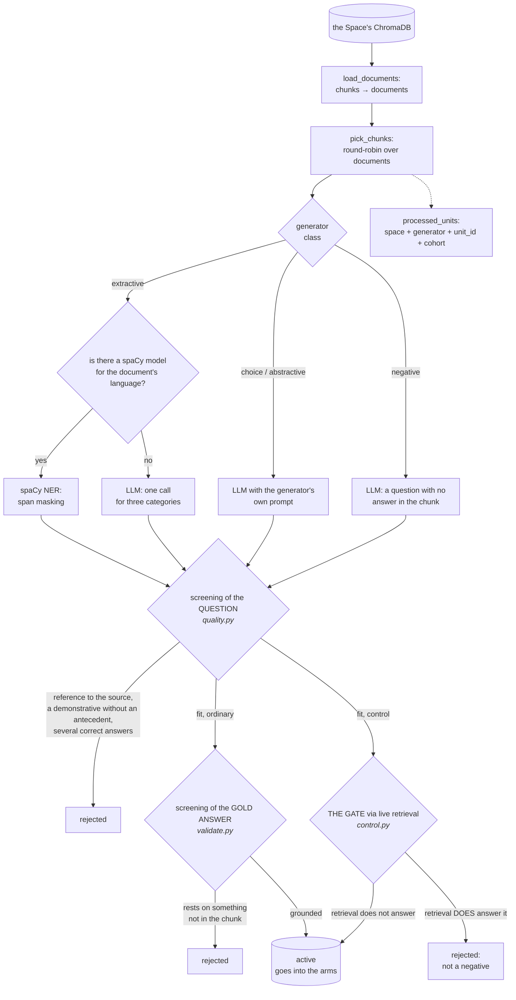

# Stage 2. Building the set

```bash
uv run syft-benchmark generators                   # the line-up and the settings
uv run syft-benchmark generate docs                # all but the disabled ones
uv run syft-benchmark generate docs -g qa -g mcq   # by name
uv run syft-benchmark generate docs --limit 2      # 2 units per EACH generator
```

The dataset is built by ten generators over chunks and documents from the
Space's index. Here: what they build, how the unfit is screened out, and what
configures it.

Which part of what is built goes into the measurement and stays in it is a
separate stage, [03-dataset.md](03-dataset.md).

---

## The two halves of the set

**Eight answerable ones.** Seven are carried over from the LiveTruth project
(`honest-agi-live`, phase 2); the eighth is an addition of ours. Each asks a
question in its own way, and together they test different properties of the
endpoint: one measures the accuracy of extracting a fact, another the ability
to connect two facts, a third resistance to plausible falsehood. The answer to
such a question is in the corpus by construction — the item was made out of a
chunk, after all.

**Two control ones.** There is NO answer to them in the corpus. Without them
the dataset measures half of the behaviour: what the pair does when there is no
answer is not measured at all — and that is the most frequent question a live
user asks and the most dangerous trap in RAG. At a similarity threshold of
`0.0` retrieval is obliged to return top-k for ANY question, which means the
endpoint's model receives an authoritative, topically relevant context that
contains no answer. Hence the typical failure: **an invention assembled out of
real quotations and looking as if it were backed by references**.

| Generator | Class | Scope | Judging | What builds it |
| --- | --- | --- | --- | --- |
| `named_entity_masking` | extractive | chunk | judge | spaCy or LLM |
| `numeric_masking` | extractive | chunk | judge | spaCy or LLM |
| `temporal_masking` | extractive | chunk | judge | spaCy or LLM |
| `mcq` | choice | chunk | by the letter | LLM |
| `two_truths_one_lie` | choice | chunk | by the letter | LLM |
| `multihop_synthesis` | abstractive | document | judge | LLM |
| `tiered_explanation` | abstractive | document | by the facts | LLM |
| `qa` | abstractive | chunk | judge | LLM |
| `unanswerable_property` | negative | chunk | by behaviour | LLM + gate |
| `false_premise` | negative | chunk | judge | LLM + gate |

**Scope** is what is fed in. This is not a performance setting: you cannot
connect two facts or lay out the core of a topic from a single paragraph — such
items degenerate into paraphrase at chunk scope.

**Judging** is what the answer is measured by; in detail in
[05-judging.md](05-judging.md). `by the letter` needs no model at all; `by the
facts` checks a list of claims rather than a text match; `by behaviour` also
does without a model — where no correct answer exists, there is nothing to
judge.

**Why all ten are on by default.** A dataset of items of a single shape
measures a single property, while the endpoint's card carries a single number:
that number has to be computed over different shapes, otherwise it describes
not the endpoint but the way of asking. Choosing on the owner's behalf which
property of their endpoint is uninteresting is the wrong default. The two
control ones are not "one more shape" but the second half of the behaviour, and
switching them off means deliberately not measuring it.

---

## Extractive: span masking

Three generators of one shape. A sentence is taken, one span is replaced with
`______`, and the span itself becomes the gold answer.

```
Fill in the blank: In-cluster it authenticates as the chart's ______.
Answer: ServiceAccount
```

| Generator | What it masks |
| --- | --- |
| `named_entity_masking` | people, organisations, products, components, places, events |
| `numeric_masking` | amounts, percentages, counters, sizes, port numbers, versions |
| `temporal_masking` | dates, years, durations, deadlines |

**Why this class is valuable.** The gold answer cannot be invented: it is cut
out of the text, not composed. These are the only items where the generator
cannot lie, and gold-answer screening passes trivially on them.

**Two construction paths**, chosen automatically and per document:

* **spaCy** — named entity recognition. Deterministic, without a single call to
  a model, dozens of items in seconds. Requires an installed model for the
  document's language.
* **LLM** — one call for all three categories at once. Any language, but the
  gold answer is once again produced by a model.

| `extractive_mode` | What it does |
| --- | --- |
| `auto` (default) | if there is a spaCy model for the document's language we go through it, otherwise through the LLM. **Nothing needs configuring**, the corpus may be mixed by language |
| `spacy` | spaCy only; documents in languages without a model are skipped. Makes sense when reproducibility matters |
| `llm` | LLM only; one path for any language, spaCy not needed at all |

The language is determined from the function words spaCy carries around for
each language. A separate detector is not required: the question asked is not
"what language is this at all" but "does the text look like one of those we
have a model for".

**Filters that are not in the original.** LiveTruth worked over news prose; our
corpus is technical documentation. Two differences had to be accounted for:

1. **Markup is not masked.** Code blocks, tables and the arrows of mermaid
   diagrams are taken for sentences by the sentence segmenter. Masking `Bearer`
   inside an example request is meaningless: what gets tested is not knowledge
   of the corpus but the ability to guess the syntax.
2. **The shape of the gold answer is checked.** The entity recogniser was
   trained on news and makes mistakes on technical texts: `+ vector` arrives
   labelled `DATE`. A span containing punctuation and operators is screened
   out.

---

## Choice: the answer is picked from options

These are judged by matching the letter — a judge model is not needed and would
only add noise.

**`mcq`** — four options, one correct, three plausibly incorrect.

**`two_truths_one_lie`** — three statements about a subject, one of which is
false: a specific detail in it has been altered — a number, a name, a setting,
an outcome. The item answers a question ordinary QA does not ask: **does the
endpoint tell truth from plausible falsehood**. The self-sufficiency
requirement is applied to statements just as it is to questions: "this
solution" inside a statement is unreadable out of context.

**The layout of the options is shuffled** deterministically from the question's
text, and the seed is written into `meta`. Otherwise the lie in "two truths"
would always sit in the position the generator chose, and a correct answer in
arm A would mean not that the corpus is public but that it coincided with the
generator's favourite letter.

---

## Abstractive: they demand understanding

**`multihop_synthesis`** — a question that cannot be answered knowing a single
paragraph: it takes connecting at least two facts from different places in the
document. For a RAG endpoint this is the harshest test — retrieval has to
return **two different** chunks, not one suitable chunk. The item is screened
out if the generator listed fewer than two facts in the link: then it is an
ordinary question, and it has no place in multihop.

**`tiered_explanation`** — one topic, three explanations of differing
difficulty: `eli5`, `eli10`, `eli18`. It is judged **by key facts**, not by
text match, and that is a departure from the original: an explanation for a
five-year-old is obliged to use words that are not in the source — that is the
point of it. Comparing such prose against a reference would mean punishing the
wording. So the generator lists the facts the explanation rests on, and the
judge checks how many of them are covered. In LiveTruth, BLEU, ROUGE and
BERTScore were added for open-ended items; we do not carry those into judging —
checking the facts is fairer and drags in no dependencies.

**`qa`** — a free-form question with a short answer. **Our addition, not in
LiveTruth**: there, knowledge of paid content was being tested, whereas we also
need the ordinary shape in which a real storefront user comes to the endpoint.

---

## The control set: there is NO answer in the corpus

**`unanswerable_property`** — a question about a subject that is named in the
chunk, but about a property that is not there: "what port does X use", where X
is described but the port is nowhere stated.

The negative is deliberately **near**, not unrelated. A question about the
capital of France would only catch an outright crude failure; a question about
a neighbouring property of a real component catches exactly the case the set
was created for.

It is judged **by behaviour**, and the judge is not called at all: no correct
answer exists, so abstaining is the right behaviour and any answer is an
invention. A hedge of "I don't know, but most likely X" counts as an answer: it
is a guess.

**`false_premise`** — a question whose premise contradicts the source: "why did
the hub move to SQLite" when it is on PostgreSQL. The right behaviour here is
**not abstention but correction**: "there was no such move, the metadata is in
PostgreSQL". So the item has a real gold answer and an ordinary judge — an
abstention is catchable with regexes, a correction is not. What is checked
against the chunk is not the gold answer itself (it is reworded) but the
grounds that make the premise false — as with "two truths and a lie".

The two halves of the control set **ask for opposite things** — stay silent
versus refute — and the report counts them separately.

---

## The pipeline and the double screening



### Screening the questions: can this be asked apart from the source

During testing the answerer sees only the question — without the chunk — and a
question of the form "according to the text..." or "this statement" is useless.
Every rule in `quality.py` appeared after analysing a specific pair that was
spoiling the metrics: the endpoint answered correctly and the benchmark scored
it a miss. So in the code an explanation stands beside every rule — without it
the next reader will take the rule for over-caution and remove it.

The rules depend on the item's class, and that is a condition of the thing
working, not a convenience: a masked sentence is a phrase from the document, in
which pronouns legitimately appear because the antecedent is right next to the
mask. Running it through the rules for a free-form question would mean killing
off almost all masking.

| Class | What is checked |
| --- | --- |
| `extractive` | the mask is in place, the sentence is not a stub |
| `abstractive` | self-sufficiency **and** unambiguity |
| `choice` / `statement` | self-sufficiency only: the options are unambiguous on their own |
| `negative` | as for abstractive: a control question is asked the same way |

### Screening the gold answers: does the answer rest on the source

The generator writes the gold answer with the chunk in front of it, and usually
copies it from there — but sometimes fills in from memory: adds a year, a job
title, the name of a DBMS. Such a gold answer understates a good endpoint's
score **silently**: the metrics are simply lower than they should be, and there
is nothing to point at.

The check is lexical rather than model-based, and that is deliberate: it is
cheap (there are thousands of gold answers), deterministic, and measures
exactly what is needed. The coverage threshold for content words is
`answer_coverage_threshold`, 0.6 by default; short gold answers ("47",
"Alembic", "2026-09-08") are not measured by coverage at all — the word is
either there or invented.

Where the gold answer is **obliged** to differ from the text — the reworded
explanation of `tiered_explanation`, the false statement in
`two_truths_one_lie` — what is checked is not the answer but the facts the
generator listed (`review_claims`).

It has already paid for itself on a live corpus: it caught the gold answer "the
FastAPI backend runs on SQLite" (the hub is on PostgreSQL) and an entirely
invented explanation in which a 4B model decided that OMSyft was a medical
device with an ECG.

Screened-out items are **not deleted**: they are material for tuning prompts,
not rubbish. Such an item never comes back — unlike `retired`, see
[03-dataset.md](03-dataset.md).

### The gate for control questions: without it the set is more dangerous than its absence

For control items the grounding check is **replaced by its opposite**: they
have no gold answer by construction, and running them through grounding would
mean cutting out the whole set.

A generated negative is only the model's **conjecture** about what is not in
the corpus. A conjecture can be wrong: **the generator sees ONE chunk, while
retrieval searches the whole collection**, and the answer may well lie in a
neighbouring document. Letting such a question into the measurement means
recording a correct answer as a hallucination.

So a candidate goes through a check: the question is put to **the live
retrieval of that very endpoint**, and a judge decides whether among what was
found there is a chunk that answers it.

Three decisions, each of which changes the meaning of the check:

* **It is the live retrieval of that very endpoint that is asked.** The label
  "there is no answer" is only meaningful relative to a specific endpoint, not
  to an abstract corpus. This is a definition, not a simplification: that same
  retrieval is exactly what is measured afterwards.
* **A judge decides, not the generator.** There is no reason for the generator
  to judge its own work.
* **Unknown is not fit.** If retrieval is unreachable or the gate did not run,
  the candidate goes to screening with an explicit note: a question about which
  one cannot say whether it is answerable does not go into the measurement.

Hence the corollary: **generating control questions requires a reachable
endpoint**. Without one, both control generators run to no effect, and this is
said out loud.

---

## Generation settings

### Choosing the generators

| Setting | Default | What it does |
| --- | --- | --- |
| `disabled_generators` | `[]` | Which generators not to run |
| `answer_coverage_threshold` | `0.6` | The share of the gold answer's content words that is looked for in the chunk |

```bash
uv run syft-benchmark settings set disabled_generators   '["multihop_synthesis","tiered_explanation"]'
```

A single run's line-up can also be set on the spot, on top of the setting:

```bash
uv run syft-benchmark generate docs                    # all but the disabled ones
uv run syft-benchmark generate docs -g mcq -g qa       # by name
uv run syft-benchmark generate docs --all              # all, bypassing the setting
```

If the setting has disabled everything, `generate` does not start the run and
says so: an empty run that finished silently is worse than an error.

Switching off the two control generators should be understood as a decision not
to measure half of the behaviour:

```bash
uv run syft-benchmark settings set disabled_generators   '["unanswerable_property","false_premise"]'
```

### The volume of generation

| Setting | Default | What it does |
| --- | --- | --- |
| `chunks_per_run` | `8` | How many units to take per EACH generator per run |
| `pairs_per_chunk` | `2` | How many items to ask for per unit |
| `min_chunk_chars` | `400` | Shorter than this and a chunk is not taken into work |

**Each generator has its own queue.** What has been processed is marked in
`processed_units` together with the generator and the cohort, so one and the
same chunk is handed to each generator separately. A shared batch would mean
that a generator connected second skips what the first processed and spends
model calls on certain duplicates.

Hence the arithmetic of a run: eight units across ten generators at two items
each — up to 160 items, not 8 and not 16. That is an upper bound: screening
carries part of it away.

`--limit` does not cancel the setting but replaces it with the same meaning:

```bash
uv run syft-benchmark generate docs --limit 3   # 3 units per generator
```

These are **units, not items and not percentages**: how many items come out of
a unit is decided by `pairs_per_chunk` and by screening. The same flag at
the evaluation stage counts differently — there it is about items, and also per
generator; the arithmetic is in [03-dataset.md](03-dataset.md).

---

## What is worth knowing before the first run

**Start with `--limit 2`.** That is about forty candidates at generation and
twenty questions at run time — enough to see a working pipeline across every
kind of item, and cheap if it does not work.

**The extractive ones are almost free.** With spaCy they do not call a model at
all: dozens of items in seconds, and all of them pass screening. It is
reasonable to start with those.

**The document-level generators are heavy for a small model.**
`multihop_synthesis` and `tiered_explanation` receive the whole document, and a
4B model breaks down into invention at that volume. Screening catches it, but
the time has been spent. A larger model makes sense for them — set with the
same `generator_model`.

**The price of completeness is time.** If time is dearer than completeness, the
most sensible things to switch off are precisely those two document-level ones.
The extractive ones with spaCy cost almost nothing and stay on in any case.

Next — [stage 3: which set goes into the measurement](03-dataset.md).
