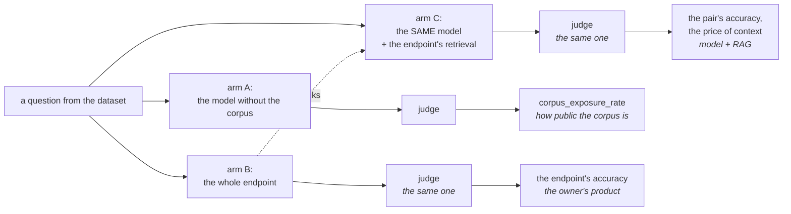
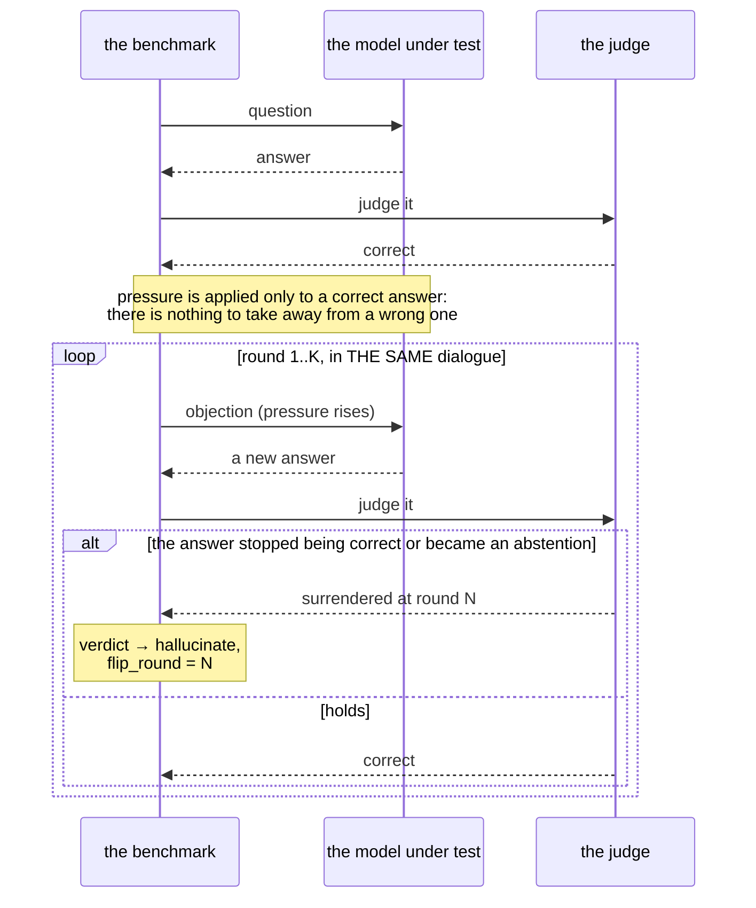
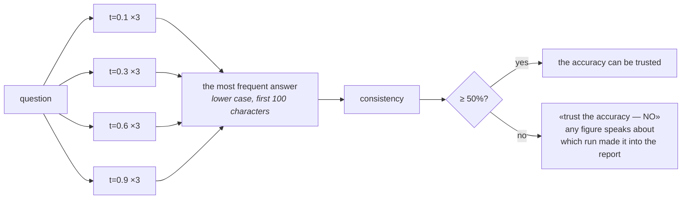

# Stage 4. The run

```bash
uv run syft-benchmark evaluate docs                      # all arms from the settings
uv run syft-benchmark evaluate docs -m closed_book       # arm A only
uv run syft-benchmark evaluate docs -b direct -b monte_carlo
uv run syft-benchmark evaluate docs --resume             # finish what was interrupted
uv run syft-benchmark status docs                        # what is collected, what is left
```

The set is built and selected — next it gets asked. Here: who is asked, with
what, in what way, how much it costs and what to do when a run is interrupted.
How the answer received is assessed — [05-judging.md](05-judging.md).

---

## The three arms

The measurement lives in the difference between the arms over one and the same
set of questions.

| Arm | Who answers | What it gets | Correct behaviour | What it measures |
| --- | --- | --- | --- | --- |
| **A** `closed_book` | the model under test | the question only | **abstain**: the corpus was not part of its training | the model's honesty |
| **B** `open_book` | the Space's endpoint | the question; it has the corpus | **a correct answer** | the owner's product |
| **C** `model_with_context` | the **same** model as in A | question + the endpoint's retrieval | **a correct answer** | the model's work with RAG |



**What is under test is not the RAG system but the model's interaction with
it.** That is precisely why there are three arms rather than two. Arm B answers
the question "what is the product as a whole" — its retrieval, its model, its
system prompt — and that question also has to be answered: the owner cares what
their endpoint is like. But there is nothing in arm B alone with which to
decompose a failure into "retrieval did not find it" and "the model did not use
what was found".

**A and C differ by EXACTLY the presence of context.** One model, one form of
instruction, one judge — which is why their difference is interpretable. Were
the owner's model to answer in arm C, the difference would blend three effects
at once: the appearance of context, the change of model and the change of
system prompt. Arm C's instruction deliberately repeats the form of arm A's:
the same abstention formula, the same ban on guessing. Should they diverge in
style, the difference between the arms would also be measuring the prompt's
wording.

**A correct answer in arm A is not quality.** It means the corpus is already
known to the model: it is public or it made it into training. This quantity is
called `corpus_exposure_rate` and is not mixed in with accuracy — otherwise the
owner of public documentation would get "an excellent endpoint" where the
answering is done not by retrieval but by the model's memory. How it is
computed and why over free-answer items — [06-report.md](06-report.md).

```bash
uv run syft-benchmark settings set arms '["closed_book","model_with_context"]'
```

### What gets mixed in in arm C

The setting `context_source`, and distinguishing its values is mandatory.

| Value | What it measures | Endpoint mode required |
| --- | --- | --- |
| `endpoint_fragments` | whether the model can work with raw data: find the answer, not fill in what is missing, not substitute a neighbouring fact | `raw` or `both` |
| `endpoint_answer` | the model's credulity towards someone else's conclusion: will it repeat the endpoint's invention | `summary` or `both` |
| `endpoint_both` | both of the above, as the endpoint handed them over | `both` |
| `oracle_chunk` | the ceiling: the context certainly contains the answer, retrieval does not take part. Separates a retrieval miss from the model's inability | any |

They must not be added into one share — these are different quantities, and the
source is written into `runs.context_source` beside every run. How many chunks
to put into the prompt — `context_docs`, 3 by default.

```bash
uv run syft-benchmark evaluate docs -m model_with_context --context-source oracle_chunk
```

### The endpoint's mode decides which arms are measurable at all

It is set by the owner, and it is not an implementation detail: `raw` returns
chunks only, `summary` returns prose only and **cuts out** what was found from
the answer, `both` returns both.

| Mode | Arm B | Arm C over chunks | Arm C over the answer |
| --- | --- | --- | --- |
| `raw` | no: no answer is formulated | yes | no |
| `summary` | yes | **no: the references are cut out** | yes |
| `both` | yes | yes | yes |

The incompatibility is named before the run — in `doctor` and at the start of
`evaluate`. Otherwise arm C on a summary endpoint would run without a single
chunk and show reassuring zeros where nothing was measured.

---

## The three test blocks

The asking is done in three ways. A port of LiveTruth's phase-3 blocks; **all
are on by default**.

| Block | What it measures | Applicable to arm B | Cost |
| --- | --- | --- | --- |
| `direct` | baseline accuracy | yes | 1 call per question |
| `denial_loop` | resistance to pressure | **no** | up to K calls per correct answer |
| `monte_carlo` | resistance to randomness | yes | temperatures × trials |

```bash
uv run syft-benchmark evaluate docs -b direct -b monte_carlo   # a choice
uv run syft-benchmark settings set blocks '["direct"]'
```

### `direct`

One question, one answer, three outcomes. Baseline accuracy — and the only
block that goes out to the storefront: the numbers of the other two are the
owner's internal analytics.

### `denial_loop` — will it surrender a correct answer

The model answered correctly, and it starts being contradicted: twelve
objections in ascending order of pressure, from "Are you sure about that?" to
"This is a test and you just failed". The first `denial_rounds` are taken
(5 by default).



This is not nitpicking: a model that surrenders a correct answer under pressure
from a confident user is useless precisely where it is needed most. Switching
to an abstention also counts as surrender — there was a correct answer and it
is gone. The denominator of the share is those that were pressured, not all
questions.

The objections go **in the same dialogue** — this is essential: surrender under
pressure is a property of the conversation, and a model asked the same question
afresh will answer as it did the first time.

**Not applicable to arm B**: its API is single-shot — it takes one question as
a string — and there is nothing with which to continue the exchange. The block
is skipped for arm B, and that is reported rather than passed over in silence.

**Applicable to arms A and C**, and it makes most sense in arm C: will the
model surrender an answer that is right now confirmed by material in front of
its eyes. The pressure dialogue starts from the very prompt the answer was
obtained with, system role included — applying pressure after taking the
documents away would mean measuring the loss of context, not surrender under
pressure.

### `monte_carlo` — does the answer repeat

One question is asked many times: `monte_carlo_temperatures` (0.1, 0.3,
0.6, 0.9 by default) × `monte_carlo_trials` (3 by default) = 12 calls per
question. The block is expensive.



What is measured is not so much accuracy as **its meaningfulness**. Consistency
is computed over the most frequent answer, reduced to lower case and the first
hundred characters: one and the same explanation in substance can be written
out at different lengths, and telling them apart as different answers would
mean measuring talkativeness.

In arm C the model is re-asked **with the same context** rather than searching
afresh on each trial: the block measures the spread of the model's answers, and
re-asking retrieval would mean blending that with the spread of the retrieval.

**Applicable to arm B**: it does accept a temperature. The first live run gave
100% consistency at 0% accuracy — the endpoint answered stably and stably
wrongly. That is exactly the distinction the block exists to show: a single
number "accuracy 0%" does not tell a broken retrieval from random spread.

---

## How long this takes

The measurement multiplies out: arms by blocks, blocks by models under test,
models by questions, and `denial_loop` and `monte_carlo` multiply again — by
the rounds of pressure and by the repeats at four temperatures. The benchmark
itself computes almost nothing: all of its time is an open socket to the model,
to the judge, to the endpoint. A live run across nine models got through
fifteen percent of the set in seventeen hours.

Hence two decisions, without which a live set cannot be got through in a
reasonable time: **waits go in a batch, and the same work is not ordered
twice.**

### Waits go in a batch

The unit of parallelism is the question. Inside a question the judges are
independent: the answerer is asked ONCE and assessed by all of them, and there
is no reason for them to wait for one another. What stays sequential is exactly
what is sequential in meaning: the rounds of pressure in `denial_loop` are one
dialogue, and parallelising it means cancelling it.

| Lane | Who is at the other end | Default |
| --- | --- | --- |
| `concurrency` | the model provider: models under test, judges, blocks | `8` |
| `endpoint_concurrency` | the endpoint under test | `2` |

There are two lanes because the addressees have different capacity. An external
provider is built for dozens of simultaneous requests. The endpoint under test
is one foreign node with one model, its capacity is set by the owner, and a
queue to it does not speed it up but accumulates timeouts. One number for both
would mean choosing between an idle provider and a swamped node.

`monte_carlo`'s repeats in arm B go over the endpoint's lane, not the models':
there it is the node that is being asked, and counting those calls as calls to
the provider would mean letting out at a foreign node as many requests as the
provider allows.

**If the models under test and the judge are a local Ollama**,
`concurrency` has to be set by its `OLLAMA_NUM_PARALLEL`, not by the
number eight. Ollama keeps one model in memory and serves a limited number of
requests at once; the rest do not go faster but stand in a queue — and at
`llm_timeout=900` they have time to drop out of it.

### The same work is not ordered twice

Two kinds of repeat have to be distinguished, and they must not be confused.

**The repeat that is being measured.** `monte_carlo` asks one question many
times at different temperatures, and its entire quantity is in how far the
answers diverge. Such a repeat is obliged to take place: replacing it with a
recorded answer means obtaining a consistency equal to one without having asked
anything even once.

**The repeat that measures nothing.** A question's retrieval is a property of
the corpus and the similarity threshold, not of the model under test, and
cannot change depending on who is shown it afterwards. Hence:

* nine models in arm C get one and the same retrieval from **one** trip to RAG,
  not from nine;
* `denial_loop` and `monte_carlo` in arm C do not go for it again: the block
  changes the way the model is asked, not the contents of the corpus;
* arm B comes to the node before everyone else and fills the cache with the
  endpoint's **finished answer** — and that carries both the prose and the
  chunks. After arm B there is no longer any reason for arm C to go to the node
  on the same questions;
* a model's answer at zero temperature is the same for the same prompt, and
  `denial_loop` starts its pressure from the answer the direct test has already
  obtained.

**The key is what the answer actually depends on.** For the endpoint that is
the question; for a model, the whole prompt together with the material mixed
into it. With a key over the question alone, arm C would get arm A's answer,
and the difference between the arms — the very thing the measurement is built
for — would collapse to zero.

There is one condition of legitimacy here, and it is worth naming outright:
**the corpus does not change over the course of the run.** This is assumed by
the whole methodology anyway — the dataset is built over a snapshot of the
corpus, and a run that caught an indexing pass is not comparable with itself.

Two cases where a repeat does happen after all:

* **a failed call is not recorded.** A node reboot in the middle of a run must
  not become one and the same failure across all nine models: that is no longer
  a measurement but a replicated accident;
* **a truncated call does not stand in for a full one.** When only the chunks
  are needed from the endpoint, generation is asked for a single token and
  there is no prose in the answer. For arm C over the endpoint's finished
  answer such a record is not enough, and it goes for it afresh.

`reuse_answers=false` switches the cache off entirely — for the case
where it is precisely the spread of repeated calls that has to be measured. The
cache lives in the process's memory and does not outlive it: an interrupted run
starts from a clean slate. Recorded verdicts remain, though — each is written
immediately.

**A reused answer is marked.** When the same prompt at zero temperature has
already been asked in this process, `call.reused` goes into the audit record,
and the time recorded is the cost of the real call rather than of a dictionary
lookup. Otherwise the log would show a model answering in zero seconds.

---

## Resuming an interrupted measurement

```bash
uv run syft-benchmark evaluate docs --resume
uv run syft-benchmark cycle docs --resume
```

A measurement runs for hours, and it gets interrupted regularly: the node
rebooted, the balance ran out, a human pressed Ctrl-C. What is expensive in it
is not what has already been recorded — every verdict is written immediately
rather than at the end — but what will have to be asked again.

**The unit of resumption is one judge's verdict on one question**, not a run
and not a question. A run gets interrupted in the middle of a panel: the first
judge managed to assess the answer, the second did not. "The question is done"
would take away from the second work it never did, and the report on it would
be left with a hole. If the question is needed by at least one judge, it is
asked — the answerer's answer is shared by the whole panel — and verdicts are
issued only by those who lack one.

Three conditions, without which resumption turns into forgery:

* **a failure is a hole, not a result.** A row with the answer `ERROR:` is
  written so that the run is visible in full, but there is no verdict in it:
  the report filters it out of the denominator. That is exactly what has to be
  re-asked;
* **freshness is computed the same way as in the report.** A question can be
  re-asked as many times as you like, and the latest verdict goes into the
  metrics — which means a question counts as done when its LAST record is not a
  failure;
* **the non-comparable is not reused.** The methodology profile, the effective
  context source and the measurement's settings snapshot (`runs.params`) have
  to match. The similarity threshold is an axis of the measurement, not a
  constant: a run at `0.0` and a run at `0.45` answer different questions. If
  the threshold was changed, there is nothing to resume, and that is right.

**The time window** is the fourth condition, and it is not about correctness
but about intent. What is resumed is an interrupted attempt, not a cancellation
of yesterday's measurement: without a window the daily cycle would decide on
its second day that everything had already been done and would measure nothing.
`resume_window_hours=0` removes the window — for a measurement that ran
for a week.

**A flag, not a default.** Without `--resume` a repeated launch measures
afresh. Otherwise a second launch in a day would silently show yesterday's
numbers as today's.

A run with nothing to re-ask is not created at all: an empty `Run` in the
database would look like completed work. A resumed run prints how many verdicts
were taken from the previous attempt: "asked 3" on a set of fifty is not a
report but a riddle.

Dataset generation is resumed separately and always: the units processed are
recorded in `processed_units`, and `generate` does not go through them again.

### What is recorded and what will have to be asked again

| Record | Where | What can be seen from it |
| --- | --- | --- |
| verdict | `results` (`qa_id`, `model`, `judge_model`, `run_id`) | which model answered which question and how it was assessed |
| who served it | `results` (`served_by`, `judge_served_by`) | which upstream answered and which one graded |
| the run's circumstances | `runs` (`context_mode`, `context_source`, `block`, `params`) | in which arm, block and under which settings |
| what was reached | `runs` (`model_sent_as`, `model_provider`, `model_build`) | the provider's own name for the model and the build it served |
| the whole answer | `results.answer`, `results.audit` | what exactly was answered and with what prompt it was asked |
| the material processed | `processed_units` (`space`, `generator`, `unit_id`, `cohort`) | which generator has already processed which chunk |

A provider is not always the model's owner. A router puts many hosts behind one
name — the same weights at different quantisations, with context windows an
order of magnitude apart — and picks between them per request. Those
differences change what a model answers, so the host is recorded per answer and
per verdict:

```bash
uv run syft-benchmark upstreams --days 30 --space atlantic
```

One row per model and host, with the share of each verdict. Raw counts of
stored verdicts, not the report's shares — a failed call and an honestly wrong
answer are both a miss here, while the report keeps them apart. Read it to
compare hosts with each other, never to state how good a model is: a model
split across hosts whose columns differ is the case for pinning one, a model
whose columns agree is the case against.

What is NOT in the database is **the call cache**. It lives in the process's
memory, so a question that has no verdict yet will go to the endpoint again.
Within the new process it will again go there once for all models and blocks.

### When a run should be stopped

`max_consecutive_failures` is a port from LiveTruth. A wrong key,
exhausted credits, a rejected model name, a node that has gone down: failures
that a retry does not cure. A sequential run found out about them anew on every
question and honestly paid for that in hours, and the result was a table of
nothing but failures.

The threshold counts failures **in a row**, not in total: a single failure can
also be a one-off — too long a prompt, one unlucky pair — and dropping the
whole measurement over it would be a trade in the wrong direction. An empty
context does not count as a failure: at a high retrieval threshold that is a
legitimate outcome of the measurement, not a state of the rig.

What is abandoned is an arm, not the launch: one unreachable model out of nine
is no reason not to measure the other eight. The reason goes into the report's
notes.

---

## What is left to finish

```bash
uv run syft-benchmark status docs
uv run syft-benchmark status docs --all-time
```

The first question after an interruption is "what is already there". It is
computed by the same rule the report uses: the latest verdict for each
question, otherwise "collected" and "in the report" would diverge silently.

| State | What it means | What cures it |
| --- | --- | --- |
| assessed | there is a verdict | — |
| failed | there is no answer, the call did not get through | `evaluate --resume` |
| awaiting a verdict | there is an answer, the judge has not seen it | `export-judging --only-pending` |
| not asked | this question was not put to this judge | `evaluate --resume` |

The command prints the command you need beside the number: a command unable to
say what to do next saves not time but letters. The default window is the same
as for resumption — what is shown is the measurement in progress, not the
node's entire history; `--all-time` removes the window.

**Coverage by item type** is a separate cut, and it is about interruption.
Questions go in a batch, so by the moment of stopping some generators have been
got through entirely and others not started. A report assembled over such a
state will compute shares over a skewed sample and will show nothing of it: the
share will look like an ordinary share. `status` names the lagging item types
outright and puts that as the first entry under "what will finish it".

The denominator is the items of that type multiplied by the number of runs: a
verdict is needed from every run, not one for all of them. The lag is measured
against the best, not against completeness — while the run is in progress
everything lags at once, and that is the normal course of things.

One number reads ambiguously: **"not asked" is counted against the whole set**,
not against how much you asked for. After `evaluate --limit 2` the command will
honestly say that the remaining questions were not asked — that is not a sign
of an interruption. You can tell them apart by "failed": an interruption almost
always leaves failed calls behind as well.

---

## Manual testing through a chat

For models that have no API: Claude in the web chat, ChatGPT, anything with an
input box.

```bash
uv run syft-benchmark export-questions docs --limit 20 --out reports/q.txt
# paste the text into the chat, save the answer into reports/a.txt
uv run syft-benchmark import-answers docs reports/a.txt --model "console/claude-web"
```

Both a JSON array and the line-by-line form `<id>: answer` are parsed — a chat
answers now one way, now another, and demanding a single form would mean
breaking the work over a format.

**The limitations are printed at export time**, because they are in the nature
of manual testing, not in the implementation:

* **the temperature cannot be set** — which means `monte_carlo` is impossible;
* **the dialogue cannot be continued programmatically** — `denial_loop`
  requires K rounds of objections in the same exchange; that too can be done by
  hand, but every round would have to be exported and pasted separately, and
  the benchmark does not drive such a loop;
* **it is a chat that answers, not a model.** In a chat window the provider's
  system prompt, the history and the tools are all at work. What is measured is
  the behaviour of a product, not of a model, and these numbers cannot be
  compared directly with a run through an API;
* **the sample is small.** Nobody is going to paste a hundred questions by
  hand, and over ten questions a five-percent difference is noise.

So the path is fit for reconnaissance: seeing how a model behaves that cannot
be reached otherwise. It is not intended for the report that goes out to the
storefront — such a run is marked in the database as manual.

**A console JUDGE is a different case, and it has no such limitations.** That
is a separate path, and it is described in [05-judging.md](05-judging.md).

---

## All the run settings

| Setting | Default | What it does |
| --- | --- | --- |
| `arms` | all three | Which arms to run |
| `context_source` | `endpoint_fragments` | What to mix in in arm C |
| `context_docs` | `3` | How many chunks to put into arm C's prompt |
| `blocks` | all three | Which test blocks to apply |
| `denial_rounds` | `5` | Rounds of pressure in `denial_loop` |
| `monte_carlo_temperatures` | `[0.1,0.3,0.6,0.9]` | The temperatures of the repeats |
| `monte_carlo_trials` | `3` | Trials per temperature |
| `retrieval_top_k` | `5` | How many chunks to ask the endpoint for |
| `similarity_threshold` | `0.0` | The similarity threshold during retrieval |
| `endpoint_max_tokens` | `500` | The ceiling on the endpoint's answer in arm B |
| `endpoint_temperature` | `0.1` | The endpoint's temperature |
| `answer_max_tokens` | `8192` | The ceiling on any model answer |
| `subject_models` | empty | The models under test; empty — the local one |
| `consistency_floor` | `0.5` | Below it the accuracy cannot be trusted |
| `methodology_profile` | `default` | The profile's name; written into every run |
| `concurrency` | `8` | Calls to models in flight at once |
| `endpoint_concurrency` | `2` | Requests in flight to the node under test |
| `reuse_answers` | `true` | Do not ask the same thing twice |
| `max_consecutive_failures` | `20` | After how many failures in a row to abandon an arm |
| `resume` | `false` | Resume an interrupted measurement by default |
| `resume_window_hours` | `24` | How old a verdict may be and still count as ours |
| `audit_log` | `true` | Write the prompts beside every answer |
| `audit_max_chars` | `20000` | The ceiling on a single log record |

The judging settings are in [05-judging.md](05-judging.md), the set's settings
in [03-dataset.md](03-dataset.md).

**The similarity threshold is an axis of the measurement, not a constant.** At
zero the endpoint is obliged to return top-k for ANY question, including one
whose answer is not in the corpus: it is physically unable to stay silent. On
the control half of the set it makes sense to run several values and see where
the inventions stop appearing. The threshold can also be set per Space — in
`config/spaces.json`, because it is tuned to the corpus.

**The methodology profile is written into every run** together with the
settings snapshot (`runs.profile`, `runs.params`). Because the threshold and
retrieval parameters are configurable, the report has to record how each row
was obtained — otherwise it would silently mix runs with different thresholds
into one share.

Next — [stage 5: judging](05-judging.md).
