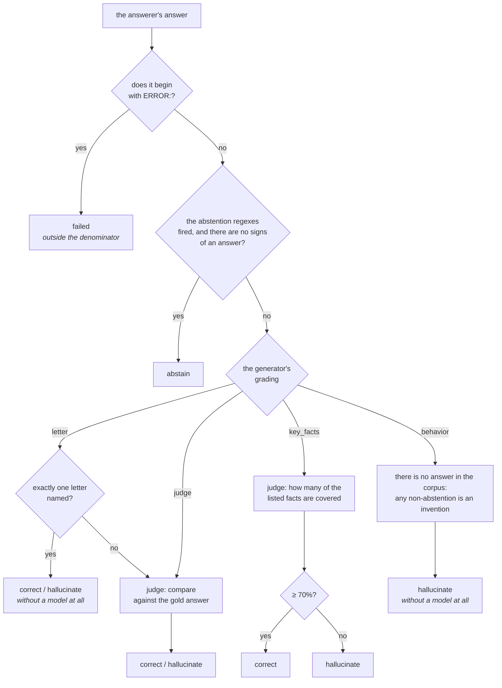
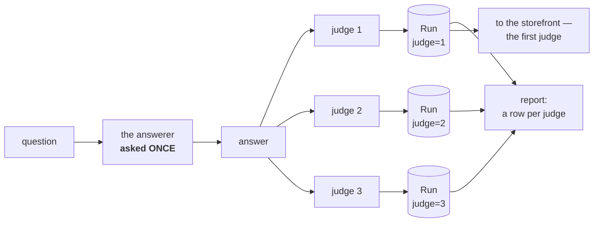

# Stage 5. Judging

The answer has been obtained — next it has to be reduced to an outcome.
Normally that happens inside `evaluate` and is not a separate command; what is
done by separate commands is judging without an API and deferred judging, with
which the expensive half of the measurement is separated from the cheap one.

```bash
uv run syft-benchmark evaluate docs --defer-judging       # answers only
uv run syft-benchmark export-judging docs --judge claude-console --only-pending
uv run syft-benchmark import-judging docs --judge claude-console --verdicts v.json
```

---

## Three outcomes, not a score

The judge reduces any answer to one of three:

* `correct` — answered to the substance of the gold answer;
* `abstain` — honestly said it did not know;
* `hallucinate` — answered confidently and wide of the mark.

**Abstention is separated from a miss deliberately.** A model that says "I
don't know" about a corpus it does not know is behaving correctly; a model that
confidently invents about the same corpus is dangerous. Their average score
might coincide — which is why there is no score, but three shares.

**A verdict is stored as BEHAVIOUR, not as an assessment of correctness.** On a
question whose answer is not in the corpus, an abstention is recorded as
`abstain` — and it is the report that knows this is the correct behaviour here.
The difference is not formal: this way a change of methodology does not require
a re-run, and the interpretation lives in the report rather than being stamped
into the stored verdict.

Alongside the three outcomes there are two states that are not outcomes:

* **`failed`** — a call that did not go through. It speaks about the rig, not
  about the quality of the answers, and does not go into the metrics'
  denominator;
* **`pending`** — there is an answer, the judge has not seen it. It does not
  enter the shares, is shown on a separate line in the report, and in `status`
  as a separate state with its own remedy. An answer without a verdict can
  neither be thrown away silently nor recorded as an outcome nobody issued.

---

## What an answer is judged by

The judging method is set by the generator, and this saves both calls and
accuracy.



**By the letter** (`mcq`, `two_truths_one_lie`) — a judge model is not needed
and would only add noise. The endpoint answers in prose ("The correct answer is
C) Three"), so we look for the letter across the whole text; if several
different letters are named, they cannot be decided on — the question goes to
the judge.

**By the facts** (`tiered_explanation`) — because an explanation for a
five-year-old is **obliged** to use words that are not in the source: that is
the point of it. Comparing such prose against a reference would mean punishing
the wording. The threshold `key_facts_threshold` is 0.7, not 1.0: the
`eli5` level legitimately drops the particulars it exists to drop.

**By behaviour** (`unanswerable_property`) — no correct answer exists, there is
nothing to compare against. The triple of outcomes collapses to a pair:
abstention is the correct behaviour, any answer is an invention. The judge is
not called at all, and this part of the control half turns out to be almost
free.

The exception is `false_premise`: there the correct behaviour is not abstention
but **correction** ("there was no such move, in fact it is like this"), and
regexes do not catch it. So it has a real gold answer and an ordinary judge.

**An abstention is recognised before any call to a judge**, by regexes in two
languages. Hedging is caught separately: "I'm not sure, but the answer is C" is
a guess, not an abstention, and is assessed as an answer.

The ceiling on the judge's answer is generous on purpose: reasoning models
spend output tokens on reasoning **before** they print the JSON, and at a short
ceiling the answer breaks off in the middle of the object. This adds nothing to
the bill — `max_tokens` limits, it does not order.

---

## The judge's independence

A judge and a model under test from the same provider is a conflict of
interest: a model more readily approves an answer in its own style, and a match
of providers makes the verdict an interested one.

The provider comes from the model catalogue, and from the namespace in the
identifier for anything the catalogue does not hold: `anthropic/claude-sonnet-5`
→ `anthropic`. A local model judging itself is the same conflict without
providers, and it is caught too by comparing names. It cannot be ruled out
entirely — a local model has no provider at all — so the policy is
configurable.

| `judge_policy` | What it does |
| --- | --- |
| `off` | do not check |
| `warn` (default) | warn in the log and carry on |
| `recuse` | the judge recuses itself on models from its own provider, the rest carry on working |
| `strict` | refuse the run |

In practice: if you are testing three models from three providers, the judge is
best taken from a fourth. Under `strict` a run against a model from the same
provider simply will not start, and that is noticed at once rather than while
puzzling over strange numbers. `recuse` is the working policy for a panel;
`strict` is appropriate with a single judge, when there is nothing to carry on
with.

---

## The panel of judges

The assessment is made by a model, and models differ in their opinions — and
that divergence is itself measurable. `judge_models` turns a single judge
into a panel.

```bash
uv run syft-benchmark settings set judge_models   '["anthropic/claude-sonnet-4","openai/gpt-4o"]'
uv run syft-benchmark settings set judge_policy recuse
```



Three rules without which a panel is meaningless:

1. **The answerer is asked once.** Otherwise each judge would see its own
   answer, the divergence between judges would blend with the spread of the
   answers themselves — and there would be nothing to compare, while the model
   under test would be counted as many times as there are judges.
2. **The expensive blocks are computed by the first judge.** `denial_loop` and
   `monte_carlo` measure the answerer's behaviour, not the spread of
   assessments; running them for every judge means paying a multiple for
   nothing.
3. **Metrics are cut by judge.** Otherwise the verdicts merge, the "latest" for
   a question turns out to be the opinion of whoever finished last, and instead
   of a comparison of judges you get an assessment by one of them. The first
   judge goes to the storefront: there is room for one number on the card, and
   a blend of opinions means nothing.

**Judge agreement is computed as a number.** Three columns with different
verdicts show that the judges diverged but not by how much; how the agreement
share is computed and why the threshold is 70% — [06-report.md](06-report.md).

---

## Judging without an API

```bash
uv run syft-benchmark evaluate docs --defer-judging
uv run syft-benchmark export-judging docs --judge claude-console --only-pending
# paste the text into the chat, put the answer into a file
uv run syft-benchmark import-judging docs --judge claude-console --verdicts v.json
```

A console **judge** has not a single one of a console model's limitations, and
that is no coincidence but a consequence of the design: the judge holds no
dialogue and needs no temperature — it reads the question, the gold answer and
the answer once and says whether it is right. Nobody re-asks the answerer: what
is judged is what was recorded.

The gain is direct — the judge's line drops out of the bill entirely, and a
subscription takes its place. Across nine models and three judges that is a
noticeable share of the whole measurement.

**Deferred judging** (`--defer-judging`) is the second half of the same thing:
answers are recorded with the verdict `pending` and the judge is not called.

Four things worth knowing:

* **only what costs a call is deferred.** A failed call, a recognised
  abstention and a letter match on an option all run as usual: they do not call
  a judge, and deferring what is free means doing the work twice;
* **the `direct` block only.** Pressure and repeats issue their verdicts AS
  THEY GO: `denial_loop` judges every round in order to work out at which one
  the model surrendered, `monte_carlo` every trial. A console judge sees one
  recorded answer and knows nothing of the rounds; its verdict, placed into
  such a block's row, would carry off someone else's decision about the
  surrender and pass it off as its own. It is built the same way in LiveTruth,
  and for the same reason;
* **one answer is exported once**, even if there have already been three
  judges: the answerer's answer is shared by the whole panel;
* **for `tiered_explanation` the judging is coarsened.** A machine judge
  computes the share of facts covered; a human is shown the same list, but the
  answer comes out binary. This is recorded in the verdict.

The verdicts go into the report on a par with the machine ones and take part in
judge agreement: the point of a second judge is that the first can be compared
against it. The settings snapshot, the profile and the endpoint mode are copied
from the original run — what is judged is a recorded answer obtained under the
settings of that time, and substituting today's would mean ascribing to the
verdict conditions under which it was not issued.

---

## Judging settings

| Setting | Default | What it does |
| --- | --- | --- |
| `judge_model` | `gemma3-4b-gpu` | Judges the answers |
| `judge_models` | empty | The panel: assessment is done once per judge |
| `judge_url` / `_KEY` | empty | A separate provider for the judge role |
| `judge_policy` | `warn` | Whether to require the judge's independence |
| `key_facts_threshold` | `0.7` | The share of facts covered for "correct" |

The judge is the same across all arms — otherwise the numbers are not
comparable, and the comparison is the whole measurement.

Next — [stage 6: the report](06-report.md).
