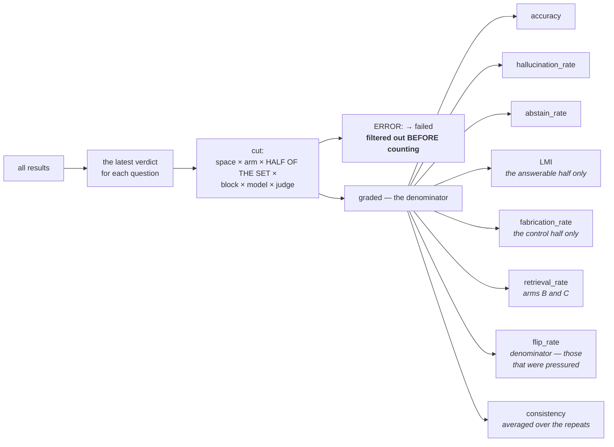

# Stage 6. The report and the metrics

```bash
uv run syft-benchmark report docs --out reports/latest.md
uv run syft-benchmark report docs --docx reports/latest.docx   # with charts
```

Two forms of the same thing. The Markdown reads in a console, goes into git and
is compared line by line between runs. `--docx` assembles a document for a
human out of the same metrics: charts, an explanation of each quantity,
computed observations and a conclusion. The daily cycle writes both forms side
by side.

**There is no corpus text in either.** Both are assembled from aggregates; the
raw records live in the [audit export](07-audit.md) and are marked as corpus.

---

## How the shares are computed



* **The latest verdict per question.** A question can be rechecked as many
  times as you like; the last result goes into the metrics.
* **The denominator is the assessed answers.** A failed call speaks about the
  rig, not about quality, and is counted on a separate line of the report. It
  is filtered out **before** counting rather than subtracted afterwards: such
  rows are written with the verdict `hallucinate` (the verdict column has to
  contain something), and after-the-fact subtraction would silently break the
  moment a judge once gave them a different class.
* **The cut is mandatory.** A Monte Carlo "accuracy" is an average over the
  repeats, not the same number as the direct test's; adding them together means
  getting a quantity that means nothing.
* **`flip_rate` is computed over those that were pressured.** Pressure is
  applied only to a correct answer, and taking all questions as the denominator
  would understate it.
* **A dash instead of a zero.** For the direct test `flip_rate` and
  `consistency` are `None`, and in the report a "—" stands in their place: "not
  measured" and "zero" are different things.
* **The halves of the set are counted separately, and that is not a detail.**
  On a control question no correct answer exists; an "accuracy" computed over
  both halves at once would drop simply because there came to be more control
  questions. So the summary takes the answerable half by default, and mixing
  has to be requested explicitly.

**LMI and why it is not everywhere.** `H / (H + C)` from the original is
meaningful only on the answerable half. Where there is no correct answer, the
denominator holds a quantity that does not exist, and the metric starts
rewarding lucky guessing — that was the main objection in the review of the
original. On the control half `fabrication_rate = 1 − the share of
abstentions` is computed.

---

## Quantities that arise only out of comparison

Not one arm has them on its own — they are the subject of the measurement.

| Quantity | Formula | What it means |
| --- | --- | --- |
| **abstention discrimination** | `abstentions(control) − abstentions(answerable)`, per arm | does the answerer tell "there is an answer" from "there is no answer" |
| **the price of context** | `inventions(arm C) − inventions(arm A)`, for one model | what the material that appeared did to the honesty |
| **the 2×2 cut** | by `retrieval_hit` on the answerable ones | whose ailment this is — retrieval's or the model's |

**Discrimination is a difference, not a product.** The original proposed
`Abstain(set 1) × Answer(set 2)`; the difference is Youden's statistic, in
which abstention is treated as a detector of the absence of an answer. It reads
in percentage points and composes with confidence intervals, while the property
"the always-abstaining and the always-answering both get zero" is the same.

It is computed **per arm**, and the expectations are themselves diagnostic: in
arm A the discrimination should be around zero — the model does not know the
corpus and is obliged to abstain in both halves; a significant plus would mean
it somehow senses the availability of an answer, that is, the corpus is
familiar to it.

**The price of context is the most important number in the measurement, and
its sign is not known in advance.** A minus means the material helped it
abstain: saying "this is not in the documents provided" is easier than "I don't
know". A plus means the context removed the caution — the question started
looking as if the answer were somewhere here, and the model that stayed silent
in arm A answered. Which way this quantity goes on a particular corpus is an
empirical question, and it is the reason arm C exists.

The pair for the comparison is **one and the same model under one and the same
judge** in two arms. Otherwise the quantity would be measuring a change of
model or a divergence of judges.

**The 2×2 cut by retrieval hit** is needed because an abstention on a retrieval
miss and an abstention on a hit are different things, and in a single accuracy
share they are indistinguishable:

| | retrieval found the right chunk | did not find it |
| --- | --- | --- |
| **answered** | the pair's accuracy | **invention over someone else's context** — the most dangerous class |
| **abstained** | **a false abstention**: the material lay in front of the model | correct behaviour |

The field `retrieval_hit` is written into every row from the very beginning, so
the cut does not cost a single extra call.

---

## How public the corpus is

A correct answer in arm A means not quality but that the corpus is already
known to the model. There are three reasons for it, and the third is
separated out: the fact is common knowledge, the corpus made it into training,
or the model guessed. There is nothing with which to tell the first two apart,
and the report does not hide that — it names both.

The third can be separated out, and not separating it means recording the
arithmetic of the number of options as corpus publicity. `mcq` has four
options, that is, 25% correct answers blind; `two_truths_one_lie` has three,
that is, 33%. So `corpus_exposure_rate` is computed **over free-answer items**
— masking, `qa`, connecting facts — where there is no guessing floor: the span
either matches the gold answer or it does not.

Multiple-choice items go on a separate line together with their own floor, so
that the reader sees what to compare against: 27% on four options is zero
knowledge, not "the corpus is a quarter known". A set assembled only from
multiple-choice items does not allow publicity to be measured at all, and the
report says so outright rather than handing over a share with a floor inside
it.

---

## What is in the report

The cut by arm, half of the set, block, model and judge — these must not be
folded into one row. Separate sections cover:

* **control questions** — the share of abstentions and the share of inventions.
  There is no share of "correct" ones there, and LMI is not computed. They are
  counted separately: "there is no answer" and "false premise" ask for opposite
  things — stay silent versus refute;
* **abstention discrimination**, **the price of context**, **the cut by
  retrieval hit** — see above;
* **resistance to pressure** — the share of surrendered correct answers by
  model;
* **resistance to randomness** — consistency and the "trust the accuracy"
  conclusion;
* **how public the corpus is**;
* **failed calls** — how many requests did not get through; they do not enter
  the shares;
* **deferred answers** — those that do not have a verdict yet.

At the end the judge is named: without it the numbers are unreadable, because
different judges diverge in their assessment of borderline answers.

### By item type

The summary answers how many times the model erred; this cut answers where
exactly. The generators measure different skills: number masking — precision
about a figure, multihop — the ability to connect two facts, tiered — an
extended explanation. A model that holds dates confidently and falls apart on
connecting facts gets "accuracy 71%" in the summary — a number by which there
is nothing to fix.

The cut goes worst-first and only over the answerable half: on the control half
there is nothing to compute "accuracy by item type" from.

### Judge agreement

A panel is set up so that the divergence of assessments can be seen, but by
themselves three columns show nothing. The report gives the share of questions
on which two judges issued ONE verdict — pairwise and on average.

It is computed over the questions that **both** judges saw: a recusal or an
interrupted run leaves the judges with different sets, and dividing agreement
by the full set would mean recording someone else's gap as a disagreement.

**Below 70% the report says so outright:** the judges diverge too often, and
the difference between models is smaller than that spread — noise. Models
cannot be compared on such a measurement. The threshold comes not from the
literature but from the meaning: at an agreement of 0.7 every third verdict is
disputable.

An important caveat: high agreement means the judges are alike, not that they
are right. Assessment by a model has no absolute scale.

### Similarity to the gold answer

```bash
uv run syft-benchmark settings set text_metrics '["bleu","rouge"]'
uv sync --extra metrics     # only for bertscore: it drags in torch
```

Off by default, and that is not caution but what they are.

**What for.** The headline assessment is the judge's verdict, that is, a
model's opinion about a text. And it should be the headline one: comparing
prose with prose is a lottery, and an explanation can be correct and unlike the
gold answer. But the judge's opinion has exactly one trouble — there is nothing
to check it with except another opinion. These metrics are computed
mechanically, do not depend on any judge, and therefore work as a second,
independent view. If the verdict and the textual match diverge, that is grounds
for a look with your own eyes.

**What they are not.** Neither BLEU nor ROUGE knows whether the answer is
right: what is measured is the overlap of words. A retelling in one's own words
gets a low score with a correct answer; a verbatim quotation off the point gets
a high one. So they enter no share of the report, are not published and take no
part in the verdict. It makes sense to compare them between the models of ONE
report, not against numbers from other people's papers.

**Where they apply.** Only where the answer is prose: `multihop_synthesis`,
`tiered_explanation`, `qa`. Masking has a one-word gold answer, and ROUGE over
it degenerates into "matched or not", which the judge already measures; for
multiple-choice the answer is a letter.

| Metric | What it computes |
| --- | --- |
| `bleu` | n-gram overlap up to order four, with smoothing and a brevity penalty |
| `rouge` | ROUGE-1, ROUGE-2 and ROUGE-L by F1 |
| `bertscore` | embedding similarity; requires `uv sync --extra metrics` |

| Setting | Default | What it does |
| --- | --- | --- |
| `text_metrics` | `[]` | Which similarity measures to compute: `bleu`, `rouge`, `bertscore` |
| `bertscore_model` | `bert-base-multilingual-cased` | The model for BERTScore |

BLEU and ROUGE are computed in-process, without third-party packages: the
definitions are settled and short. Smoothing is mandatory for BLEU — the
answers here are short, 4-grams almost never match, and without it the metric
would silently turn into a constant zero. BERTScore is built differently, it is
a model run: no package — the metric is skipped with a note in the log, and the
measurement carries on.

---

## What the document has beyond the Markdown

* **a settings snapshot** on the first page — the similarity threshold, the
  number of chunks, the methodology profile. The threshold is an axis of the
  measurement, not a constant: the same pair at a different threshold gives
  different numbers, and two reports without a snapshot silently compare
  different things;
* **charts** for every section. They are drawn over already-computed metrics
  and compute nothing themselves — otherwise a picture would one day diverge
  from the table beneath it. "Not measured" stays a gap: a zero bar in its
  place is indistinguishable from a measured zero, and those are different
  assertions;
* **observations** — statements about the computed quantities, assembled out of
  them. An observation appears only if the quantity was measured;
* **the analyst's paragraph**, written by a model from the report's aggregated
  numbers alone. It is marked as written by a model: it is a retelling, not a
  measurement. If the model is unreachable the paragraph is simply absent, and
  the report build does not fail over it.

The sections are numbered by what was written: a run without the control half
or without the repeats block would leave a gap of the form "3, 5, 7", and the
reader cannot explain it — they do not know what was not measured.

**There is no corpus text in the document** — no questions, no gold answers, no
chunks. This is a property of the build: only aggregated numbers go into the
builder's input, and importing the database or the `sources` package into it is
closed off by an invariants test. The document is shown to the endpoint's
consumer, while the measurement's raw records are handed over by
[`audit`](07-audit.md).

---

## What the summary does not show

A summary share answers the question "how many times did the model err". The
node's owner and an auditor need two others, and the summary answers neither:
**where it erred** (the cut by item type) and **can whoever did the counting be
trusted** (judge agreement and the second, mechanical view). Both cuts are
described above — and both exist because one number laid over ten skills and
three judges hides exactly what needs fixing.

There is a third thing the summary does not show in principle: **different
Spaces cannot be compared on accuracy.** Each has its own corpus, and therefore
its own questions, generated out of that same corpus; see
[08-publish.md](08-publish.md).

Next — [stage 7: the audit](07-audit.md).
