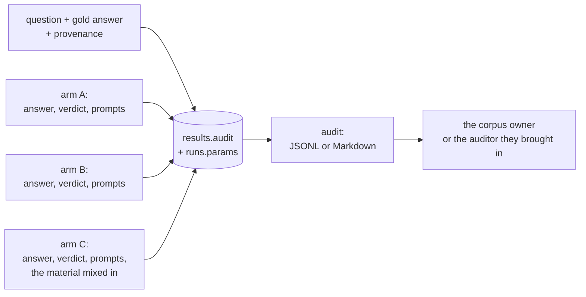

# Stage 7. The audit log

```bash
uv run syft-benchmark audit docs --out reports/audit.jsonl
uv run syft-benchmark audit docs --out reports/audit.md      # for reading by eye
uv run syft-benchmark audit docs --judge openai/gpt-4.1      # a single judge
uv run syft-benchmark audit docs --job <id>                  # a single launch
uv run syft-benchmark audit docs --no-context                # without corpus text
```

The benchmark's number is a share computed from a judge **model**'s verdicts
about text that is not in the report. There is no way to check it against the
report itself other than by taking it on trust. For the corpus owner and for
the auditor they bring in that is not enough, and hence the log.

The stage stands aside from the daily cycle: it does not affect the numbers and
is done when someone actually sets out to check them.

---

## What is in it



Beside every answer the following is saved:

* **the answerer's system and user prompts** — for arm C together with the
  material mixed in, verbatim;
* **the judge's prompt and its raw answer** before the JSON is parsed;
* **the context source** and the run's settings: the similarity threshold, the
  number of chunks, the methodology profile;
* **the circumstances of the call**: `finish_reason`, the marks `truncated`,
  `reused`, `length_retry` and the number of attempts. A truncation is visible
  in the record rather than worked out after the fact from strange numbers.

The format follows the extension: `.md` for reading by eye, anything else JSON
Lines, one record per line.

---

## Four decisions that make the log fit for checking

**It is written during the run, not assembled afterwards.** A prompt depends on
the settings of the moment — the retrieval threshold, the number of chunks
mixed in, the text of the instruction — and those change. Reconstructing after
the fact what actually went to the model is impossible; so an export of old
runs honestly says that there are no prompts in them, instead of showing
today's.

**The answers of all the arms lie in one record.** The comparison of A, B and C
is the very thing being checked; splitting them across three files would mean
making the auditor stitch the export together themselves.

**The latest answer is taken for each combination** of arm, block, answerer and
judge — by the same rule the metrics are computed with. Otherwise the audit
would be looking at one set of records and the report at another.

**A verdict that did not cost a model call is marked as such.** Matching an
option's letter and recognising an abstention do not call a judge — that too is
a fact the auditor needs to know: the argument there is not with a model but
with a regex. A verdict issued by a human through console judging is marked the
same way.

---

## The log contains corpus text

Arm C's prompt carries the retrieved chunks in full, and gold answers not
infrequently quote the source verbatim. This is not a side effect but the point
of the export — there is nothing to check without seeing the original text. So:

* `results.audit` is protected like the database itself
  ([invariant 4](privacy.md)), and the exported file like the corpus, and it is
  handed only to someone who has access to the corpus anyway;
* a test makes sure the log does not end up on the publication path
  ([invariant 3](privacy.md));
* `--job` checks one measurement instead of the node's whole history, and that
  is usually the thing wanted: settings change between launches, and an export
  that mixed two of them would lay answers obtained at different similarity
  thresholds side by side under one heading. The id is the one the job history
  hands out; the job's row carries the settings snapshot beside it, so the
  records and the configuration that produced them are read together. A run
  started from the console belongs to no launch and is not swept into one;
* `--no-context` gives a trimmed export — without the text of the chunks — and
  it **says right in the record** that the prompt has been cut out: a verdict
  cannot be rechecked from such an export, and it must not pretend to be
  complete;
* `audit_log=false` switches the log off entirely, if the owner has
  decided they do not need a third copy of the prompts. The export will then
  say that there are no prompts: they cannot be assembled after the fact.

| Setting | Default | What it does |
| --- | --- | --- |
| `audit_log` | `true` | Write the prompts beside every answer |
| `audit_max_chars` | `20000` | The ceiling on a single log record |

Next — [stage 8: publishing](08-publish.md).
