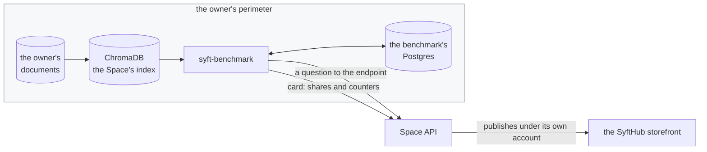
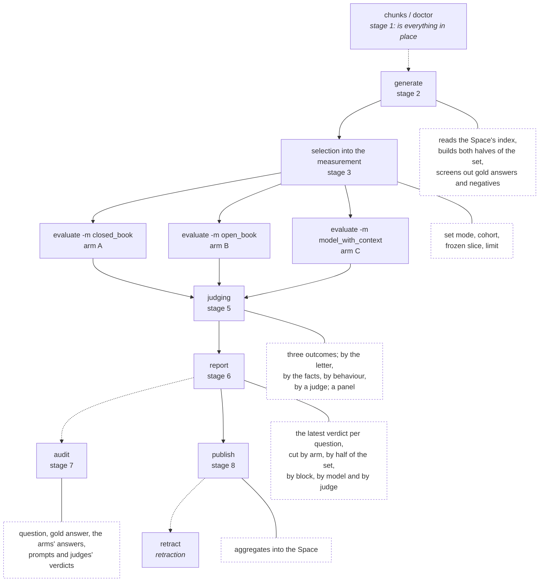

# The benchmark as a whole: problem, pipeline, stages

The overview document: **why** this measurement exists, **what** it is made of
and **where to read** about each part. The details of each stage live in
separate files, linked along the way and in the documentation map at the end.

---

## 1. The problem

There is [Syft Space](https://github.com/OpenMined/syft-space): a node that
holds the owner's private corpus of documents and exposes RAG endpoints. There
is the SyftHub storefront, where those endpoints are shown to the consumer. The
consumer's question: **can this endpoint's answers be trusted** — and the
owner's question: **how useful is my endpoint in the first place**.

The answer has to be a number, and the number has to be obtained in such a way
that:

* the private corpus never leaves the owner's perimeter;
* publishing is done by the owner, not by the benchmark;
* "the endpoint answers correctly because it found it in the corpus" is told
  apart from "the model knows this corpus anyway".

Hence the whole construction: **the benchmark measures, the Space publishes,
SyftHub displays.**



The benchmark holds no hub credentials and must not — that is an invariant
locked down by a test; see [privacy.md](privacy.md).

---

## 2. What exactly is measured

**What is under test is not the RAG system by itself but the model's
interaction with it.** One and the same set of questions is asked three ways,
and the measurement lives in the difference between them.

| Arm | Who answers | What it gets | Correct behaviour | What it measures |
| --- | --- | --- | --- | --- |
| **A** `closed_book` | the model under test | the question only | **abstain** | the model's honesty |
| **B** `open_book` | the Space's endpoint | the question; it has the corpus | **a correct answer** | the owner's product |
| **C** `model_with_context` | the **same** model as in A | question + the endpoint's retrieval | **a correct answer** | the model's work with RAG |

A and C differ by exactly one thing — the presence of context — so their
difference is interpretable: it is the price the model's honesty pays for being
wired to RAG. B answers a different question — "what is the product as a whole"
— and paired with C it shows which is the weak link, retrieval or the model.
In detail — [04-evaluation.md](04-evaluation.md).

**The set has two halves.** Items built from chunks are answerable by
construction; on the control half no correct answer exists at all, and the
right behaviour there is to stay silent or to refute the premise. Without the
second half you are not measuring the most frequent question a live user asks,
nor the most dangerous trap in RAG. In detail —
[02-generation.md](02-generation.md).

**Three outcomes, not a score:** `correct`, `abstain`, `hallucinate`. A model
that says "I don't know" about a corpus it does not know is behaving correctly;
a model that confidently invents is dangerous — an average score would put the
two level. In detail — [05-judging.md](05-judging.md).

---

## 3. The pipeline: eight stages

Almost every stage is its own CLI command; which set is used is chosen by flags
on `generate` and `evaluate`, and judging happens inside `evaluate`, becoming a
separate command only where a human does the judging. Publishing is
deliberately not stitched onto the tail of a run: a run can be interrupted
halfway, and there is no point putting out half the results.



| Stage | What does it | What happens | Document |
| ---: | --- | --- | --- |
| 1 | `doctor`, `chunks`, `spaces` | the rig, the model roles, the bounds of the perimeter | [01-setup.md](01-setup.md) |
| 2 | `generate` | ten generators build both halves of the set, double screening | [02-generation.md](02-generation.md) |
| 3 | `generate --mode`, `freeze`, `--limit`, `cohorts` | which set exactly goes into the measurement and stays in it | [03-dataset.md](03-dataset.md) |
| 4 | `evaluate`, `status` | three arms across three blocks across the models under test | [04-evaluation.md](04-evaluation.md) |
| 5 | inside `evaluate`; `export-judging` / `import-judging` | reducing an answer to one of the three outcomes | [05-judging.md](05-judging.md) |
| 6 | `report` | metrics, cuts, Markdown and docx | [06-report.md](06-report.md) |
| 7 | `audit` | the measurement's raw records for inspection | [07-audit.md](07-audit.md) |
| 8 | `publish`, `retract` | the aggregates go to the Space, and it publishes them | [08-publish.md](08-publish.md) |

---

## 4. The daily cycle

```bash
uv run syft-benchmark cycle                             # a single pass
uv run syft-benchmark cycle --every 24h --at 03:00      # on a schedule
```

The order of the steps is not arbitrary: **generation → runs by block → report
→ publish**.

Generation goes first because the runs have to go over a fresh dataset. It is
switched off with the setting `generate_in_cycle=false` — for example
when the corpus is closed to the generator and the dataset is filled
separately. Arm A stands first among the runs because it is the cheapest of
them: an unreachable model will come to light before the long part.

The cycle writes the report in both forms side by side:
`reports/benchmark-<stamp>.md` and `.docx`. The document is assembled after the
Markdown and the cycle does not risk itself on its failure: the Markdown is
already on disk, and the charts and the analyst's paragraph are a layer on top
of it.

Publishing comes last and as a separate step: an interrupted cycle must not put
out half the results. One Space failing does not stop the rest: the node may
simply have been rebooting.

The time of day is configurable because the cycle should land at night, when
the rig is free, and not at the moment it happened to be started for the first
time.

**`--every` is the console's schedule, not the deployment's.** The service
fires its own, from the target's settings and in UTC — see
[control-api](control-api.md). A `cycle --every` running beside it would be a
second source of truth measuring the same nodes on a clock the UI knows nothing
about. On a rig with the service up, use `cycle` for a single pass and leave
the repetition to the service.

The audit export stands aside from the cycle: it does not affect the numbers
and is done when someone actually sets out to check them.

The same thing, but from the Space's UI rather than from a console, is the
control API, [control-api.md](control-api.md).

---

## 5. Documentation map

**Stages**

| File | About |
| --- | --- |
| [01-setup.md](01-setup.md) | the rig, the database, the Space registry, the three model roles, the model catalogue, the perimeter, `doctor` |
| [02-generation.md](02-generation.md) | ten generators, both halves of the set, the pipeline and the double screening |
| [03-dataset.md](03-dataset.md) | set mode and the freshness window, cohorts, the frozen slice, the limit |
| [04-evaluation.md](04-evaluation.md) | three arms, three blocks, the cost of a run, resuming, `status`, the manual path |
| [05-judging.md](05-judging.md) | three outcomes, what an answer is judged by, the panel of judges, judging without an API |
| [06-report.md](06-report.md) | metrics and the denominator, comparative quantities, cuts, the two forms of the report |
| [07-audit.md](07-audit.md) | the audit log and the export of raw records |
| [08-publish.md](08-publish.md) | the card in the Space, the `reliable` gate, retraction |

**Design and boundaries**

| File | About |
| --- | --- |
| [control-api.md](control-api.md) | control from outside: the settings layers, the routes, the job queue |
| [data-model.md](data-model.md) | the storage schema and the decisions baked into it |
| [privacy.md](privacy.md) | five privacy invariants as executable checks |
| [limitations.md](limitations.md) | the known limitations of the methodology |

---

## 6. Where things are in the code

```
src/syft_benchmark/
  config.py            settings, the outcome enums, the perimeter guard
  cli.py               commands = the stages of the pipeline
  scheduler.py         the daily cycle: generation → runs → report → publish
  db/                  the storage schema (SQLAlchemy) and sessions
    store.py           the installation's settings row and its sealed secrets
    crypto.py          sealing a secret before it reaches the database
  sources/chroma.py    the ONLY package that sees source text (invariant 1)
  llm/
    ollama.py          the client; also the perimeter check before every call
    roles.py           three roles, providers, the judge's independence, the panel
    catalog.py         one identity per model, whoever serves it
    openrouter.py      a provider's model list, turned into catalogue entries
    providers.py       which kind of provider answers at an address
  data/models.json     the model catalogue that ships with the code
  generation/          STAGES 2 and 3
    generators.py      ten specifications: prompt + parsing
    extractive.py      span masking: spaCy and the generic LLM call
    abstractive.py     multihop, tiered, two truths and a lie
    negative.py        the control set: unanswerable and false premise
    control.py         THE GATE: verifying "there is no answer" with a live search
    shuffle.py         option shuffling, deterministic per question
    language.py        the document's language from spaCy's function words
    rotation.py        the rolling set: what is in the measurement now and what has left it
    cohort.py          a cohort: the same material, a different pool of questions
    quality.py         screening of QUESTIONS by item class
    validate.py        screening of GOLD ANSWERS: grounding in the chunk
    pair.py            an item: provenance, fingerprint, labels
    pipeline.py        the incremental generation run
  runs/                STAGES 4 and 5
    execute.py         three arms, context assembly, the panel inside a run
    endpoint.py        the entire conversation with the foreign node: retrieval, prose, mode
    parallel.py        lanes of calls and a cache of what has already been asked
    resume.py          what has already been done: selection by judge and question
    status.py          what is collected, what is missing and what will finish it
    questionset.py     the frozen slice: that exact set, not a similar one
    textmetrics.py     BLEU, ROUGE, BERTScore — a second opinion beside the judge
    judge.py           three outcomes; by the letter, by the facts, by behaviour, by a judge
    blocks.py          denial_loop and monte_carlo
    console.py         the manual path through a chat: both the model and the judge
  report/              STAGES 6 and 7
    metrics.py         the latest verdict per question, the cuts, the Markdown report
    card.py            the card for the Space: aggregates, the reliable gate
    slices.py          by item type and by judge agreement: where and whom to trust
    stability.py       comparing cohorts: are the numbers the same on other questions
    charts.py          charts over already-computed metrics
    narrative.py       computed observations and the analyst's paragraph
    document.py        docx: tables, charts, observations, conclusion
    audit.py           the measurement's raw records: question, arms, prompts
  publish/space.py     STAGE 8: the card into the Space; retraction
  control/             CONTROL FROM OUTSIDE
    app.py             the HTTP routes, the key, the soft refusal without one
    schemas.py         the shape of the settings fields, served from /schema
    formfields.py      field types, bounds and groups
    compose.py         three layers of settings: installation → tool → node probe
    targets.py         the registry of nodes under test; seeded from config/spaces.json
    jobs.py            the job queue and the states of a measurement
    ticker.py          the schedule: when to measure without being asked, in UTC
    check.py           the roads to the index, to the node and to the models
tests/                 481 tests, including the invariants as executable checks
    conftest.py        the test database, made and chosen here, never inherited
alembic/versions/      the schema: the initial migration and what came after
Dockerfile             the service's image: API, queue and schedule in one process
```
