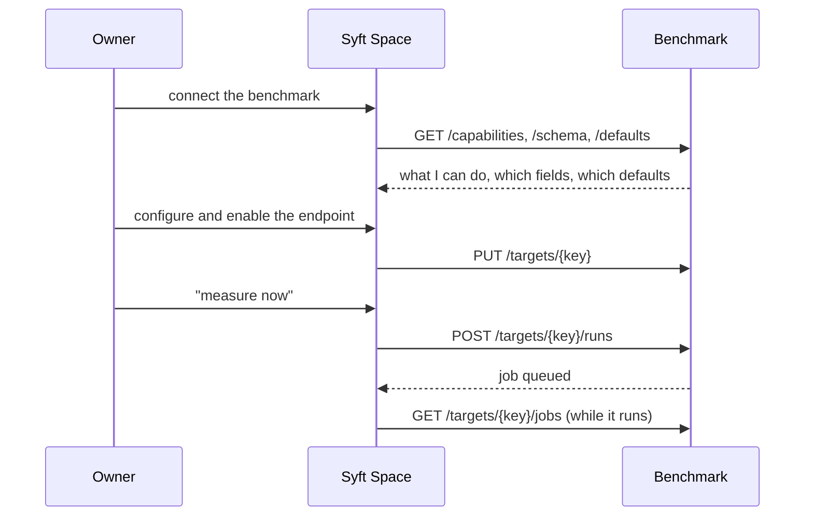

# Control from outside

The benchmark can be driven from a console, or from the Space's UI. This
document is about the second way: what the benchmark exposes, what it accepts
and why it is like that. The measurement itself meanwhile goes the same way as
the daily cycle — stages 1–8 in [README.md](README.md).

## Who decides what

The Space's owner decides **what to measure, with what and when**. The
benchmark decides **how the measurement is built**. The boundary runs here, and
it is not a formality: the list of arms, the panel of judges and the thresholds
are properties of the instrument, shared across all the nodes of one
installation, and there is no place for them in the Space's database.



## Three layers of settings

There are some sixty-five settings, and they belong to different owners.

| Layer | What is in it | Where it is set |
| --- | --- | --- |
| **Installation** | the defaults under everything: addresses, models, concurrency, thresholds | one row in this service's database — `PUT /settings` |
| **Instrument** | arms, blocks, judges, models under test, thresholds | one per Space |
| **Probe** | set mode, window, generators, `top_k`, similarity threshold | per Space and per individual node |

All three are rows in this service's database. A value that can be written in
two places is a value that disagrees with itself on the day somebody edits the
wrong one, so there is exactly one place for each of the sixty-five.

**The environment is the layer under the row**, read-only and supplied by the
deployment. An edit made in the row outranks it — for good, not until the next
restart. It is not a one-time seed, deliberately: the container's compose file
sets the addresses that differ inside a container, and a seed would have
applied them once and then silently stopped, leaving an installation pointed at
a model provider inside itself.

**Four things stay in the environment** and `PUT /settings` refuses them by
name: the database URL, because it is the address of the row; the control key,
because it guards the API that edits the row; the master key, because it opens
the stored secrets; and the perimeter — `allow_external_models` and
`external_hosts`. The last is the one that matters. The ban on calls outside is
a check rather than an agreement, because the questions are built from private
documents; a list of allowed hosts that anyone holding this key could edit
would not be a perimeter. It is a decision for whoever has the host.

**The secrets are in neither.** The provider keys and the Space tokens are
sealed with AES-256-GCM in a table of their own, each ciphertext bound to the
name of the slot it belongs in so that a row cannot be copied from `judge_key`
into `subject_key`. They are kept out of the settings document on purpose: the
settings are read on every launch, copied into a job's snapshot and every run's
params, handed out by `/defaults` and written to the log, and a key among them
would arrive everywhere they arrive.

They go in and do not come out. `GET /credentials` says what is stored and
when it was last set — the same thing a target's token has always said about
itself. With no master key configured, `PUT` answers 503 rather than storing
plain text: an installation with half its secrets encrypted and no record of
which half is worse than one that said no.

The layers are applied in one order: the installation's row → the
instrument → the node's probe. The closer a layer is to a specific node, the
more authority it has — because it was set by whoever knows most about that
node.

**An unset field means "take it from the layer above", not zero.** Without that
distinction a settings form opened and closed without a single edit would zero
out the freshness window and the similarity threshold.

**The instrument is not overridden on an individual node.** The card declares
it in the `instrument` block, and the endpoints that can be compared with one
another are exactly those whose instrument matched; allowing the judge to be
changed on one node would mean quietly making two nodes non-comparable while
leaving a promise of the opposite in their cards.

## A key is mandatory

Until `BENCH_CONTROL_TOKEN` is set, the API answers only on `/health` and tells
everything else that it is not configured. This is not over-caution: its one
working route raises work that costs hours and money in external models, and a
port open by default would mean that anyone who could reach the network could
spend someone else's budget. The behaviour is the same as a Space's with
`benchmarks_mode=off`: not "you may not" but "there is nothing here".

```bash
uv run syft-benchmark serve                 # address and port from the settings
uv run syft-benchmark serve --port 8300     # over the settings, one-off
```

| Variable | Default | What it does |
| --- | --- | --- |
| `BENCH_CONTROL_TOKEN` | empty | The key; while it is empty only `/health` stays alive |
| `BENCH_CONTROL_HOST` | `0.0.0.0` | The address to listen on |
| `BENCH_CONTROL_PORT` | `8200` | The port |
| `BENCH_CONTROL_ORIGINS` | `[]` | The origins CORS is allowed for |

An empty list of origins means there are no browser requests at all: the UI
comes here from its own server, not from a page. Filling it in means opening
the launching of measurements to any open tab.

The same process also holds the job queue and the schedule. There is no reason
to separate them: the queue is strictly sequential, a measurement spends almost
all its time waiting on a socket, and three processes would have to agree
through the database they already share.

## Where the service runs

**In a container, beside the Space.** The Space keeps ChromaDB as a subprocess
in its own container, listening on `0.0.0.0:8100`. A port has to be published
only to reach it from the host; from a sibling container on the same docker
network it is plain `http://<the Space's container>:8100`. So the benchmark
joins the rig's network and reads the index straight over HTTP.

`docker exec` into the Space's container is a fallback for the one case that
route does not cover: a port that was never published at all. It mounts no
docker socket for the ordinary path — a service that goes out to external model
providers has no business holding a root-equivalent privilege on the host.

What this costs is one piece of configuration that cannot be guessed: a
target's `chroma_host` is the Space's **container name**, not `localhost`.
Inside a container `localhost` is the benchmark itself, and a target left at
the default will look for the index in the wrong place and find nothing.
Checking the target says so at once rather than an hour into a run.

```bash
cd packages/benchmark
cp .env.example .env                       # at least BENCH_CONTROL_TOKEN
docker compose --profile service up -d --build
```

Without the profile only the database comes up — that is the console flow,
where the CLI runs on the host against it. The profile is what adds the
service.

The image runs `alembic upgrade head` on start: a service whose schema has to
be brought up to date by hand from somewhere else is a service that comes up
broken on the one deploy nobody was watching.

| Variable | Default | What it does |
| --- | --- | --- |
| `BENCH_SPACE_NETWORK` | `syft-space-network` | The rig's docker network to join. A Space raised by its own compose file names it that; one raised as part of a larger rig gets that project's name — `docker network ls` says which |
| `BENCH_CONTROL_PORT` | `8200` | The port published to the host |
| `ollama_url` | `http://host.docker.internal:11434` | A local Ollama lives on the host, so it is reached through the host gateway. An external provider is a URL and needs none of this |

The measurement extras are not in the image: `metrics` drags in torch and
`spacy` is gigabytes, both are optional and both are guarded at every use. A
rig that wants them builds with `--build-arg EXTRAS="--extra metrics"`.

## The schedule

A target carries an interval (`24h`, `6h`, `90m`) and, for a daily one, the
hour it should land on. The service watches them itself: a thread beside the
queue looks at the table twice a minute and puts a measurement in it when the
moment comes, marked `trigger=schedule` so that the history tells a nightly run
from a pressed button.

It is set where the endpoint is configured — the Space's page for it — and
arrives here in the target's spec like any other setting. Per endpoint rather
than per Space: a corpus that changes daily wants a nightly run, and one kept
for reference wants far less.

**The hour is UTC.** Not for convenience but because nothing else can be
honest: a container knows nothing of the owner's night, and a service that took
its own clock for it would shift every schedule the day the host moved. The
Space's form says so where the hour is set, and shows `next_run_at` in the
reader's own time zone where it is read.

`next_run_at` on the target says when it will fire, and is handed out rather
than left to the UI to work out — it is the answer to "why has it not run yet"
and "did my change take". Three rules about it:

* a schedule **saved for the first time is planned, not fired**. "Every 24h at
  03:00" means tonight, and answering a saved form with hours of paid work is
  not what was asked for;
* a schedule **changed is replanned**. Otherwise switching a measurement from
  nightly to hourly would leave it nightly until the night it was already
  waiting for;
* **windows slept through are not worked off.** A service that was down for
  three nights owes one measurement, not three: only the last of them would
  have been about today.

A measurement that outruns its own schedule is not overtaken — a target already
queued or running is not queued twice. A node answering under double load is
not the node that answered yesterday, and the numbers would diverge for a
reason of their own.

## The routes

| Route | What it does |
| --- | --- |
| `GET /health` | Without a key: is there anyone at this address at all |
| `GET /capabilities` | What the installation can do: arms, blocks, generators, models, provider |
| `GET /schema` | The shape of the settings fields — names, types, bounds, groups |
| `GET /models` | The model catalogue, filtered: what a picker may offer |
| `POST /models/refresh` | Fetch the provider's model list afresh and store it |
| `GET /defaults` | What an unset setting will turn out to be |
| `GET/PUT /settings` | The installation's own overrides — the layer under the instrument |
| `GET /credentials` | Which secrets are stored, and since when. Never the values |
| `PUT/DELETE /credentials/{name}` | Store a secret, sealed; remove one |
| `POST /credentials/rotate` | Re-seal every secret under the active master key |
| `GET /targets` | All registered targets as a list |
| `GET/PUT/DELETE /targets/{key}` | One target: read, create or amend, remove |
| `POST /targets/{key}/check` | Are the index, the node and every configured model reachable |
| `POST /targets/{key}/runs` | Put a measurement in the queue |
| `GET /targets/{key}/jobs` | The node's measurement history |
| `GET /jobs/{id}` | One job: its state, progress and card |
| `POST /jobs/{id}/cancel` | Stop a queued or running job |
| `DELETE /jobs/{id}` | Discard a finished job: its runs, verdicts and card |

### Why `/schema` rather than a form in the Space

The list of settings could have been repeated in the Space, and at first that
would have been simpler. But then every new field here would mean a migration
there, and a forgotten migration would mean a form that silently cannot
configure something that already works.

So what goes out is the **shape** of the fields: name, type, bounds, allowed
values, group. There are deliberately no labels — by the same rule under which
the card hands over `trust.flags` as codes: the wording belongs to whoever is
displaying it, and in their reader's language.

The same goes for reasons: why an arm is unmeasurable, why a job did not finish
— as codes. The only thing that passes through as is is the text of a failed
call: it is not enumerable, and hiding it is worse than showing it
untranslated.

### Why `/models` is a route of its own

`choices` on a field carries its own values — three arms, four blocks — and the
form draws them as they arrive. Three hundred models cannot travel that way,
and they change on a refresh rather than on a release. So a field says
`catalog: "models"` instead, and the form fetches the list from here.

The form recognising the four model fields by name is exactly the coupling
`/schema` exists to prevent: a fifth such field would then need a release on the
other side before anyone could pick a model for it.

**One model, one identifier, whoever serves it.** The settings hold this
service's name for a model — `anthropic/claude-sonnet-5` — and the provider's
own name for it is worked out where the call is made: the same model is
`claude-sonnet-5` at Anthropic's own API. Moving an installation from one
provider to another therefore does not rewrite the settings, and measurements
taken on either side stay comparable.

**A moving name is pinned as a setting is saved.** `~anthropic/claude-sonnet-latest`
means a different model every few months. The catalogue hands out the map
(`pins`) so a form can show both, but what is stored is what the name meant on
the day it was chosen — otherwise a run could not be repeated, and two runs a
season apart would sit in one report under one name.

**The catalogue is not a whitelist.** A model released this morning is in no
snapshot; it goes through, marked as unknown. Refusing it would make the picker
less capable than a text box.

The list that ships with the code is the floor. `POST /models/refresh` stores a
newer one in `model_catalog` and that is what is read from then on. Fetching it
is a call outside the perimeter, so it is an explicit action rather than a
schedule, and it answers 403 naming the host to open when the perimeter forbids
it. An installation that never opens it works from the shipped snapshot.

Models this rig has pulled itself are added live from Ollama and stand first in
the list: they are inside the perimeter, which is where the generator belongs.
They are asked for only when the shared address is an Ollama — a gateway has no
such route.

## The model provider

The benchmark does the counting, and the bill goes to the key's owner. So the
installation tells you about itself: which address, how it introduces itself to
the provider, whether a key is set, which hosts are open and which roles have
their own provider rather than the shared one.

**The key does not leave the perimeter — neither as a value nor into any
storage.** The Space never calls the provider even once, and a copy of the
secret in a service that does not use it would be extra surface, not
convenience. In the UI the field only shows: "a key is set" and the address.

The roles are listed one by one because each has its own address/key pair. A
single answer "the provider is such-and-such" for all three is sometimes simply
wrong: the generator reads documents and should normally stay inside the
perimeter, while the models under test are almost always external — and an
owner looking at a shared answer would think the documents go nowhere.

`editable: false` is stated explicitly. Editing from here would mean both a
copy of the key in the benchmark's database and — in an installation serving
several Spaces — that one owner changes the bill for all the rest. The key is
changed in the service's environment.

## Jobs

A measurement runs for hours, and an HTTP request does not live that long. The
route puts a job into the queue and answers `202` at once; a worker thread does
the work, checking in on the same row.

The queue is shared and strictly sequential. This is not a simplification: a
measurement is bounded not by the processor but by the model provider and by
the node under test itself, and two jobs at once will speed up neither — but
will spoil both. A node answering under double load is not the same node that
answered yesterday.

| State | Meaning |
| --- | --- |
| `queued` | Waiting: one job at a time is allowed per node |
| `running` | In progress; `phase` says on what exactly |
| `succeeded` | Finished counting. A non-empty `error` — it went through, but not entirely |
| `failed` | Did not reach the end at all |
| `cancelled` | Stopped by the owner; what was measured stayed in the database |

**Stopping is a request, not a kill.** The run finishes writing the current
question and exits by itself: half a measurement is data too, and its verdicts
are already in the database.

### A job is the handle on one measurement

Every run a job opens carries its id, and so every verdict can be traced back
to the launch that obtained it. Without that a job and its runs would share a
target and a span of time and nothing else — and time cannot tell a nightly
measurement from one somebody started by hand in the same hour.

This is what makes a launch readable afterwards rather than only while it runs:

* **the report of that measurement**, as against the node's numbers today. They
  differ for two reasons and both are ordinary — a later launch overwrites the
  latest verdict per question, and a rolling set drops the questions that were
  screened out since. Scoped to a launch, neither happens: a question retired
  from the set was still asked in August, and screening it out afterwards does
  not unask it;
* **the audit of that measurement.** Settings change between launches, and an
  export that mixed two of them would lay answers obtained at different
  similarity thresholds side by side under one heading. The job's row already
  carries the settings snapshot it was launched with, so the numbers and the
  configuration that produced them are read together.

From the console that is `syft-benchmark audit <space> --job <id>`. The id is
the one the job history hands out.

One honest limit. A launch that resumed a pass already finished opens no run
for it — there is nothing left to ask — so the verdicts it inherited belong to
the earlier launch that obtained them. Scoped to a job, "what did this launch
measure" is exactly that, and it is not the same question as "what did the node
look like when this launch ended".

A run started from the console belongs to no job and says so with an empty
field. That is a fact rather than a gap: filling it in afterwards would mean
inventing a launch that never happened.

### "Reached the end" and "measured something" are different things

A job reports more than that the runs have finished. A model provider that is
down gives a full pass over the set, zero verdicts and a thoroughly reassuring
result; an empty freshness window gives a full pass over zero questions. Both
would report "went through", and the owner would go looking for numbers that do
not exist.

| Code | When |
| --- | --- |
| `nothing_generated: …` | The set was to be built and every generator call was refused |
| `no_questions` | There were runs, there turned out to be nothing to ask |
| `nothing_graded: …` | Questions were asked, not a single verdict came out |
| `no_card` | There is nothing to report |
| `publish_refused: …` | The Space did not accept the card |
| `target_gone` | The target no longer exists |
| `service_restarted` | The process restarted in the middle of a measurement |

A trial run (`limit`) takes several items **per generator**, not in total — for
the same reason the limit in the console is built that way
([03-dataset.md](03-dataset.md)): a generator is a distinct skill, and a total
cap at a small value would simply throw some skills out of the measurement
while the report called the result accuracy. A thin sample is not hidden but
named: the card carries `few_samples` in `trust.flags`, and the reader sees how
many questions the numbers stand on.

### Building the set and asking it questions are two different launches

`generate` and `evaluate` answer two different questions, and a launch chooses
either or both:

| Field | Answers |
| --- | --- |
| `generate` | Build the question set from the corpus before anything else? None — as configured on the target |
| `evaluate` | Ask and grade against the set that results? None — yes |

`evaluate: false` is the launch that only wants the set refreshed: it costs one
pass over the corpus and nothing else — no model under test is asked a single
question, so there is nothing to grade and no card. `job.total` stays `0`
throughout it for exactly that reason: no passes were ever planned. The
opposite, `generate: false, evaluate: true`, asks and grades against whatever
is already in the set without rebuilding it first — the ordinary shape of a
launch that wants to test, not to refresh.

### The card is not the same decision as publishing it

`JobView.card` carries the card assembled right after measuring — in the same
shape the Space is handed, [payload_for](../src/syft_benchmark/publish/space.py)
— and it is there whether or not `publish` was ticked, and whether or not the
Space took it. Building it costs nothing extra: the verdicts it is built from
are already in the database, and withholding the one readable summary of a run
until someone agrees to make it public would mean "how did this go" has no
answer of its own.

`publish` decides one thing only: whether the card is also handed to the Space
(`POST /endpoints/{slug}/quality`), from where it may reach a marketplace. A
run with `publish: false`, or one the Space refused (`publish_refused`,
`benchmarks_mode` off), still has its `card` — read it from `GET /jobs/{id}` or
`GET /targets/{key}/jobs`, decide from it, and publish afterwards by launching
a new run with `publish: true` against the same, unchanged dataset.

`DELETE /jobs/{id}` discards a finished job — its own row, the runs it opened
and their verdicts, card included. Not the question set: `qa_pairs` belongs to
the target and is shared by every job that ever measured it, past and future,
so deleting one run's data does not thin it out for the rest. A job still
queued or running answers `409` — cancel it first, on its own terms.

## The node registry

Targets live in a table, while `config/spaces.json` remains a **seed**: a
target that is not in the table is taken from the file at service start-up. An
installation configured by the file keeps working, knowing nothing about the
UI.

There is deliberately no way back: changes from the UI are not written to the
file. A service that rewrites a human's configuration file sooner or later
wipes out something it did not understand.

What a target stores is **overrides**, not the full set of settings. A full
snapshot would freeze the installation's defaults as of the day the target was
created, and a raised answer ceiling would never reach a single node.

### What the check walks

Three roads, and any of them can be out while the others are fine. To the index
the benchmark goes past the Space API, over the internal network or through
`docker exec`; to the node, by ordinary HTTP with a token; to each model, out
through the perimeter to whatever provider that role points at.

The models are the road most easily left broken. They are named in the
instrument, which is edited in a UI, while the address and the key reaching them
are the installation's own layer — so an instrument full of a gateway's model
names on an installation with no gateway configured is a working configuration
that cannot answer a single question. The check asks once per distinct address
and name; on an external provider that is a one-token request, which is the
price of the button and far below the price of learning the same thing from the
run it precedes.

### The collection's name

The collection in the index is named after the Space's dataset, not after the
target's key. The two coincide only when the key has been hand-picked to match
the index. So the name is a field of the target, and `POST
/targets/{key}/check` returns a list of what is actually in the index: the
owner should not have to guess what the Space called the collection.

A Space creating a target from the UI fills the name in itself — it knows its
own dataset.
