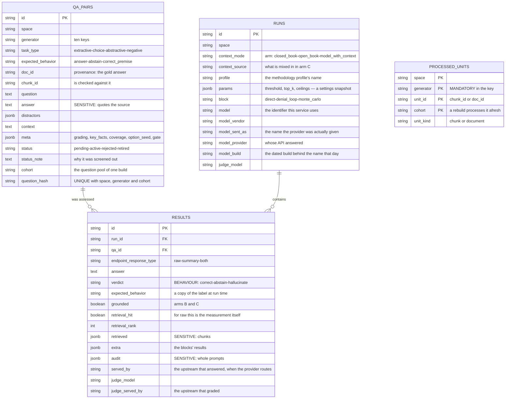

# The data schema

Four tables for the measurement and two for the control API. Here: the design,
and the decisions, each of which is entailed by the construction of the
measurement rather than chosen out of taste.

---

## The schema's decisions

### What was asked for, and what answered

`runs.model` holds this service's identifier — `anthropic/claude-sonnet-5`. One
identifier per model whoever serves it: moving an installation from one provider
to another neither rewrites the settings nor makes the old measurements
incomparable with the new.

That alone does not reproduce a run. The provider is told its own name for the
model (`claude-sonnet-5` at Anthropic's own API), and behind that name stands a
dated build the vendor replaces without renaming anything. So `model_sent_as`,
`model_provider` and `model_build` record what was actually reached; without
them two rows under one model name can be two different sets of weights and say
nothing of it.

One layer deeper, a provider is not always the model's owner. OpenRouter is a
router: behind `qwen/qwen3.8-27b` stand sixteen upstreams — the same weights at
fp4 and at bf16, context windows from 64k to a million, output ceilings from 32k
to 236k — chosen per request by price and availability. All three differences
change what a model answers.

`results.served_by` records which host answered and `judge_served_by` which one
graded. Per answer, because that is the grain the choice is made at: one run can
be served by four hosts, and an aggregate would say it was mixed without saying
which answers came from where. The judge keeps a column of its own — the number
is a judge's verdict, so "answerer or grader" is the first question when it
moves. `syft-benchmark upstreams` reads them both.

Recorded, not pinned: a pinned host that is down takes a run with it, and that
price is not worth paying before the records say it matters.

All five are columns and **not** keys in `params`. That snapshot is compared for
exact equality to decide whether yesterday's answers may be counted as done, and
a build moves on its own — inside it, every measurement would become unresumable
the day a vendor refreshed a model. Evidence about one run does not belong among
the conditions for comparing two.

* **`runs.context_mode`** — without it the arms are indistinguishable in the
  database, and everything rests on comparing them. The column is a string
  rather than an enum, so adding an arm needs no migration of the rows already
  written.
* **`runs.context_source`** — arm C is uninterpretable without it: "a model on
  raw chunks" and "a model handed someone else's finished conclusion" measure
  different things and give different numbers.
* **`runs.profile` and `runs.params`** — the thresholds, prompts and retrieval
  parameters are configurable, so the report has to know how each row was
  obtained. Without the snapshot it would silently add runs measured under
  different similarity thresholds into one share.
* **`qa_pairs.expected_behavior`** — what counts as the correct behaviour. The
  field sits on the pair, not on the run: there is one set and three arms, and
  the correct behaviour is determined by the question, not by who is answering.
  It is duplicated in `results`, because the control set's labelling gets
  refined and an old verdict relates to the previous labelling.
* **`results.audit`** — the prompts beside the answer. They cannot be assembled
  after the fact: a prompt depends on the settings of the moment.
* **`qa_pairs.status`** — the result of screening and of rotation at once.
  `rejected` is a verdict on the gold answer, irreversible; `retired` is what
  has left the freshness window or a previous cohort: out of the measurement,
  not out of the database. Screened-out items are not deleted: they are
  material for tuning prompts, not rubbish.
* **`qa_pairs.cohort` in the uniqueness key** — a question repeating between
  cohorts is legitimate and meaningful: it means the generator produced the
  same question from the same material, that is, it is stable. Forbidding such
  a repeat would make rebuilds impossible.
* **`processed_units` with the generator and the cohort in the key** — there
  are ten generators, they see one text differently, and a chunk processed by
  masking is obliged to reach MCQ as well. Without the generator in the key the
  second generator would silently skip everything the first had got through;
  without the cohort a rebuild would not start at all.
* **`results.endpoint_response_type` beside the answer**, rather than read from
  the card at parsing time: the mode can be switched, and an old verdict
  relates to the previous one.
* **`results.extra` as jsonb**, not as columns: each block has its own results,
  and separate columns would produce a table where every row has a different
  third of it filled in.
* **`retrieval_hit` / `retrieval_rank`** — for `raw` mode this is the
  measurement itself: no model takes part, and "the accuracy of the answer"
  means whether the gold answer landed in the retrieval and in which position.
* **`results.qa_id` with a cascade** — which is why an item cannot be deleted
  without carrying off the history of measurements with it. Hence `retired`
  instead of deletion.

---

## The control API's tables

`targets` is the registry of nodes under test, `jobs` is the job queue and the
jobs' states — both belong to the service (`serve`), not to the measurement
itself; see [control-api.md](control-api.md).

What a target stores is **overrides**, not the full set of settings: a full
snapshot would freeze the installation's defaults as of the day the target was
created.

**`jobs.card`** holds the card assembled right after measuring, in the shape
the Space is handed — set whether or not the job's `publish` was ticked, and
whether or not the Space accepted it. It is the one place "how did this run go"
is answered from, independent of whether the card ever left the perimeter.

`model_catalog` holds one provider's model list per row, as a whole document.
The list is read whole and written whole — a refresh replaces a source's
catalogue in one go — so rows per model would buy joins nobody performs and cost
a migration whenever a provider adds a field. The catalogue that ships in
`syft_benchmark/data/models.json` is underneath this table and is read wherever
it holds no row, which is what lets an installation with no way out of the
perimeter draw a settings form full of real model names.

---

## The database is a third copy of the corpus

`qa_pairs.answer` not infrequently quotes the source verbatim,
`results.retrieved` stores the retrieved chunks, `results.audit` whole prompts.
After the Space's files and ChromaDB this is a third copy of the content, and
it is protected the same way: a separate Postgres on port 5442, reachable only
from the host and from its own network. The audit export is the same copy
placed into a file. See [privacy.md](privacy.md).
