# Privacy invariants

Conditions whose violation robs the whole pipeline of meaning. All five are
**executable checks**, not bullet points in a README: a README does not fail on
commit. They live in `tests/test_invariants.py` and `tests/test_perimeter.py`.

```mermaid
flowchart TB
    subgraph I1["1 — source text"]
        S1["the sources package only"] --- T1["the import graph (ast)"]
    end
    subgraph I2["2 — questions and gold answers"]
        S2["do not leave the perimeter"] --- T2["check_model_host in the LLM client;<br/>BOTH the flag AND the host in the list are needed"]
    end
    subgraph I3["3 — outwards"]
        S3["only aggregates leave"] --- T3["the payload's composition is locked down by a test"]
    end
    subgraph I4["4 — the database"]
        S4["protected like the corpus"] --- T4["its own Postgres, its own network"]
    end
    subgraph I5["5 — SyftHub"]
        S5["no credentials here"] --- T5["no hub_* fields;<br/>nobody calls a hub route"]
    end
```

---

## 1. Source text is read only by `sources`

Checked by the import graph. The boundary is **by package, not by agreement**:
an import stays in the file, whereas understanding leaves along with the
person. The test lists the files that legitimately need a chunk — the
generation pipeline, the prompts, the diagnostic command `chunks` — and fails
on any next one.

The same graph closes off the **report document builder**, but from the other
side: `sources`, the database and the audit log are all forbidden to it. The
document travels furthest of all — it is shown to the endpoint's consumer — and
there is no corpus text in it not because the author chose not to put any there
but because the builder has nowhere to take it from: its input is nothing but
aggregated numbers.

## 2. Questions and gold answers do not leave the perimeter

A call to any host other than local ones and explicitly allowed ones is an
error, not a warning.

**The check sits in the LLM client, not in the callers.** There are many
callers, and forgetting the check once is enough. A separate test makes sure
`chat/completions` does not appear anywhere outside the client: an optional
check is not a check.

**One flag is not enough to go outside** — the host has to be named explicitly,
and a key is not a permission. Three settings out of four can be set by
mistake; all four, no longer. What happens to the data in the process is stated
outright: fragments of the corpus leave the perimeter, so the mode is fit only
for a public or synthetic corpus; see [01-setup.md](01-setup.md).

**Refreshing the model catalogue goes through the same door.** It carries no
data of ours — it asks a provider for its public list of models — but it is
still a request leaving the perimeter, so it obeys the same permission and
refuses with the host to open when that permission is absent. It is never
automatic: nothing here leaves on a schedule.

## 3. Only aggregates go to the Space

The composition of the dictionary sent is fixed by a test. The invariant is
held by form: not one published string contains a space, because they are all
names of models, generators, modes and profiles. In detail —
[08-publish.md](08-publish.md).

The same test closes off the audit log's path: it must not end up on the
publication path.

## 4. The database is protected like the corpus

`qa_pairs.answer` not infrequently quotes the source verbatim,
`results.retrieved` stores the retrieved chunks, and `results.audit` whole
prompts. This is a **third copy of the content** after the Space's files and
ChromaDB, and it is protected the same way: a separate Postgres on port 5442,
reachable only from the host and from its own network.

The audit export is the same copy placed into a file, and it should be handled
the same way; see [07-audit.md](07-audit.md).

## 5. There are no SyftHub credentials here

The test watches both the settings — there are no `hub_*` fields — and the fact
that nobody calls a hub route directly. Metrics go to the Space, and the Space
puts them out under its own account.
