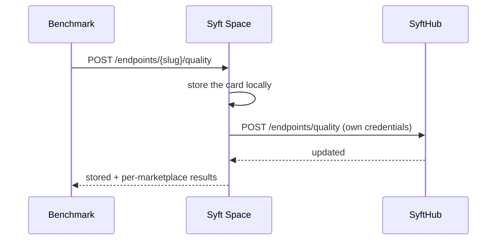
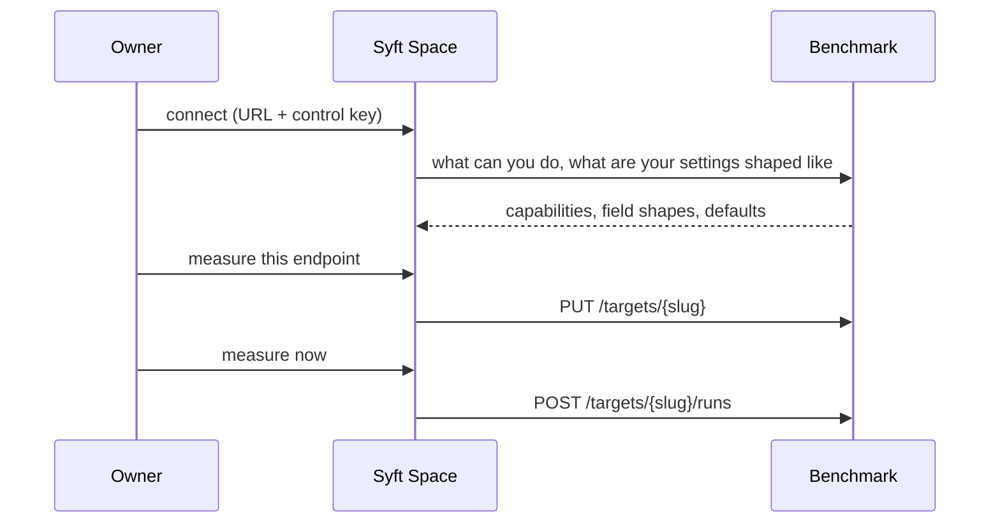

# Benchmark Reporting

Health says an endpoint *responds*. A benchmark says whether what comes back is
any good. This page is about how that verdict reaches the outside world — and
about who is allowed to say it.

## Who does what

The Space measures nothing. A **benchmark** — a separate service, run by whoever
the Space owner trusts — builds a question-and-reference dataset from the
endpoint's own index, asks the questions back, grades the answers, and hands the
Space a **card**. The Space stores it and publishes it to every marketplace it is
registered with.

The split is the point: **marketplace credentials live in the Space and nowhere
else.** A benchmark never needs, and never gets, an account on the hub. It hands
its figures to the Space that owns the endpoint, and the Space speaks for
itself — exactly as it already does for endpoint health.



## Two kinds of product

An endpoint in `raw` mode never writes an answer — it finds material, and
someone else's model answers. So it has no "accuracy": its product is what it
found, and its share of the blame is whether the material it hands over pushes
that model into inventing. An endpoint in `summary` or `both` mode answers and is
judged by the answer.

| `kind` | What was measured | `score` means |
| --- | --- | --- |
| `answering` | the endpoint's own answer | the answer matched the reference |
| `retrieval` | what the search returned | the search found the right material |

**Nothing may render `score` without `kind`.** "Finds 82%" and "correct 82%" are
different claims about different products, and a badge that cannot tell them
apart will state one as the other.

The kind is the benchmark's to decide, from what it actually measured. A card
whose kind no longer matches this endpoint's `response_type` is still stored —
the owner is free to switch modes between runs, and the card describes what
*was* measured, not what is served today. The mismatch is logged.

## Wiring one up

A Space ships with no benchmark. Connecting one is a decision the owner makes on
the **Benchmark** page: who measures. That is a different question from who may
speak in the owner's name — see
[Consent, not assumed](#consent-not-assumed) below — and the two stay separable:
the first connection links them once, and the owner can pull them apart again at
any time by turning reporting back off.



### Settings are stored, not modelled

The Space keeps what the owner set as an opaque document and hands it over.
Naming those fields here would mean a migration in this repository every time
the benchmark grows a knob, and a forgotten migration would mean a form that
silently cannot configure something that already works.

So the **benchmark describes its own fields** — names, types, ranges, choices,
and a group code — and this Space supplies the words. That is the same rule by
which a card carries `trust.flags` as codes: wording belongs to whoever renders
it, in his reader's language. A field nobody has written words for yet is still
shown, under its own name.

### Three layers, and what may not be in the third

| Layer | What | Where it is set |
| --- | --- | --- |
| Installation defaults | everything | the benchmark's own environment |
| Instrument | arms, checks, judges, subject models, thresholds | once per Space |
| Probe | dataset shape, search and answer limits | per Space, refined per endpoint |

An unset field means *take it from the layer above*, never zero. Without that
difference a settings form, opened and closed without a single edit, would zero
the freshness window and the similarity threshold.

**The instrument cannot be overridden on one endpoint.** It is what the card
declares in `instrument`, and endpoints measured with the same one are exactly
the endpoints that compare. Letting one endpoint use a different panel would
make two endpoints of the same Space quietly incomparable while the card still
promised otherwise.

### The key that pays for it

The benchmark does the asking and the grading, so the bill lands with whoever
owns the model provider's key. The Benchmark page therefore shows which
provider the installation uses, what it calls itself there, whether a key is
set, and which hosts it is allowed to reach.

**The key itself never comes here — not as a value, and not into this Space's
database.** A Space never calls the provider, so a copy of that secret would be
extra exposure rather than convenience. The field is read-only: the provider is
configured in the benchmark service's own environment, and changing it means
editing that environment and restarting it.

Roles are listed one by one when they differ, because each has its own address
and key. A single "the provider is X" can be plainly wrong: the question writer
reads the documents and usually has to stay inside the perimeter, while the
models under test almost never do — and an owner reading the single answer
would think his documents go nowhere.

### Two roads to a node

The benchmark reaches this Space's API over HTTP, and the endpoint's index
**directly** — ChromaDB's own port, or `docker exec` into the container when
that port is not published. There is no route through this Space's API for
corpus text and there is not meant to be one: questions and reference answers
quote the owner's documents almost verbatim.

The collection name is resolved from the endpoint's dataset rather than typed.
The owner picked a dataset, not a collection; making him find the name in
ChromaDB would be asking him to know an implementation detail of his own Space.

### What the endpoint's page adds

On the endpoint's **Benchmark** tab, above the card: whether anyone measures it,
whether both roads work, what is happening right now, and — folded away, because
most endpoints differ in nothing — what differs about this one.

Pausing is not the same as stopping. Unticking keeps the settings and the
history and stops new runs; taking the endpoint out removes it from the
benchmark as well, so it does not keep measuring on schedule something that has
been taken off the list. Neither touches what is already published: that is
retraction, and it is a decision of its own.

## Consent, not assumed

`benchmarks_mode` decides whether the reporting route below exists at all.
While it is off, reporting answers **404** — not "you may not" but "there is
nothing here": a Space that does not currently consent should not advertise a
way to speak in its name.

Connecting the first benchmark this Space has ever had turns it on, to
`"local"`. Only the owner can reach the connection route, and making the
connection already says he means for that benchmark to report in his name —
asking him to also find this switch on a settings page and flip it separately
would be the same consent asked for twice. He can turn it back off here at any
time, and it stays off from then on, including through a later, second
connection.

| Route | What it does |
| --- | --- |
| `GET /api/v1/settings/benchmarks` | Read the current mode |
| `PATCH /api/v1/settings/benchmarks` | Set it to `off` or `local` |

| Mode | Meaning |
| --- | --- |
| `off` | The reporting route does not exist |
| `local` | Cards are accepted from an authenticated caller on this Space |

It is a string rather than a flag on purpose: the ways a benchmark may be
trusted will multiply, and `local` is only the first of them.

## Reporting a card

```
POST /api/v1/endpoints/{slug}/quality
```

```json
{
  "version": 2,
  "kind": "answering",
  "arm": "open_book",
  "checked_at": "2026-09-14T03:00:00Z",
  "score": 0.71,
  "fabrication_rate": 0.04,
  "reliable": true,
  "samples": 515,
  "answerable":   {"samples": 412, "correct": 0.71, "abstain": 0.12,
                   "hallucinate": 0.17, "lmi": 0.19},
  "unanswerable": {"samples": 103, "fabricated": 0.04},
  "discrimination": 0.63,
  "retrieval": 0.82,
  "models": [{"model": "anthropic/claude-sonnet-4", "samples": 412,
              "accuracy": 0.78, "fabrication": 0.02, "lmi": 0.10,
              "context_gain": 0.05}],
  "skills": [{"generator": "mcq", "samples": 80, "accuracy": 0.9}],
  "trust": {"judges": 3, "agreement": 0.86, "consistency": 0.91,
            "even_coverage": true, "failed": 2, "pending": 0, "flags": []},
  "dataset": {"mode": "rolling", "window_days": 7,
              "cohort": "20260914-0300", "questions": 515},
  "instrument": {"profile": "default", "judge": "gemma3-4b-gpu",
                 "judges": 3, "subjects": 9}
}
```

### The parts, and why each is there

**Two halves, not one.** `answerable` is the half the corpus can answer;
`unanswerable` is the half it cannot. There is no correct answer to the second,
so any reply at all is an invention — and that is the half a consumer cannot
check for himself and cannot recover from. `fabrication_rate` is its headline.

**`models` is a list, never an average.** A mean over the subject models would
move whenever the benchmark changed its own list of models, while nothing had
happened to this endpoint. The reader's question is "what do I get with *my*
model", and a spread answers it; a mean hides it.

**`reliable` is a gate, not a grade.** The benchmark says whether it vouches for
its own figures. `trust.flags` say why not, as **codes** rather than sentences —
the wording belongs to whoever renders them, in his reader's language. Known
codes: `few_samples`, `judges_disagree`, `uneven_coverage`, `pending_verdicts`,
`failed_calls`.

**`instrument` is what makes comparison honest.** Endpoints measured by one
benchmark installation share a grader, a panel and a list of subject models, and
so compare with each other. Between two installations nothing is guaranteed — and
a marketplace lists both.

### What is refused

Refusing is the point: a card understood wrongly is worse than a card not taken,
because the first publishes a figure that means something else and nobody can
see that it does.

- **`version` this Space does not read** — 422.
- **`kind` that is neither `answering` nor `retrieval`** — 422.
- **A share outside 0..1**, or a negative count — 422.
- **A string where an identifier was expected** — 422. Every string in a card is
  one token: a model id, a task type, a mode, a flag. A benchmark builds its
  questions from a private corpus and promises that only shares, counts and
  identifiers leave it; this is where that promise is checked, by form rather
  than by a list of forbidden words, because a fragment of somebody's corpus
  always has spaces in it.

### The response

Both halves of what happened — what the Space kept, and how each marketplace
answered:

```json
{
  "endpoint_slug": "my-docs",
  "stored": true,
  "results": [
    {"marketplace_id": "…", "marketplace_name": "SyftHub",
     "success": true, "supported": true, "message": "Card reported to SyftHub"}
  ]
}
```

The card is stored locally as well as pushed. The Space needs something to show
its owner, something to re-send after a marketplace outage, and something to
retract. A run that took hours should not be lost to a network blip.

**A marketplace that predates the feature is not a failure.** It comes back with
`supported: false`, and the card is still recorded locally.

## Reading the stored card

```
GET /api/v1/endpoints/{slug}/quality
```

The owner's own view, and **not** gated on `benchmarks_mode`: he must be able to
read what is being said in his name even after closing the door on new reports.

It carries the whole card rather than the badge figures, because this is the
view a retraction is decided from. The owner's question is not "is this endpoint
good" but **"do I vouch for this number"**, and that is answered by what the
number rests on — how many graders, how far apart they were, whether every task
type was measured, how much of the run failed.

```json
{
  "endpoint_slug": "my-docs",
  "reported": true,
  "kind": "answering",
  "score": 0.71,
  "fabrication_rate": 0.04,
  "samples": 515,
  "reliable": true,
  "checked_at": "2026-09-14T03:00:00Z",
  "published_to": ["…"],
  "report": { "…the whole card…" }
}
```

`reported: false` means no benchmark has ever reported. That is not a score of
zero and must never be rendered as one.

### Where the owner reads it

In the Space UI, on the endpoint's **Benchmark** tab. The order on that page is
the order of the owner's questions, not of the benchmark's figures:

1. **What is published about this endpoint**, and the button that takes it down.
2. **Grounds to doubt this run** — the benchmark's own reservations, in words
   rather than codes. Second, because if the run cannot be trusted then nothing
   below it describes the endpoint at all.
3. **Where it breaks** — search hit rate, risk per answer, whether its silence is
   a signal, and the breakdown by question type. This is the part he can go and
   fix.
4. **With each model the benchmark tried**, by name. The marketplace shows only a
   spread; the owner is entitled to know which model his endpoint falls apart
   with, and what his material did to each model's honesty.
5. **What was measured, and with what** — window, question pool, graders,
   profile.

Reporting is switched on in **Settings**; the tab itself is always there, and
says plainly when nobody has measured the endpoint.

## Retracting a card

```
DELETE /api/v1/endpoints/{slug}/quality
```

Owner-only, and **not** gated on `benchmarks_mode`. Reporting can be delegated;
retraction cannot:

- Switching reporting off never strands what was published while it was on.
- A broken or hostile benchmark cannot erase cards it did not report.

The call clears the local card and asks every marketplace to do the same. It is
idempotent — an endpoint with no card returns `cleared: false`, which is not an
error.

## What actually leaves the Space

Shares, counts and identifiers. No questions, no reference answers, no fragments
of the corpus. The questions and references stay with the benchmark, and they
are as sensitive as the documents themselves — they often quote them verbatim.

## Fields on the endpoint

The card is stored in two shapes at once, and that is deliberate. The columns
are what a *list* of endpoints paints a badge from without opening a document per
row; `quality_report` holds the whole card for the detail view.

| Column | Meaning |
| --- | --- |
| `quality_kind` | `answering` or `retrieval`; the score cannot be read without it |
| `quality_score` | headline share for that kind |
| `quality_fabrication_rate` | share of no-answer questions answered anyway |
| `quality_samples` | how many questions were graded |
| `quality_reliable` | whether the benchmark vouches for the figures |
| `quality_checked_at` | when the run happened |
| `quality_report` | the whole card |

All are nullable, and NULL throughout is the honest state: never measured. There
is no TTL — a card stands until a newer one replaces it or the owner takes it
down — so consumers judge freshness from `quality_checked_at`.
