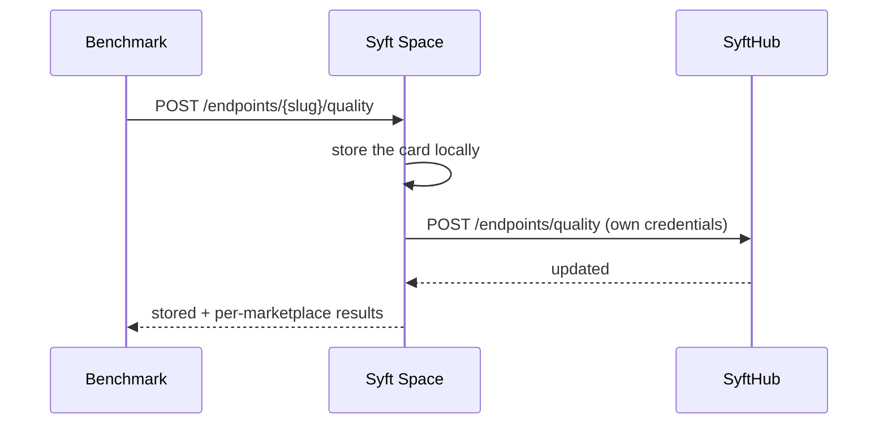
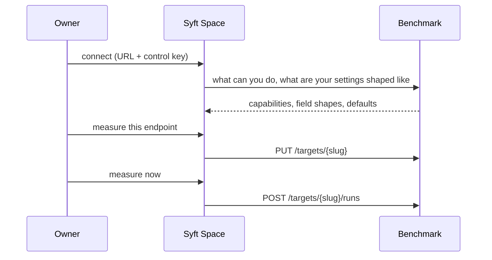

# Benchmark Reporting

Health says an endpoint *responds*. A benchmark says whether what comes back is
any good. This page is about how that verdict reaches the outside world — and
about who is allowed to say it.

## Who does what

The Space measures nothing. A **benchmark** — a separate service, run by whoever
the Space owner trusts — builds a question-and-reference dataset from the
endpoint's own index, asks the questions back, grades the answers, and hands the
Space a **card**. The Space stores it and publishes it to every marketplace it is
registered with.

The split is the point: **marketplace credentials live in the Space and nowhere
else.** A benchmark never needs, and never gets, an account on the hub. It hands
its figures to the Space that owns the endpoint, and the Space speaks for
itself — exactly as it already does for endpoint health.


```mermaid
sequenceDiagram
    participant B as Benchmark
    participant S as Syft Space
    participant H as SyftHub
    B->>S: POST /endpoints/{slug}/quality
    S->>S: store the card locally
    S->>H: POST /endpoints/quality (own credentials)
    H-->>S: updated
    S-->>B: stored + per-marketplace results
```

## Two kinds of product

An endpoint in `raw` mode never writes an answer — it finds material, and
someone else's model answers. So it has no "accuracy": its product is what it
found, and its share of the blame is whether the material it hands over pushes
that model into inventing. An endpoint in `summary` or `both` mode answers and is
judged by the answer.

| `kind` | What was measured | `score` means |
| --- | --- | --- |
| `answering` | the endpoint's own answer | the answer matched the reference |
| `retrieval` | what the search returned | the search found the right material |

**Nothing may render `score` without `kind`.** "Finds 82%" and "correct 82%" are
different claims about different products, and a badge that cannot tell them
apart will state one as the other.

The kind is the benchmark's to decide, from what it actually measured. A card
whose kind no longer matches this endpoint's `response_type` is still stored —
the owner is free to switch modes between runs, and the card describes what
*was* measured, not what is served today. The mismatch is logged.

## Wiring one up

A Space ships with no benchmark. Connecting one is a decision the owner makes on
the **Benchmark** page: who measures. That is a different question from who may
speak in the owner's name — see
[Consent, not assumed](#consent-not-assumed) below — and the two stay separable:
the first connection links them once, and the owner can pull them apart again at
any time by turning reporting back off.


```mermaid
sequenceDiagram
    participant U as Owner
    participant S as Syft Space
    participant B as Benchmark
    U->>S: connect (URL + control key)
    S->>B: what can you do, what are your settings shaped like
    B-->>S: capabilities, field shapes, defaults
    U->>S: measure this endpoint
    S->>B: PUT /targets/{slug}
    U->>S: measure now
    S->>B: POST /targets/{slug}/runs
```

### Settings are stored, not modelled

The Space keeps what the owner set as an opaque document and hands it over.
Naming those fields here would mean a migration in this repository every time
the benchmark grows a knob, and a forgotten migration would mean a form that
silently cannot configure something that already works.

So the **benchmark describes its own fields** — names, types, ranges, choices,
and a group code — and this Space supplies the words. That is the same rule by
which a card carries `trust.flags` as codes: wording belongs to whoever renders
it, in his reader's language. A field nobody has written words for yet is still
shown, under its own name.

### Three layers, and what may not be in the third

| Layer | What | Where it is set |
| --- | --- | --- |
| Installation defaults | everything | the benchmark's own environment |
| Instrument | arms, checks, judges, subject models, thresholds | per Space, refined per endpoint |
| Probe | dataset shape, search and answer limits | per Space, refined per endpoint |

An unset field means *take it from the layer above*, never zero. Without that
difference a settings form, opened and closed without a single edit, would zero
the freshness window and the similarity threshold.

**An endpoint's own instrument overrides the Space-wide one**, the same way its
probe already does — both are flattened here, on this side, before being
handed to the benchmark as one document. The card declares the instrument
each run actually used, so a reader comparing two cards can tell whether they
were measured the same way rather than assuming it.

### The key that pays for it

The benchmark does the asking and the grading, so the bill lands with whoever
owns the model provider's key. The Benchmark page lets the owner set an
address and a key for each of the three roles — generator, subject, judge —
plus the shared default any role left blank falls back to, proxied to the
benchmark's own `PUT /settings` and `PUT/DELETE /credentials/{name}`.

**A key, once set, is never read back — not as a value, and not stored in
this Space's own database.** It travels straight through to the benchmark on
the one call that sets it, sealed there; what this page keeps afterward is
only whether one is set and since when, the same thing the benchmark's own
`GET /credentials` says about itself. Because these four slots are
installation-wide rather than per-connection, setting one from a Space that
shares its benchmark with others changes the bill for all of them — a
trade-off the owner accepts by using the field, not a technical restriction
this page hides from him.

Roles are listed one by one when they differ, because each has its own address
and key. A single "the provider is X" can be plainly wrong: the question writer
reads the documents and usually has to stay inside the perimeter, while the
models under test almost never do — and an owner reading the single answer
would think his documents go nowhere.

### Two roads to a node

The benchmark reaches this Space's API over HTTP, and the endpoint's index
**directly** — ChromaDB's own port, or `docker exec` into the container when
that port is not published. There is no route through this Space's API for
corpus text and there is not meant to be one: questions and reference answers
quote the owner's documents almost verbatim.

The collection name is resolved from the endpoint's dataset rather than typed.
The owner picked a dataset, not a collection; making him find the name in
ChromaDB would be asking him to know an implementation detail of his own Space.

### What the endpoint's page adds

Two tabs, because measuring and reading a measurement are different jobs and
one page doing both buried the figures under the settings that produced them.

The **Benchmark** tab is the console: whether anyone measures this endpoint,
whether both roads work, and the measurement itself. One **Run** starts a full
launch with the settings as they stand — generate, filter, execute, judge,
report — with a cap beside it of so many questions **per generator**, built and
asked, which is what makes trying a configuration cost a handful of calls
instead of a night.

Under it, one collapsible block per phase — **Generate**, **Filter**,
**Execute**, **Judge** — holding the settings that phase reads. They start
nothing of their own: which phases a launch performs is a property of the
launch, and five buttons that each start a partial run are five ways to end up
with a card measured on something other than what these settings say. Report
has no block at all — the results tab builds the same card when it opens, so a
button for it only ever did early what looking does anyway.

Nothing on this tab reads a result.

The **Benchmark results** tab is where a run is read, and it is described
under [Where the owner reads it](#where-the-owner-reads-it).

Every call this page makes for the five blocks is proxied: the Space mints a
session token scoped to this one target and calls the benchmark's own
`/console/*` routes with it, the same routes `packages/benchmark/frontend`
calls directly from a browser holding the token itself — see
[control-api.md](../../../benchmark/docs/control-api.md#the-console). The token
never reaches this page's own browser; only the data it returns does.

Pausing is not the same as stopping. Unticking keeps the settings and the
history and stops new runs; taking the endpoint out removes it from the
benchmark as well, so it does not keep measuring on schedule something that has
been taken off the list. Neither touches what is already published: that is
retraction, and it is a decision of its own.

## Consent, not assumed

`benchmarks_mode` decides whether the reporting route below exists at all.
While it is off, reporting answers **404** — not "you may not" but "there is
nothing here": a Space that does not currently consent should not advertise a
way to speak in its name.

Connecting the first benchmark this Space has ever had turns it on, to
`"local"`. Only the owner can reach the connection route, and making the
connection already says he means for that benchmark to report in his name —
asking him to also find this switch on a settings page and flip it separately
would be the same consent asked for twice. He can turn it back off here at any
time, and it stays off from then on, including through a later, second
connection.

| Route | What it does |
| --- | --- |
| `GET /api/v1/settings/benchmarks` | Read the current mode |
| `PATCH /api/v1/settings/benchmarks` | Set it to `off` or `local` |

| Mode | Meaning |
| --- | --- |
| `off` | The reporting route does not exist |
| `local` | Cards are accepted from an authenticated caller on this Space |

It is a string rather than a flag on purpose: the ways a benchmark may be
trusted will multiply, and `local` is only the first of them.

## Reporting a card

```
POST /api/v1/endpoints/{slug}/quality
```

```json
{
  "version": 2,
  "kind": "answering",
  "arm": "open_book",
  "checked_at": "2026-09-14T03:00:00Z",
  "score": 0.71,
  "fabrication_rate": 0.04,
  "reliable": true,
  "samples": 515,
  "answerable":   {"samples": 412, "correct": 0.71, "abstain": 0.12,
                   "hallucinate": 0.17, "lmi": 0.19},
  "unanswerable": {"samples": 103, "fabricated": 0.04},
  "discrimination": 0.63,
  "retrieval": 0.82,
  "pressure": {"samples": 25, "flip_rate": 0.2, "held": [0.92, 0.84, 0.8]},
  "stability": {"samples": 30, "consistency": 0.91,
                "by_temperature": [{"temperature": 0.3, "accuracy": 0.9},
                                   {"temperature": 0.9, "accuracy": 0.7}]},
  "models": [{"model": "anthropic/claude-sonnet-4", "samples": 412,
              "accuracy": 0.78, "fabrication": 0.02, "lmi": 0.10,
              "context_gain": 0.05}],
  "skills": [{"generator": "mcq", "samples": 80, "accuracy": 0.9}],
  "trust": {"judges": 3, "agreement": 0.86, "consistency": 0.91,
            "even_coverage": true, "failed": 2, "pending": 0, "flags": []},
  "dataset": {"mode": "rolling", "window_days": 7,
              "cohort": "20260914-0300", "questions": 515},
  "instrument": {"profile": "default", "judge": "gemma3-4b-gpu",
                 "judges": 3, "subjects": 9}
}
```

### The parts, and why each is there

**Two halves, not one.** `answerable` is the half the corpus can answer;
`unanswerable` is the half it cannot. There is no correct answer to the second,
so any reply at all is an invention — and that is the half a consumer cannot
check for himself and cannot recover from. `fabrication_rate` is its headline.

**`models` is a list, never an average.** A mean over the subject models would
move whenever the benchmark changed its own list of models, while nothing had
happened to this endpoint. The reader's question is "what do I get with *my*
model", and a spread answers it; a mean hides it.

**`reliable` is a gate, not a grade.** The benchmark says whether it vouches for
its own figures. `trust.flags` say why not, as **codes** rather than sentences —
the wording belongs to whoever renders them, in his reader's language. Known
codes: `few_samples`, `judges_disagree`, `uneven_coverage`, `pending_verdicts`,
`failed_calls`.

**`instrument` is what makes comparison honest.** It names the grader, the
panel and the subject models the card was actually built with, so a reader
comparing two cards — of two endpoints, or the same endpoint over time — can
tell whether they were measured the same way rather than assuming it.

### What is refused

Refusing is the point: a card understood wrongly is worse than a card not taken,
because the first publishes a figure that means something else and nobody can
see that it does.

- **`version` this Space does not read** — 422.
- **`kind` that is neither `answering` nor `retrieval`** — 422.
- **A share outside 0..1**, or a negative count — 422.
- **A string where an identifier was expected** — 422. Every string in a card is
  one token: a model id, a task type, a mode, a flag. A benchmark builds its
  questions from a private corpus and promises that only shares, counts and
  identifiers leave it; this is where that promise is checked, by form rather
  than by a list of forbidden words, because a fragment of somebody's corpus
  always has spaces in it.

### The response

Both halves of what happened — what the Space kept, and how each marketplace
answered:

```json
{
  "endpoint_slug": "my-docs",
  "stored": true,
  "results": [
    {"marketplace_id": "…", "marketplace_name": "SyftHub",
     "success": true, "supported": true, "message": "Card reported to SyftHub"}
  ]
}
```

The card is stored locally as well as pushed. The Space needs something to show
its owner, something to re-send after a marketplace outage, and something to
retract. A run that took hours should not be lost to a network blip.

**A marketplace that predates the feature is not a failure.** It comes back with
`supported: false`, and the card is still recorded locally.

## Reading the stored card

```
GET /api/v1/endpoints/{slug}/quality
```

The owner's own view, and **not** gated on `benchmarks_mode`: he must be able to
read what is being said in his name even after closing the door on new reports.

It carries the whole card rather than the badge figures, because this is the
view a retraction is decided from. The owner's question is not "is this endpoint
good" but **"do I vouch for this number"**, and that is answered by what the
number rests on — how many graders, how far apart they were, whether every task
type was measured, how much of the run failed.

```json
{
  "endpoint_slug": "my-docs",
  "reported": true,
  "kind": "answering",
  "score": 0.71,
  "fabrication_rate": 0.04,
  "samples": 515,
  "reliable": true,
  "checked_at": "2026-09-14T03:00:00Z",
  "published_to": ["…"],
  "report": { "…the whole card…" }
}
```

`reported: false` means no benchmark has ever reported. That is not a score of
zero and must never be rendered as one.

### Where the owner reads it

In the Space UI, on the endpoint's **Benchmark results** tab: **one card per
run**, newest first, the newest open and the rest shut. Every card is the same
card, which is the point — the figures sit in the same places, so two runs are
compared by looking down the page rather than by reading each one.

A card's **header** stays visible whether it is open or shut, because "which
run is public" is the question this page exists to answer:

- a megaphone on the published run, an archive box on every other;
- **Benchmark Result**, and when the benchmark that produced it ran;
- an eye on the published run — **Visible at**, with a link to this endpoint's
  page at each marketplace showing the card (the hub addresses an endpoint the
  way GitHub addresses a repository, `/{username}/{slug}`);
- one button, named for what pressing it does: **Public** on a run that is not
  published, **Private** on the one that is.

Opened, a card carries six figures and three charts, and nothing else:

| Figure | What it is |
| --- | --- |
| `correct` / `found` | the headline share — both numbers where the endpoint answers with its own model, one where it only searches |
| `invented` | of the questions the corpus cannot answer, the share answered anyway |
| `questions` | how many were graded, both halves together |
| `repeats` | the same question asked again, the same answer (`monte_carlo`) |
| `flipped` | of the right answers pushed back on, the share given up (`denial_loop`) |
| `models` | models under test in this run |

An endpoint that answers with its own model is two products at once — a search
that either finds the material or does not, and a model that either uses it
correctly or does not — so its headline tile carries both shares. Split across
two tiles they read as unrelated figures; together, `71%/95%` says plainly which
half to fix.

A dash is "not computed" and never rounds to zero: a block that was not run and
a block that found nothing are different facts. Each figure carries its
explanation behind a mark in the corner of its tile rather than printed under
it — six tiles are read at a glance, six sentences are not read at all. The
six charts do the same, three to a row: answer breakdown, by model under test
and by type of question; then — each drawn only where its block was run — how
many answers were still held after each round of push-back, accuracy at each
temperature the repeats were asked at, and the same model with nothing in front
of it against the same model with this endpoint's material. The last is the
comparison the arms exist for: no gap means the material added nothing, and a
fall means it led the model astray.

**More data** on an open card opens that run on its own, in place of the list:
the same card, and under it what the launch left behind, phase by phase —
**Generate**, **Filter**, **Execute & Judge**. Everything on that page is that
one launch's, which is what `job` on the card is for; a card naming no launch
(a run started outside the queue) says so rather than showing the endpoint's
whole history under the heading of one run.

Execution and judging share a tab because a verdict and the answer it is about
are one fact, and that tab is grouped by the one thing that does not repeat:
the question. The same question goes to every arm, under every check, to every
model under test, and is graded by every judge on the panel — cut by arm and
check first, the page printed the whole generator list nine times and the
question once per cell. Nothing in that was duplicated data; it was one fact
shown from nine angles with the fact repeated each time.

So: generator, question, answer, check. The question is written once; every
answer to it sits under it labelled `Arm A · gpt-4.1` (the full wording a hover
away, since that label repeats where the question does not); and under the
answer, one line per check with a tag per grader — `gpt-4.1: hallucinate`. Which
is also the comparison the arms exist for, read down a few lines instead of
across three collapsed sections.

The answer is written once per arm rather than once per check because
`denial_loop` and `monte_carlo` both record the answer they **started from** —
read as text, the three checks of an arm are the same sentence three times. What
tells them apart is what the check did, so that is the line: *gave in at round
3*, *4 tries at 2 temperatures · the same answer every time*. It also accounts
for the verdict, which otherwise looks like the judge contradicting itself:
`hallucinate` under pressure means the answer was given up, not that it was
wrong.

The tick and the cross sit on the check, which is exactly the key an override is
recorded under — giving an answer up under pressure and getting it right when
asked once are verdicts about two different things. The override stands over the
whole panel, and it belongs to the same launch, so it shows where it was made.

The run at the top may be one this Space has not been handed yet: the benchmark
rebuilds the card from what is graded right now, and that build appears as the
newest run, with the same **Public** button — which is what reports it.

Reporting is switched on in **Settings**; the tab itself is always there, and
says plainly when nobody has measured the endpoint.

## The history, and publishing an earlier run

```
GET  /api/v1/endpoints/{slug}/quality/history
POST /api/v1/endpoints/{slug}/quality/cards/{card_id}/publish
```

Owner-only, and **not** gated on `benchmarks_mode` — for the same reason
retraction is not. A share is unreadable alone: "0.71" says almost nothing,
"0.71, and 0.78 a month ago on twice the questions" is what an owner decides
on. The history therefore carries every card, withdrawn ones included, newest
run first, with the badge figures and what became of each:

```json
{
  "endpoint_slug": "my-docs",
  "cards": [
    {
      "id": "…",
      "kind": "answering",
      "score": 0.71,
      "fabrication_rate": 0.04,
      "samples": 515,
      "reliable": true,
      "checked_at": "2026-09-14T03:00:00Z",
      "reported_at": "2026-09-14T03:41:00Z",
      "retracted_at": null,
      "standing": true,
      "models": 9,
      "profile": "default",
      "report": { "…the whole card…" }
    }
  ]
}
```

Each row carries the whole card, not only the badge figures: the page draws
every run, and figures fetched per row would be a request per row.

`standing` is true for exactly one card — the newest one nobody withdrew, which
is the card the marketplaces show. It is read the same way `GET .../quality`
reads it, so the table and the section above it cannot disagree.

The POST publishes an earlier run over a later one. A newer run is not
automatically the truer one: it can rest on a question set that turned out to
be wrong, or on a night when a model under test was answering badly for reasons
of its own, and which figures stand in the owner's name is his decision.

Nothing is deleted or rewritten. The chosen card stops being withdrawn, every
card measured after it is marked withdrawn, and the stored card is sent to the
marketplaces as it was first reported — so the move is reversible by choosing
the newer run again.

## Retracting a card

```
DELETE /api/v1/endpoints/{slug}/quality
```

Owner-only, and **not** gated on `benchmarks_mode`. Reporting can be delegated;
retraction cannot:

- Switching reporting off never strands what was published while it was on.
- A broken or hostile benchmark cannot erase cards it did not report.

The call clears the local card and asks every marketplace to do the same. It is
idempotent — an endpoint with no card returns `cleared: false`, which is not an
error.

## What actually leaves the Space

Shares, counts and identifiers. No questions, no reference answers, no fragments
of the corpus. The questions and references stay with the benchmark, and they
are as sensitive as the documents themselves — they often quote them verbatim.

## Fields on the endpoint

The card is stored in two shapes at once, and that is deliberate. The columns
are what a *list* of endpoints paints a badge from without opening a document per
row; `quality_report` holds the whole card for the detail view.

| Column | Meaning |
| --- | --- |
| `quality_kind` | `answering` or `retrieval`; the score cannot be read without it |
| `quality_score` | headline share for that kind |
| `quality_fabrication_rate` | share of no-answer questions answered anyway |
| `quality_samples` | how many questions were graded |
| `quality_reliable` | whether the benchmark vouches for the figures |
| `quality_checked_at` | when the run happened |
| `quality_report` | the whole card |

All are nullable, and NULL throughout is the honest state: never measured. There
is no TTL — a card stands until a newer one replaces it or the owner takes it
down — so consumers judge freshness from `quality_checked_at`.
