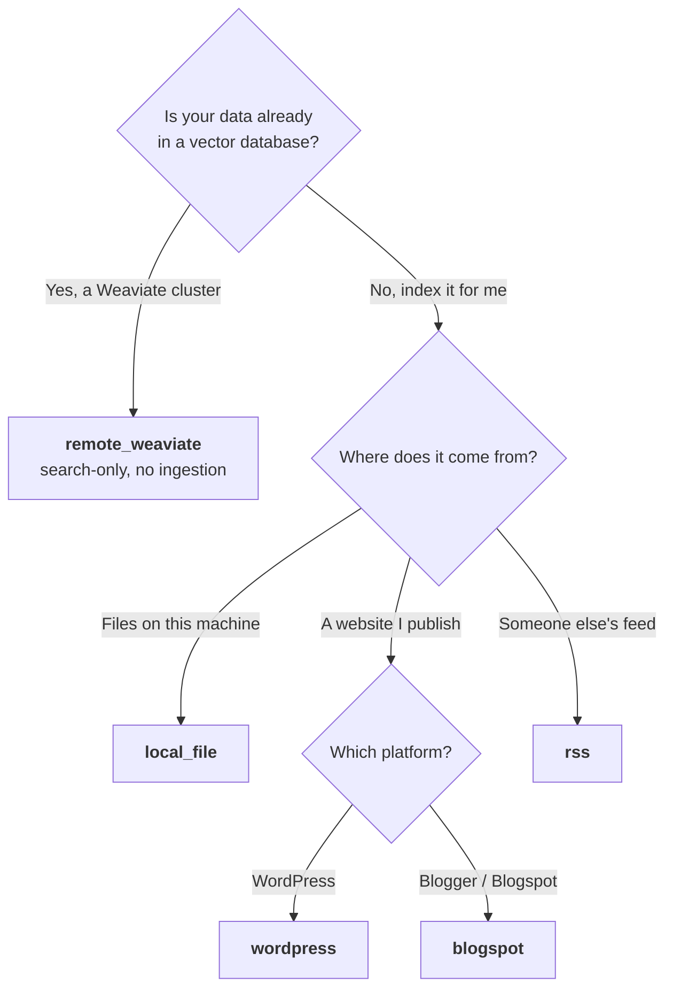
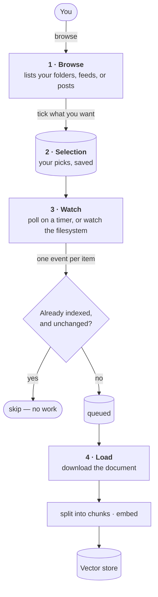

# Dataset Types

A **dataset type** is the answer to *"where does my data live, and where should
it be indexed?"* — one data **source** bound to one **vector store**. You pick a
type when you create a dataset, fill in its form, and tick the items you want.

| Type | Your data lives in | Indexed in | Page |
| --- | --- | --- | --- |
| `local_file` | Files on the machine running Syft Space | ChromaDB (local) | [Local files](./local-file.md) |
| `rss` | Public RSS or Atom feeds | ChromaDB (local) | [RSS / Atom](./rss.md) |
| `wordpress` | A WordPress site you can log in to | ChromaDB (local) | [WordPress](./wordpress.md) |
| `blogspot` | Public Blogger / Blogspot blogs | ChromaDB (local) | [Blogspot](./blogspot.md) |
| `remote_weaviate` | A Weaviate cluster you already populate | Weaviate (remote) | [Remote Weaviate](./remote-weaviate.md) |

## Choosing one

## How they all work

Every ingesting type follows the same four steps. Only the details inside each
box change from type to type.

**Browse** shows you what's available without saving anything. **Selection** is
what you ticked — stored separately from the dataset's settings, so you can add
and remove picks later without editing the dataset. **Watch** decides *when*
something needs indexing. **Load** fetches the actual document.

## How each type decides something changed

Step 3 above compares a **fingerprint** — a short token the source computes per
item. Same fingerprint as last time means nothing is re-indexed, so a re-check
is cheap. What the token is made of decides whether edits are noticed:

| Type | Fingerprint | Edits to an already-indexed item |
| --- | --- | --- |
| `local_file` | file size + modification time | re-indexed |
| `wordpress` | the post's `modified_gmt` | re-indexed |
| `blogspot` | the post's `updated` | re-indexed |
| `rss` | the item's id | **not** re-indexed — RSS cannot express an edit |
| `remote_weaviate` | — | nothing is indexed by Syft Space |

## What each one picks up

| Type | Credentials | You tick | New items appear later | Deleted items |
| --- | --- | --- | --- | --- |
| `local_file` | none | files and folders | yes, instantly (filesystem events) | removed from the index |
| `rss` | none | whole feeds only | yes, each poll | not detected |
| `wordpress` | username + application password | individual posts and pages | no — only what you ticked | not detected |
| `blogspot` | Google API key | a whole blog, or single posts | yes, for a whole-blog pick | not detected |
| `remote_weaviate` | Weaviate API key | nothing | you manage the cluster | you manage the cluster |

> **"Not detected" means** the item stops appearing in polls, but its already
> indexed copy stays searchable. None of these platforms publish a deletion
> record over their API, so there is nothing to react to. Remove the pick to
> take an item out of the index.

## Related reading

- [Core Concepts](../concepts.md) — how sources, vector stores, and bindings fit together
- [Extending the Platform](../extending.md) — adding a new source or vector store
- [Getting Started](../getting-started.md) — creating your first dataset
