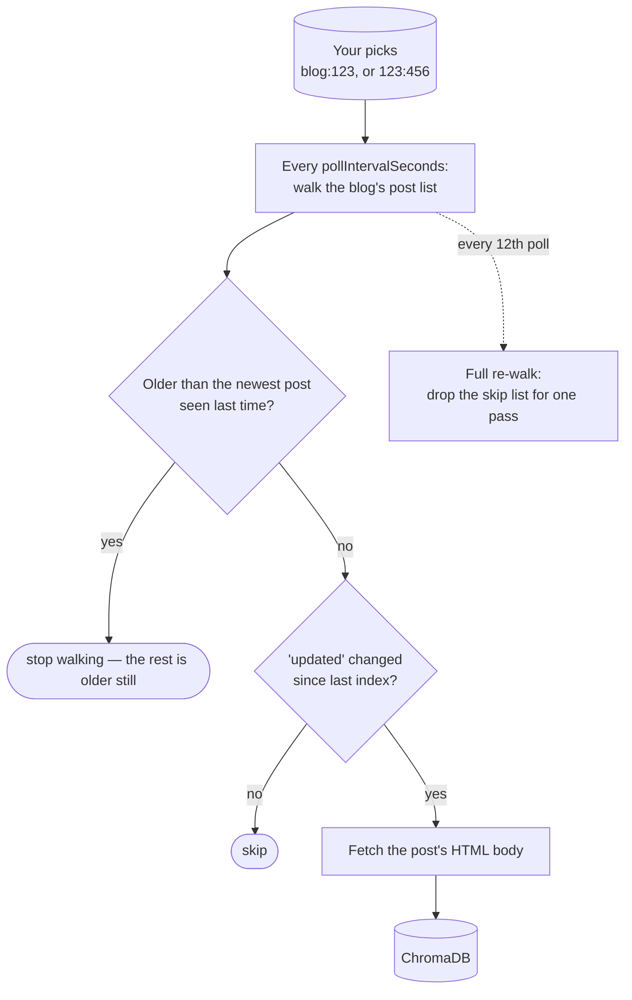

# Blogspot → ChromaDB

**`dtype: blogspot`** — indexes posts from public Blogger / Blogspot blogs
through the Blogger API v3, and notices when they are edited.

This is the type that can follow **a whole blog**: tick the blog once and every
post it publishes afterwards is indexed too.

## Settings

| Field | Required | Default | What it does |
| --- | --- | --- | --- |
| `blogUrls` | **yes** | — | One or more blog URLs, comma-separated, each with its scheme |
| `apiKey` | **yes** | — | A Google API key with the Blogger API enabled |
| `pollIntervalSeconds` | no | `300` | How often to re-check |
| `collectionName` | auto | generated | ChromaDB collection to write into |
| `httpPort` | no | auto | Port of the local ChromaDB server |

The API key is stripped from the dataset's configuration whenever it is read
back over the API. The blog URLs stay visible — they are public addresses, and
seeing which blogs a dataset follows is the point.

### Getting an API key

In the [Google Cloud Console](https://console.cloud.google.com/): create a
project → enable the **Blogger API** → **APIs & Services → Credentials → Create
credentials → API key**. That is the whole process.

> **The key is not a login.** It identifies you for quota purposes only and
> grants no access to anyone's account. This source reads exactly what an
> anonymous visitor could read — one key works for any number of blogs.
>
> Blogger nevertheless *requires* one even for public data, refusing
> unauthenticated callers with "Method doesn't allow unregistered callers".

## What you tick

Each URL resolves to a blog, shown as a container. You can tick either level:

```
My Blog                      ← tick the blog: follow everything, including future posts
├── Introducing v2           ← or tick single posts instead
└── Release notes
```

Ticking **the blog** is a subscription — new posts appear on their own. Ticking
**individual posts** indexes exactly those.

## How it works



Because a whole-blog pick can cover any number of posts, polling walks the
blog's listing rather than asking for specific ids — Blogger has no id filter.
A **watermark** stops each walk as soon as it reaches posts older than the
newest one seen last time, so a large blog is not re-read end to end every
few minutes.

Unchanged posts are not re-announced between sweeps, which keeps a big blog
cheap. Every twelfth poll — roughly hourly at the default interval — that
suppression is dropped for one full walk, so a post whose indexing failed
still gets retried.

## Change detection

The fingerprint is the post's **`updated`** timestamp. Edit a post in Blogger
and the next poll re-indexes it.

## What lands in the index

The post's title as an `<h1>`, a one-line byline (author, date, labels), then
the post's HTML body as Blogger returns it. The byline puts those facts into
the first chunk's text, so a query naming one of them can match on it. The
filename is built from the post's title plus its id, since Blogger has no slug
field.

Stored alongside, and searchable: `title`, `url`, `author`, `published`,
`updated`, `tags` (Blogger labels), `blog_id`, `post_id`.

## Limits

- **Public blogs only.** Drafts and private blogs need an account-delegated
  OAuth token, which this source deliberately does not use. That path was built
  and then discarded — an API key is a single console step, OAuth is a consent
  screen and a refresh cycle.
- **Deletes are not detected.** A removed post stops appearing in polls; its
  indexed copy remains.
- **Quota.** One key covers all your blogs but is shared across them. A short
  poll interval across many blogs will spend it faster.
