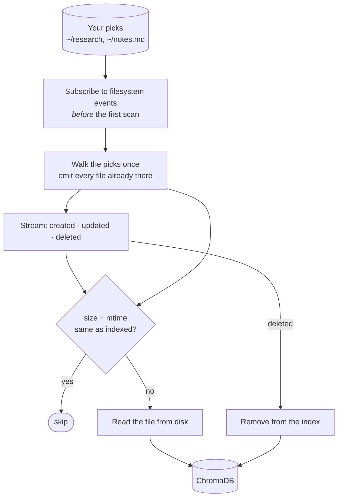

# Local files → ChromaDB

**`dtype: local_file`** — indexes documents sitting on the machine that runs
Syft Space, and keeps the index in step as you edit them.

This is the only type that reacts *instantly*. The others poll on a timer;
this one subscribes to filesystem events, so saving a file starts its
re-indexing within moments.

> **"Local" means local to the server.** If Syft Space runs in Docker or on a
> Syft Station, the picker browses the *container's* filesystem, not your
> laptop's. Mount the directory into the container first.

## Settings

| Field | Required | Default | What it does |
| --- | --- | --- | --- |
| `collectionName` | auto | generated | ChromaDB collection to write into |
| `httpPort` | no | auto | Port of the local ChromaDB server |
| `ingestFileTypeOptions` | no | see below | Which file extensions to admit |

Admitted by default: `.pdf` `.txt` `.html` `.xlsx` `.docx` `.md` `.csv` `.json`

There are no credentials — the server reads the files as whatever user it runs
as, which is also the boundary on what it can reach.

## What you tick

You can tick **a file** or **a whole folder**.

A folder is a *subscription*: it covers every admitted file beneath it, now and
in future. Drop a new `.pdf` into a ticked folder and it is indexed without you
touching the dataset.

```
~/research/                 ← tick this…
├── 2024-notes.md           ✓ indexed
├── paper.pdf               ✓ indexed
├── data.parquet            ✗ extension not admitted
├── .hidden-draft.md        ✗ hidden files are always skipped
└── archive/
    └── old.docx            ✓ indexed — folders are recursive
```

Hidden files and folders are skipped at ingestion no matter what, even if you
enabled *show hidden* while browsing.

## How it works



The subscription opens *before* the initial walk on purpose: a file saved
mid-scan is buffered rather than missed.

## Change detection

The fingerprint is the file's **size plus modification time**. Edit and save,
and both change — the file is re-indexed, replacing its old chunks. Touching a
file without changing it leaves the fingerprint alone and costs nothing.

Paths are resolved before use, so a symlinked pick and the real file agree on
one identity instead of being indexed twice.

## Deletes

This is the only type that handles them. Delete a watched file and the watcher
emits a `deleted` event, which removes its content from the index.

## Limits

- **Server-side only.** No network drive support beyond whatever the OS has
  already mounted.
- **Extension-based admission.** A `.pdf` renamed to `.txt` is admitted and
  parsed as text.
- **Unticking a folder** removes everything under it from the index, since the
  folder pick was what covered those files.
