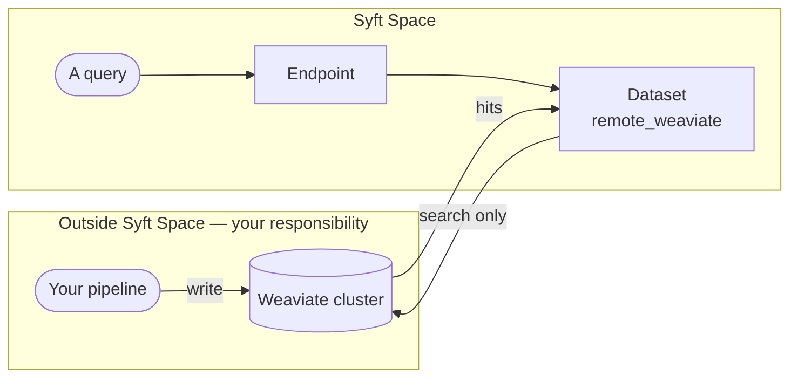

# Remote Weaviate

**`dtype: remote_weaviate`** — searches a Weaviate cluster you already run and
populate yourself. **Syft Space indexes nothing here.**

This is the odd one out. Every other dataset type pairs a data source with a
vector store; this one pairs a vector store with *nothing*. There is no browsing
step, no selection, no polling, no ingestion — you own the pipeline that fills
the cluster, and Syft Space only reads from it.

Reach for it when your embeddings already live somewhere, or when the indexing
pipeline is a system of its own that you would rather not move.

## Settings

| Field | Required | What it does |
| --- | --- | --- |
| `http_url` | **yes** | The cluster's HTTP endpoint |
| `grpc_url` | **yes** | The cluster's gRPC endpoint — Weaviate needs both |
| `api_key` | **yes** | API key for the cluster |
| `collection_name` | **yes** | The collection to search |
| `headers` | no | Extra headers, e.g. a vectoriser module's own API key |
| `content_property` | no | Which property holds the text to return as the hit |
| `metadata_properties` | no | Which other properties to return alongside |
| `default_similarity_threshold` | no | Minimum score for a hit to count |
| `filters` | no | A filter always applied to every query |

## How it works

Compare that with the [other types](./README.md#how-they-all-work), where the
browse → select → watch → load pipeline runs inside Syft Space.

## What you give up

| | Ingesting types | `remote_weaviate` |
| --- | --- | --- |
| Browsing and picking items | yes | — nothing to pick |
| Automatic re-indexing on change | yes | your pipeline's job |
| Deleting content through Syft Space | yes | your pipeline's job |
| Health check | yes | yes |
| Search, endpoints, policies, payments | yes | yes |

Everything downstream of the dataset works normally: this dataset can back an
endpoint, answer `raw` / `summary` / `both` queries, carry rate limits and
payment policies, and be published to SyftHub exactly like any other.

## Limits

- **Read-only by design.** The binding has no ingest or delete path at all —
  not disabled, absent.
- **Schema is yours.** Syft Space does not create or migrate the collection. If
  `content_property` names a property that is not there, queries return nothing
  useful.
- **Both URLs are required.** Weaviate's client uses gRPC for search and HTTP
  for everything else; one without the other will not connect.
