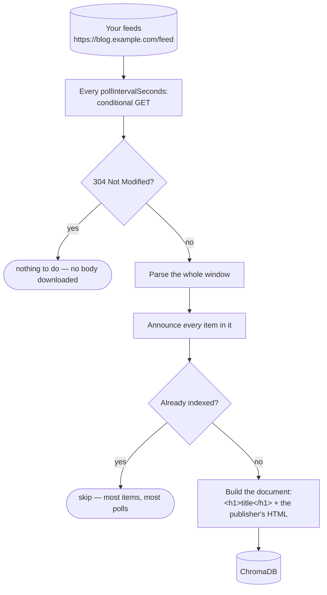

# RSS / Atom → ChromaDB

**`dtype: rss`** — follows one or more public RSS or Atom feeds and indexes
every article they publish from the moment you subscribe.

No credentials. A private feed already carries its token inside the URL, so
there is nothing separate to ask for.

## Settings

| Field | Required | Default | What it does |
| --- | --- | --- | --- |
| `feedUrls` | **yes** | — | One or more feed URLs, comma-separated. **HTTPS only** |
| `pollIntervalSeconds` | no | `3600` | How often to check. One of 15 min / 1 hour / 6 hours / daily |
| `collectionName` | auto | generated | ChromaDB collection to write into |
| `httpPort` | no | auto | Port of the local ChromaDB server |

Both the setup check and every fetch reject anything but `https`, on the
original URL *and* on each redirect hop. With certificate verification, that
also keeps the server from being pointed at your internal network.

## The one thing to understand: a feed is a window, not an archive

A feed URL is a **single document the publisher rewrites in place**. It holds
their most recent items — maybe 10, maybe 500 — and there is no way to page
back to what has scrolled off.

```
09:00   feed = [ A  B  C  D  E ]
10:00   feed = [ B  C  D  E  F ]      A is gone. Nothing can fetch it now.
11:00   feed = [ C  D  E  F  G ]      B is gone.
```

**This makes the poll interval a correctness setting, not a performance knob.**
If you poll slower than the feed turns over, the items in between are lost with
no way to ask for them again. Match the feed's publishing rate:

| Feed looks like | Use |
| --- | --- |
| A busy news site or aggregator | Every 15 minutes |
| A normal blog | Every hour *(default)* |
| A low-traffic or personal site | Every 6 hours |
| A podcast archive, a changelog | Once a day |

## What you tick

**Whole feeds only.** Expanding a feed shows the articles it currently holds so
you can confirm you have the right URL, but you cannot tick them individually.

That is deliberate: a single-article pick would index once and then poll forever
without ever producing anything again. Ticking the feed subscribes you to
everything it publishes from now on.

## How it works



Each poll re-announces the **entire** window, not just what is new. The first
poll therefore indexes everything the feed currently holds — a 500-episode
podcast archive arrives in full, queued and worked through in the background.
After that, nearly all of each poll is already indexed and skipped in memory. That sounds wasteful but buys
something: an article whose indexing failed is retried automatically on the next
poll, with no bookkeeping to go stale.

Between polls the source sends `If-None-Match` / `If-Modified-Since`, so an
unchanged feed answers `304` and costs no download at all.

## Change detection

**Edits are not noticed.** RSS 2.0 carries only a publication date and has no
way to say "this article was revised", so an item's fingerprint is its identity
and never changes. Indexing is append-only: new articles are added, existing
ones are left as first seen.

If a publisher routinely rewrites posts, use [WordPress](./wordpress.md) or
[Blogspot](./blogspot.md) against the same site instead — both expose a real
modification timestamp.

## What lands in the index

The document is the article's title as an `<h1>`, followed by the publisher's
own HTML. The heading matters: long articles are split into chunks, and the
heading gives each chunk something naming what it is about.

Stored alongside, and searchable: `feed_url`, `feed_title`, `title`, `url`,
`comments_url`, `author`, `tags`, `published`.

**Link-only items** — a Hacker News entry, for example, whose whole body is one
"Comments" anchor — are indexed as their title alone. The body is dropped so the
same boilerplate is not embedded onto every item in the feed. An item with
neither text nor a title is skipped.

## Limits

- **Deletes are not detected.** A withdrawn article stops appearing; its indexed
  copy remains.
- **Very large items are skipped**, over roughly 1 MB of HTML in one article.
- **Absurdly large feeds are truncated** past 5,000 items in one document,
  which is a guard against a malformed feed rather than a limit on real ones —
  the largest archive measured was 560. It is set high because every poll
  re-reads the window from the start, so anything cut is cut for good.
- **Items that scroll off before a poll are unrecoverable.** This is the feed's
  limitation, not Syft Space's.
