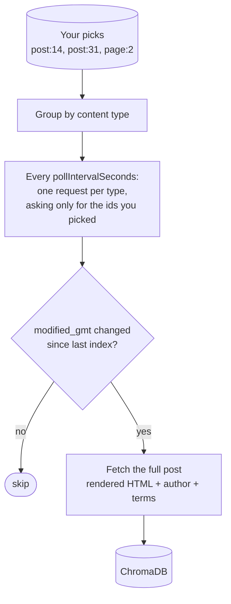

# WordPress → ChromaDB

**`dtype: wordpress`** — indexes posts, pages, and any other public content type
from a WordPress site, through its built-in REST API at `/wp-json/wp/v2/`.

Use this for **a site you can log into**. It reads through your account, so it
sees what that account is allowed to see, and it notices edits. For a site you
only read publicly, use [RSS](./rss.md).

## Settings

| Field | Required | Default | What it does |
| --- | --- | --- | --- |
| `siteUrl` | **yes** | — | The site's base URL, e.g. `https://example.com` |
| `username` | **yes** | — | Your WordPress login name |
| `applicationPassword` | **yes** | — | An Application Password — *not* your login password |
| `pollIntervalSeconds` | no | `300` | How often to re-check your picks |
| `userAgent` | no | Syft Space's | Override when a site firewall expects a specific value |
| `collectionName` | auto | generated | ChromaDB collection to write into |
| `httpPort` | no | auto | Port of the local ChromaDB server |

A trailing `/wp-json` on the site URL is trimmed for you.

### Getting an Application Password

In wp-admin: **Users → Profile → Application Passwords**. Name it something like
`syft-space`, create it, and copy the 24-character value — WordPress shows it
once. It can be revoked from that same screen without touching your real
password.

## What you tick

Browsing shows one container per content type the site exposes — Posts, Pages,
and any custom types — each listing its items most-recently-edited first, paged
as you scroll.

**You tick individual items.** There is no "follow this whole post type" mode,
so posts published *after* you set the dataset up will not appear on their own.
Add them by editing the dataset's selection.

```
Posts                  ← a container: expand it, you cannot tick it
├── Hello world        ✓ tick this
└── Release notes v2   ✓ and this
Pages
└── About              ✓ and this
```

## How it works



Polling asks for your picked ids specifically, in batches of 100 — it never
crawls the site. Ten picks cost one request per content type, however large the
site is.

## Change detection

The fingerprint is the post's **`modified_gmt`**. Edit a post in wp-admin and
the next poll re-indexes it, replacing the old chunks. This is the type to
choose when your content gets revised.

## What lands in the index

The post's **rendered** HTML — shortcodes expanded, blocks resolved — exactly
what a visitor's browser would receive.

Stored alongside, and searchable: `title`, `url`, `author`, `published`,
`updated`, `tags` (categories and tags flattened together), `post_type`,
`post_id`, `slug`, `status`.

## Troubleshooting

| What you see | What it usually means |
| --- | --- |
| *Authentication failed (401)* | Wrong username, or the Application Password was mistyped or revoked |
| *403 listing post types* | The account lacks edit rights, or a firewall is blocking the User-Agent — try setting `userAgent` |
| *No WordPress REST API found* | Not a WordPress site, the URL is wrong, or a plugin has disabled the REST API |
| *No ingestable post types exposed* | Connected fine, but the site publishes nothing readable over REST |

Credentials are checked when you save the dataset, not at first ingest, so
these surface immediately.

## Limits

- **Self-hosted WordPress.** `wordpress.com`-hosted sites use a different API.
- **Deletes are not detected.** A removed post stops appearing in polls; its
  indexed copy remains until you untick it.
- **No whole-site subscription.** Every post is an explicit pick.
- **Published and private posts only.** Private posts your account can see are
  listed and indexed; **drafts are not**. Media attachments are excluded too.
