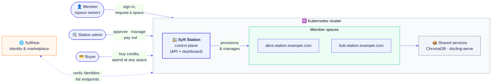
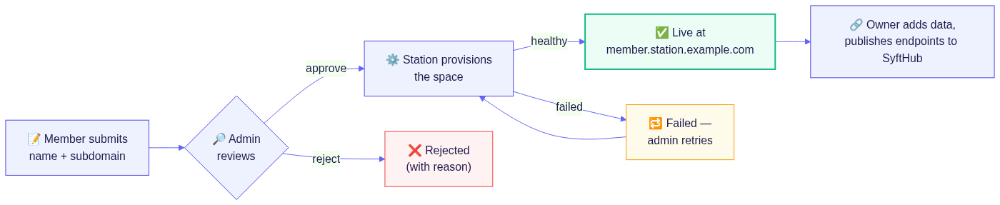

#  Syft Station

[](https://www.python.org/downloads/)
[](https://fastapi.tiangolo.com/)
[](https://vuejs.org/)
[](https://helm.sh/)
[](../../LICENSE)

> **Spin up your own Space, dock it to the Station.** Share the infrastructure, never your data.



## What is Syft Station?

Syft Station lets one organization run **[Syft Spaces](../../README.md) for all
of its members on shared Kubernetes infrastructure**. Members sign in with
their SyftHub account and request a space; the station admin approves; the
station provisions each space at its own subdomain — backed by shared
services (ChromaDB, docling-serve) so no member runs their own.

Each space stays fully member-owned: the station manages the
infrastructure, never the data.

**Key benefits:**

- **🚀 One-click spaces** — members get a running, publicly reachable space without touching Kubernetes
- **🔒 Member-owned data** — the station provisions and manages; each space's data belongs to its owner
- **📦 Shared heavy lifting** — one ChromaDB and one docling-serve serve every space
- **💰 One wallet, many spaces** — buyers purchase credits once and spend them at any space on the station; the station tracks each member's earnings
- **🛡️ Admin control** — review every request, pick the syft-space version, restart/update/pause any space from one dashboard

## How it works



- **Members** sign in with SyftHub, request a space by name and subdomain,
  and track its status. Once live, they open it through a one-click admin
  link, load their documents, and publish endpoints to SyftHub.
- **The admin** reviews requests (tweak the name or subdomain, attach the
  shared wallet, approve or reject with a reason), then manages the fleet:
  restart, pause, update every space to a new syft-space version, and pay
  members out for what their spaces earned.
- **Buyers** never touch the station UI — they buy credits through
  SyftHub (Xendit or Stripe checkout) and spend them at any space on the
  station.

## 🚀 Run a station

The Helm chart deploys everything — the station, the shared backends, and
per-space defaults:

```bash
helm install syft-station oci://ghcr.io/openmined/charts/syft-station \
  --version <version> \
  --namespace syft-spaces --create-namespace \
  --set station.adminEmail=you@your-org.com \
  --set station.ingress.host=station.your-org.com
```

Then:

1. **Point DNS at the cluster** — the station host plus a wildcard for
   the spaces (e.g. `*.station.your-org.com`).
2. **Open the station** in a browser and sign in with the admin email
   (a SyftHub account).
3. **First-run setup** walks you through the spaces' domain, an optional
   shared wallet, and the syft-space version to deploy.

For HTTPS, bring one certificate covering the station host and the space
wildcard — details in [docs/deployment.md](docs/deployment.md#tls).

### Local development

```bash
just dev up admin=you@org.com   # station on the host with hot reload,
                                # spaces provisioned into a local k3d cluster
```

The station comes up at `http://station.localhost` with the same URLs and
onboarding as production. See [docs/deployment.md](docs/deployment.md#the-dev-loops).

## 📚 Documentation

Implementation docs live in [`docs/`](docs/README.md) — one page per
component: [architecture](docs/architecture.md), [auth](docs/auth.md),
[requests & spaces](docs/requests-and-spaces.md),
[provisioning](docs/provisioning.md), [credits](docs/credits.md), and
[deployment](docs/deployment.md).

Deploying to production? Read the
**[security guidelines](docs/security.md)** first — firewall rules, DNS
and certificates (with a worked example), and the secrets an admin is
responsible for.

## 🌐 Part of the Syft Network

A station is how an organization joins the network at scale: every space
it hosts publishes its endpoints to
**[SyftHub](https://syfthub.openmined.org)**, where knowledge seekers
discover and query them — and pay in credits held by the station's shared
wallet. The station verifies every identity (members and buyers) against
SyftHub; it stores no passwords of its own.

## 📄 License

Part of the OpenMined ecosystem, licensed under Apache 2.0 — see
[LICENSE](../../LICENSE).

---

<div align="center">
  <strong>Built with ❤️ by the <a href="https://github.com/OpenMined">OpenMined</a> community</strong><br>
  <em>Making AI safer through privacy-preserving technology</em>
</div>
