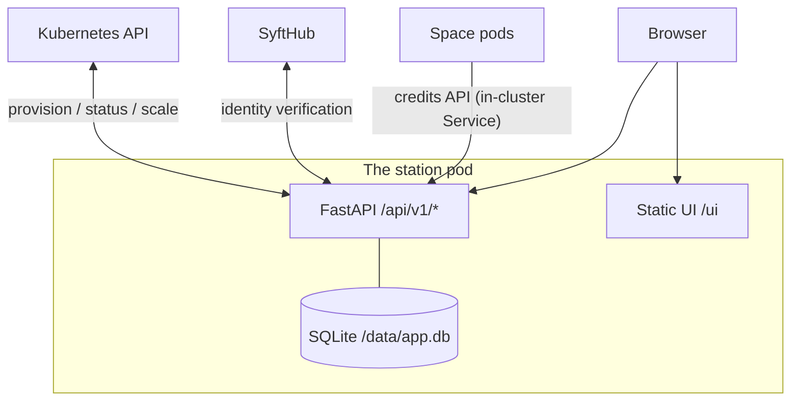

# Architecture

The station is **one pod**: a FastAPI backend (`backend/`, package
`syft_station`) that serves the built Vue frontend statically. There is no
separate frontend deployment, no worker fleet, no message queue — SQLite on
a persistent volume is the only state, and Kubernetes itself is the source
of truth for anything runtime (a space's health is read live, never
stored).

## Components

Domain-driven components under `syft_station/components/`, each with the
same file split (`entities.py`, `handlers.py`, `repository.py`,
`routes.py`, `schemas.py`, plus `interfaces.py` where a seam exists):

| Component | Routes | Owns |
|---|---|---|
| `auth/` | `/api/v1/auth/*` | SyftHub sign-in proxy, sessions, roles → [auth.md](auth.md) |
| `setup/` | `/api/v1/setup` | First-run config singleton: spaces domain + supported version. `onboarded ⇔ domain != ""` |
| `requests/` | `/api/v1/requests/*` | The space-request lifecycle state machine → [requests-and-spaces.md](requests-and-spaces.md) |
| `spaces/` | `/api/v1/spaces/*` | Provisioned-space registry, admin tokens, restart/update/pause → [requests-and-spaces.md](requests-and-spaces.md) |
| `provision/` | — (no routes) | The `Provisioner` protocol and its k8s/mock implementations → [provisioning.md](provisioning.md) |
| `credits/` | `/api/v1/credits/*` | Wallet, gateways, ledger, earnings → [credits.md](credits.md) |
| `images/` | `/api/v1/images` | syft-space version picker: lists image tags from the registry (below) |
| `shared/` | — | `database.py` (AsyncDatabase, WAL pragmas), logging, `email.py` (`NormalizedEmail`) |

## Wiring

All composition happens in `main.py`, by hand — no DI container. Handlers
receive their repositories and collaborators as constructor arguments;
routes are built by `build_*_routes(handler) -> APIRouter` factories and
mounted under `/api/v1`. Handlers own business logic and raise
`HTTPException`; repositories own persistence; routes stay thin.

Cross-component collaboration goes through **structural Protocols, not
imports**, wherever the dependency would otherwise tangle domains — e.g.
the requests component declares a `WalletAttachments` protocol that
`SpaceCreditsService` (credits) happens to satisfy, and the credits
component declares `SpaceIdentities` that the requests repository
satisfies. Neither side imports the other.

## Configuration

`config.py`: pydantic-settings with env prefix `SYFT_STATION_`. Everything
deploy-time is env; everything the admin decides at runtime (domain,
version, wallet) lives in the database. The Helm chart maps
`values.yaml` keys to `SYFT_STATION_*` env one-to-one
([deployment.md](deployment.md)).

## Persistence

- SQLite via SQLModel + aiosqlite, WAL mode, at
  `~/.syft-station/app.db` (in-cluster: `/data/app.db` on the PVC; the
  Deployment uses `strategy: Recreate` so there are never two writers).
- **Alembic from day one**: schema changes always ship with a migration.
  The server runs pending migrations at startup; `syft-station upgrade-db`
  runs them standalone. Never auto-generate schema in production.

## Startup and shutdown

`main.py`'s lifespan: run migrations → ensure the setup singleton row →
warn if `admin_email` is unset (nobody would get the admin role) → probe
the Kubernetes cluster once (failure is logged, not fatal — the station
serves and surfaces the error at provisioning time). On shutdown it waits
for any in-flight provisioning task before disposing the database.

## The frontend

Vue 3 + TypeScript + Tailwind + shadcn/ui + Pinia (`frontend/`), the same
stack and conventions as syft-space's frontend. The backend serves the
packaged UI from `syft_station/ui` when present (the Docker image copies
the built `dist` there), else the sibling `frontend/dist` (dev builds);
`/` redirects to `/ui`. The Vite dev server (`:5174`) proxies `/api` to
the backend on `:8090` so the session cookie stays same-origin.

## The images component

The admin picks which syft-space version the station deploys from a
registry version picker. `images/registry.py` talks the OCI Distribution
API anonymously (public images grant an anonymous pull token). Build tags
are commit ids with no inherent order, so each tag's creation date is
resolved through the chain *tag → index manifest → platform manifest →
config blob*; `latest` is identified by digest match, per-arch tags
(`-amd64`/`-arm64`) are hidden, and resolved tag metadata is memoized —
tags are immutable once pushed, so only new tags ever cost the
three-request chain again.

## Versioning

`station/backend/pyproject.toml` is the single version source, independent
of syft-space's own `backend/pyproject.toml` (one monorepo, separately
versioned projects). The running station reports it at `/version` (via
`importlib.metadata`), and the release pipeline stamps the same number
onto the image tag and the Helm chart — see
[deployment.md](deployment.md#the-release-pipeline).
