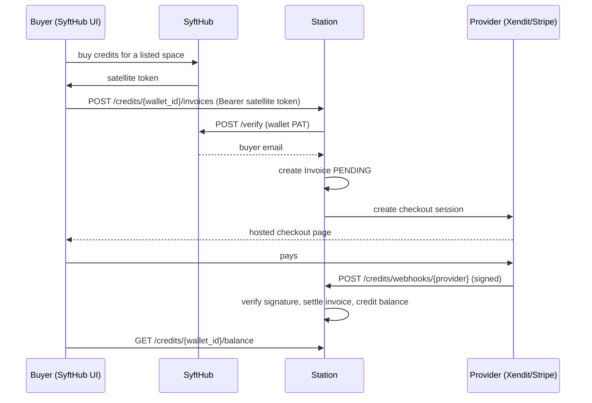

# Credits

The optional money layer: one shared wallet per station, buyers who
prepay credits and spend them at any space, and earnings the admin pays
out to members. Everything lives in the `credits/` component; the handlers
are split **one class per caller** — `CreditsHandler` (spaces),
`CheckoutHandler` (buyers via SyftHub), `WalletAdminHandler` +
`EarningsHandler` (admin), `WebhookHandler` (payment providers).

## The wallet

One wallet per station (a handler-enforced policy, not a schema
constraint — multi-wallet later is a code change only). It records the
**provider** (`xendit` or `stripe`), the **currency** (locked at setup:
station currency = wallet currency; replacing the wallet keeps it), the
provider **credentials** (API key + webhook secret), and the **hub
identity**: the owner's SyftHub user id plus a PAT used to verify buyers'
satellite tokens server-side ([auth.md](auth.md#buyer-verification-credits)).

The wallet's **id is the canonical shared identity**: it's injected into
every attached space as `SYFT_CLUSTER_CREDITS_WALLET_ID` and adopted by
the space as its own cluster-wallet id — so all spaces of one station
present a single balance to the SyftHub marketplace.

Payment gateways sit behind the `PaymentGateway` seam
(`gateway/interfaces.py`), with `gateway/xendit.py` and
`gateway/stripe.py` as implementations — checkout-session creation and
webhook signature verification are the whole surface. Prepaid bundle
catalogs (`bundles.py`, `PREPAID_BUNDLES`) are keyed provider → currency;
credits convert 1:1 with money.

## Space attachment lifecycle

`SpaceCreditsService` (`credits/provisioning.py`) satisfies the requests
component's `WalletAttachments` protocol — structurally, no import in
either direction. The request lifecycle calls in at three points:

```
approve   → choose_wallet    resolve the admin's wallet pick
provision → grant_for_space  mint the token + wallet facts for the Secret
delete    → revoke_space     kill the space's credits access
```

**Token invariant:** space credits tokens (`sct_…`) exist in plaintext
only between minting and the k8s Secret write; the station stores the
sha256 hash and verifies bearers by hash lookup. Every provisioning
attempt is revoke-then-mint — a failed attempt never leaves a live
credential behind, and the pod that comes up always has a token the
station honors.

`WalletRollout` handles the other direction: when the admin creates (or
replaces) the wallet, every existing space that is neither attached nor
opted out gets a token minted, its Secret patched, and an automatic
restart. A space whose restart fails is flagged `restart_required` —
never silently left running on the old env.

## The buyer flow



Load-bearing details:

- The Invoice row is created **before** the provider call, so a provider
  session can never outlive a local record; `client_reference`
  (`syft-<id>`) is the join key providers echo back in webhooks.
- Webhooks are **signature-verified per provider** (Stripe: HMAC over
  `t.body`, v1 scheme only, 300-second tolerance window; Xendit: callback
  token). One generalized route serves both:
  `POST /credits/webhooks/{provider}`.
- Delayed payment methods settle through a PROCESSING state; the webhook
  is what moves money, never the redirect.
- Buyer-facing URLs (`payment_url`, `invoices_url`, `credits_url`) are
  minted into the space's publish payload from the station's public URL —
  buyers reach the *station's* checkout, not the space.

## The debit hot path

Spaces charge per paid query: `POST /credits/debit` with their `sct_`
token, over the in-cluster Service URL (`SYFT_CLUSTER_CREDITS_URL`) — no
ingress round-trip. The token binding supplies both authorization and
attribution: earnings follow the calling space, refunds are scoped to the
caller's own debits.

**Idempotency:** the space generates `transaction_id`. Debits deduct via
an atomic conditional update (never below zero → 402); a replayed debit
or a concurrent double-refund lands on `UNIQUE(transaction_id, type)` and
is answered with the original outcome — never a second movement. The
admin can reverse a specific debit
(`POST /credits/admin/debits/{transaction_id}/reverse`).

Ledger design: `user_balances` is the materialized per-buyer balance (the
hot row), `ledger_entries` the append-only movement log, `invoices` the
purchase records. `user_email` is a soft reference to a SyftHub identity —
lowercased at every boundary ([auth.md](auth.md#emails-are-one-lowercase-identity)).

## Earnings and payouts

- Members: `GET /credits/earnings/mine` — per-space earned totals.
- Admin: `GET /credits/admin/earnings` (per space),
  `/admin/balances` (outstanding buyer balances = the station's
  liability), `POST /admin/payouts` (record a payout to a member;
  `payouts` table is the audit trail).

### Deleted spaces

Earnings attribution survives space deletion: the credits component
declares a `SpaceIdentities` protocol that the **requests** repository
satisfies — a deleted space's name and owner resolve from its request
row, which is never deleted. Member earnings keep showing
deleted-space money; the admin's delete dialog warns about unpaid
payables but never blocks.

## Routes at a glance

All paths are relative to the `/api/v1` prefix the app mounts every router
under.

| Caller | Routes |
|---|---|
| Space (`sct_` Bearer) | `POST /credits/debit`, `POST /credits/refund`, `GET /credits/balance` |
| Buyer (satellite token) | `POST /credits/{wallet_id}/invoices`, `GET /credits/{wallet_id}/invoices/me`, `GET /credits/{wallet_id}/balance` |
| Member (session) | `GET /credits/earnings/mine` |
| Admin (session) | `GET/PUT /credits/admin/wallet`, `POST /credits/admin/wallet/hub-token`, `GET /credits/admin/earnings`, `GET /credits/admin/balances`, `POST /credits/admin/payouts`, `POST /credits/admin/debits/{txn}/reverse` |
| Provider | `POST /credits/webhooks/{provider}` |
| Anyone signed in | `GET /credits/wallet` (wallet status, non-secret) |
