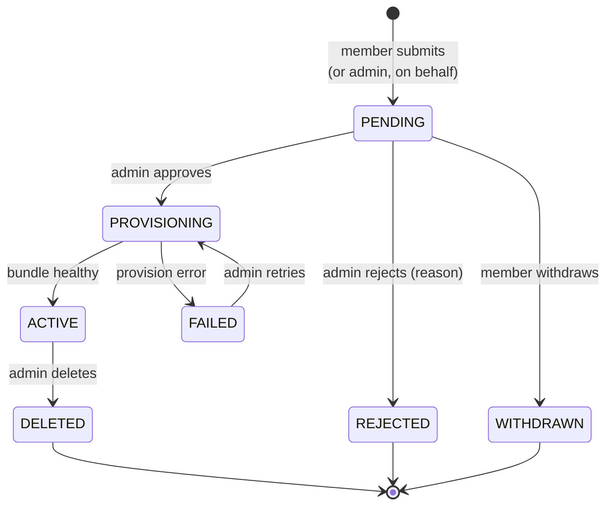

# Requests and spaces

The request lifecycle is the station's core state machine; the spaces
registry is what an approved request leaves behind. Two components, one
story.

## The request lifecycle

Routes (all under `/api/v1`): `POST /requests` (submit), then per-request
`approve`, `reject`, `retry`, `delete`, `withdraw`. Members see their own
requests (`GET /requests` is owner-scoped); the admin sees all. `WITHDRAWN` exists
as a state (rather than row deletion) so the admin retains visibility of
what members asked for and took back.

## Two reservation sets, deliberately different

Two tuples in `requests/entities.py` govern what a request "holds", and
they differ by exactly one state:

- **`SUBDOMAIN_RESERVING_STATUSES`** — `PENDING, PROVISIONING, ACTIVE`.
  A subdomain is taken while a request could still (or does) resolve to
  it. **FAILED frees the subdomain**: someone else may claim the name.
- **`OWNER_SLOT_STATUSES`** — the same three **plus FAILED**. SyftHub
  supports one space per user, so a failed request still occupies its
  owner's single slot — it's admin-retryable, and a second space must not
  appear mid-retry.

The one-space-per-owner rule is enforced twice: a guard in the submit
handler (`live_request_for_owner`, returning 409 with the occupying
request), backstopped by a **partial unique index**
(`uq_owner_live_request` on `owner_email` where status is slot-holding) so
a race can't sneak a second row in. The two status lists must stay in sync
— the migration carries the same set as the entity.

Admins can submit **on behalf of a member** (`owner_email` in the submit
body, ignored for member callers); the request records its `origin`
(member/admin), and an admin's own request doesn't block on-behalf
submissions for others.

## Approval

`POST /requests/{id}/approve` is review-and-confirm: the admin can edit
the name and subdomain in the same call (conflict resolution without a
round-trip), and picks the wallet attachment — `attach_wallet: false`
provisions without managed credits; `wallet_id: null` means "the station
wallet, if any". Approval requires the station to be onboarded (setup's
domain set). The subdomain is validated as a DNS-1123 label and checked
for conflicts against reserving requests.

Approval flips the request to `PROVISIONING` and hands off to the
converger (below). Provisioning runs as a background task; the request
row's status is what the UI polls.

## The spaces registry

A `Space` row is created when provisioning succeeds. Design decisions
visible in the schema (`spaces/entities.py`):

- **Runtime status is not a column.** Kubernetes is the source of truth;
  `GET /spaces/{id}/status` derives live status from the Deployment,
  and the spaces list annotates each row the same way. A restarted pod or
  a scaled-to-zero deployment is never stale data in SQLite.
- `wallet_id` records the admin's attachment pick; `wallet_opt_out`
  distinguishes "no wallet existed yet" from "the admin declined the wallet
  at approval". Neither is permanent: `POST /spaces/{id}/wallet` attaches
  either one later. `SpaceResponse.wallet_status` derives the three states
  (`attached` / `declined` / `unattached`) for the UI.
- Anything needing an admin to act is a row in `space_conditions`, not a
  column on the space — see [Space conditions](#space-conditions).

## Space conditions

Anything about a space that needs an admin to act is a row in
`space_conditions` (`spaces/entities.py`), one per `(space, type)` — the
index is unique, so re-raising a type rewrites its message instead of
duplicating the row. A space can need several things at once; a single
`state` column would drop whichever was raised first.

| type | raised when | cleared by |
|---|---|---|
| `restart_required` | a Secret patch landed but the automatic restart failed (`SpaceHandler._restart_to_apply`) | restart, resume, or converge |
| `wallet_stale` | the wallet facts the space carries changed under it ([credits.md](credits.md#space-attachment-lifecycle)) | converge only |

**Each type declares what clears it** — `CLEARED_BY_RESTART` and
`CLEARED_BY_CONVERGE` in `spaces/entities.py`. That distinction is
load-bearing rather than bookkeeping: a restarted pod re-reads the *same*
Secret, so clearing `wallet_stale` on restart would turn the badge green
over a space still publishing the old price list. Only re-rendering the
bundle rewrites those keys.

**What belongs in the table** — the test for anything new:

1. Can Kubernetes tell us? Derive it (health, paused, pod state).
2. Can we compute it from what we already store? Derive it — "update
   available" is `space.version != supported_version`, and `wallet_status`
   comes off `wallet_id` / `wallet_opt_out`.
3. Only the station knows it happened, and someone must act? A condition.

`message` is written when the condition is raised and then frozen:
"Publishes the xendit price list; the wallet now uses stripe" describes what
happened at the time, which can no longer be derived once the wallet has
moved on again.

Conditions ride on the space — the relationship is `lazy="selectin"`, so a
registry read carries them in one extra query and `SpaceResponse` is built
straight off the row. They cascade when the space is deleted.

## Space admin tokens

Each space gets an admin API key (`SpaceToken`), minted by the station and
injected into the space's Secret. It's stored in plaintext deliberately:
the station serves it to the owner as a one-click `authToken` URL
(`GET /spaces/{id}/admin-url`), and it already lives in the k8s Secret, so
hashing it here would add no protection. `POST /spaces/{id}/token/regenerate`
mints a replacement, patches the Secret, and restarts the space so the new
key takes effect.

## The converger

`SpaceConverger` (`spaces/provisioning.py`) is the one shared "make it so"
path — first provisioning, retry after failure, and update-to-a-new-version
all render the same bundle and apply it. The provisioner is convergent
(create-or-patch, PVC kept), so callers decide *when* to converge, never
*how*. Every converge mints a **fresh credits token and admin key** into
the Secret, so the pod that comes up always starts with credentials the
station currently honors.

On top of it, the spaces component offers:

- `POST /spaces/{id}/restart` — rollout-restart the Deployment.
- `POST /spaces/{id}/update` — converge one space to the station's
  supported version.
- `POST /spaces/update-all` — roll every space to the supported version
  (how a version bump in Settings reaches the fleet).
- `POST /spaces/{id}/pause` / `resume` — scale the Deployment 0 ↔ 1; the
  PVC (and therefore the member's data) stays.

Deleting a space (`POST /requests/{id}/delete`) tears down the bundle —
including the data volume — revokes its credits token, and marks the
request `DELETED`. Money views survive deletion: earnings resolve a
deleted space's name and owner from the request row (see
[credits.md](credits.md#deleted-spaces)).
