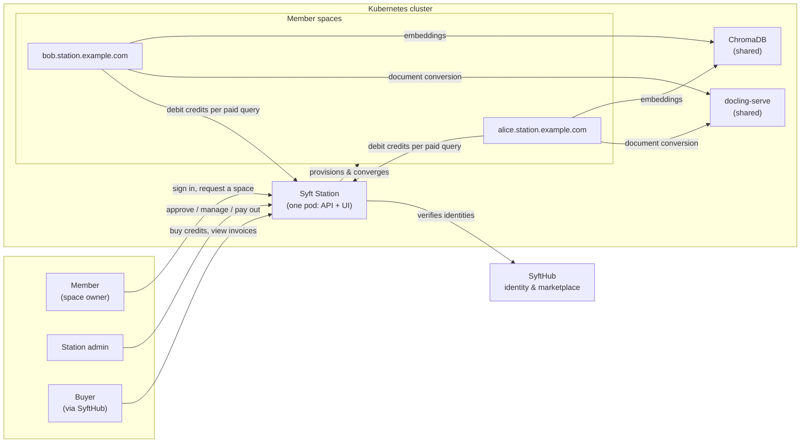
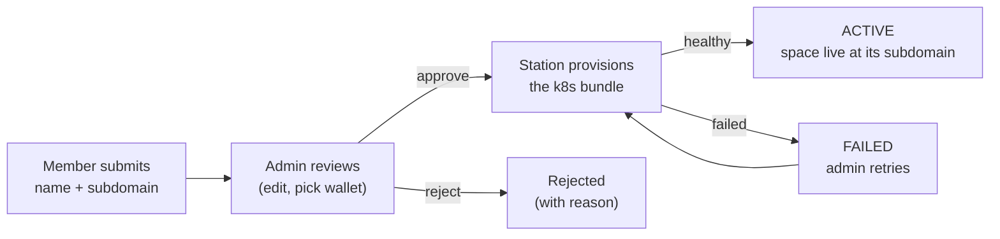

# Syft Station

> **Spin up your own Space, dock it to the Station.** Share the station, never your data.

Syft Station is the control plane for running **member-owned [Syft Space](../README.md)
instances on shared Kubernetes infrastructure**. One organization runs a
station; its members sign in with their SyftHub account and request a space;
the station admin reviews each request; approved spaces are provisioned onto
the cluster, each at its own subdomain, each backed by shared services
(ChromaDB, docling-serve) so members don't run their own.

Optionally, the station also runs a **shared wallet**: buyers purchase
credits once (Xendit or Stripe) and spend them at any space on the station;
the station tracks each space's earnings so the admin can pay members out.

## How it fits together



The station never sees a space's data. Its contract with syft-space is
deliberately thin: the container image, its `SYFT_*` environment variables,
and its health endpoint — zero shared code.

## The life of a space



Once active, the owner opens their space through a one-click admin URL, and
the admin can restart, update (roll every space to a new syft-space
version), pause, or delete spaces from the dashboard.

## Run a station

The Helm chart is the single source of truth for every deployment — the
station pod, the shared backends, RBAC, and the per-space defaults:

```bash
helm install syft-station oci://ghcr.io/openmined/charts/syft-station \
  --version <version> \
  --namespace syft-spaces --create-namespace \
  --set station.adminEmail=you@your-org.com \
  --set station.ingress.host=station.your-org.com
```

Point DNS at the cluster (`station.your-org.com` plus a wildcard for the
spaces), open the station in a browser, sign in with the admin email, and
the first-run setup walks you through the spaces' domain, an optional
shared wallet, and the syft-space version to deploy. For HTTPS, bring one
certificate covering the station host and the space wildcard — see
[docs/deployment.md](docs/deployment.md).

### Local development

```bash
just dev up admin=you@org.com   # station on the host with hot reload,
                                # spaces provisioned into a local k3d cluster
just up admin=you@org.com       # full in-cluster parity check
```

Both loops serve the station at `http://station.localhost` with the same
URLs and onboarding as production. The [justfile](justfile) is the tour
guide; [CLAUDE.md](CLAUDE.md) documents the loops in detail.

## Layout

| Path | What it is |
|---|---|
| `backend/` | FastAPI control plane (`syft_station` package) |
| `frontend/` | Vue 3 + TypeScript + shadcn/ui dashboard, served statically by the backend |
| `chart/` | The Helm chart (station + shared backends; dev and prod are the same chart) |
| `backend/syft_station/k8s/space/` | Per-space manifest templates the station renders at runtime |
| `docs/` | Implementation documentation, per component |

## Documentation

- [docs/README.md](docs/README.md) — index and reading order
- [docs/architecture.md](docs/architecture.md) — the big picture: one pod, six components, one chart
- [docs/auth.md](docs/auth.md) — SyftHub sign-in, sessions, roles
- [docs/requests-and-spaces.md](docs/requests-and-spaces.md) — the request lifecycle and space management
- [docs/provisioning.md](docs/provisioning.md) — how a space becomes Kubernetes resources
- [docs/credits.md](docs/credits.md) — the shared wallet, buyer flow, and earnings
- [docs/deployment.md](docs/deployment.md) — the chart, dev loops, and the release pipeline
